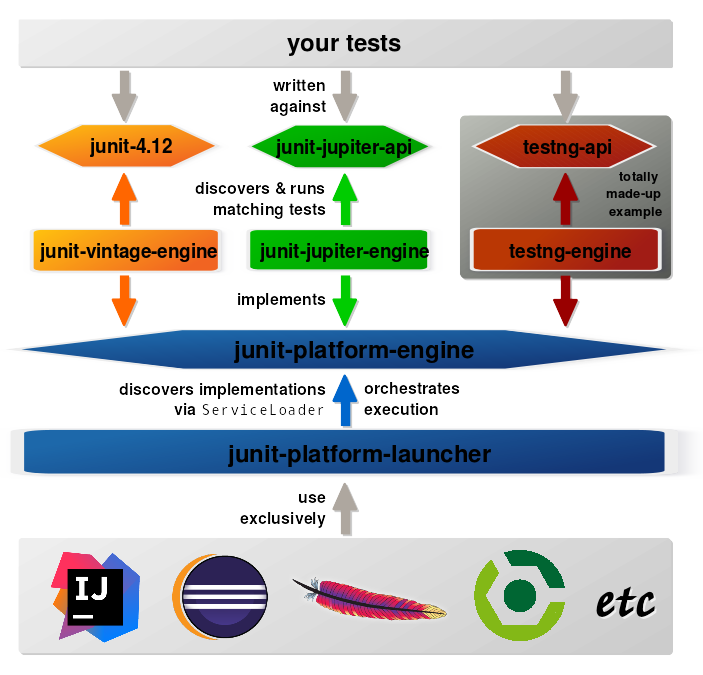
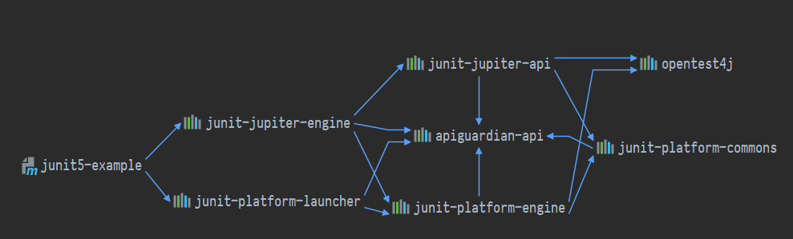
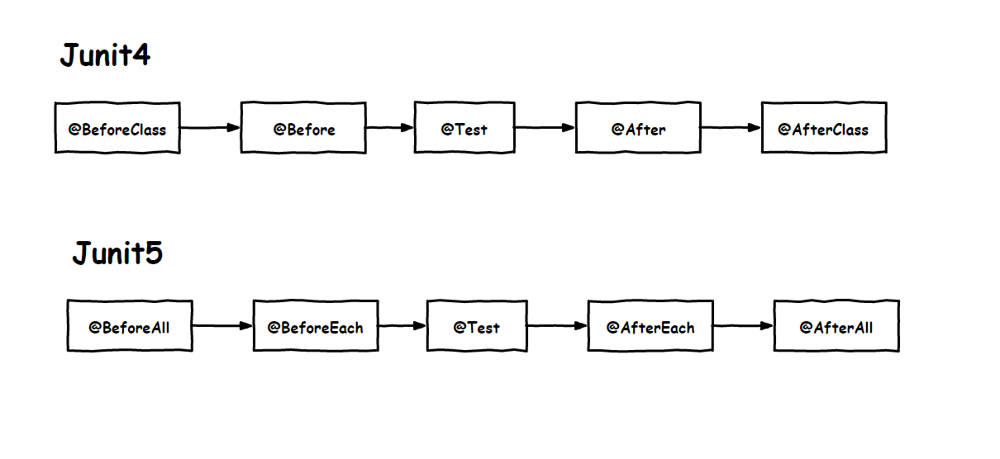

# <font color="orange">基本概念</font>

JUnit 是 java 领域占有率非常高的一个单元测试框架，已经成为了单元测试的标准。

## 1. 基本概念

### 1.1 JUnit 4

JUnit 3 在大量的 Java 应用开发中已经得到了广泛的应用，而到 JUnit 4 更引入了灵活的注解模式，一度成为 Java 应用单元测试的标准。而在 JUnit 4 发布 11 年后的 2017 年推出的 JUnit 5 更是进行了比较彻底的重构，不单纯是 JUnit 框架的进化，而是作为一个平台横空出世。

> 正是因为 TestNG 的出现对 JUnit 4 造成了一定的冲击，从而促使 JUnit 的发展走向了更高的『层次』：从测试框架，走向了测试平台！

### 1.2 JUnit 5

和 JUnit 4 只是一个单独的 jar 包不同，目前的 JUnit 5 组成如下：


| jar 包 | 说明 |
| :-  | :- |
| JUnit Platform &nbsp;&nbsp;&nbsp;&nbsp;&nbsp;&nbsp;&nbsp;&nbsp;&nbsp;&nbsp;&nbsp;&nbsp;&nbsp;&nbsp;&nbsp;&nbsp;&nbsp;&nbsp;&nbsp;&nbsp;&nbsp;&nbsp;&nbsp;&nbsp;&nbsp;&nbsp;&nbsp;&nbsp;&nbsp;&nbsp;&nbsp;&nbsp;&nbsp;&nbsp;&nbsp;&nbsp;&nbsp;&nbsp;&nbsp;&nbsp;&nbsp; | 提供平台功能的模块。通过 JUnit Platform ，其他的自动化测试引擎<small>（例如 TestNG）</small>都可以接入 JUnit 实现对接和执行。|
| JUnit Jupiter | JUnit5 的核心，可以看作是承载 JUnit4 升级演进。包含了很多丰富的新特性。 |
| JUnit Vintage<small>（非必须）</small>| 这个模块是对 JUnit3、JUnit4 版本兼容的测试引擎，使旧版本 junit 的自动化测试脚本也可以运行在 JUnit5 平台下。<br><small>如果你的测试代码并非基于 JUnit3、JUnit4 编写的，那么自然就不需要这个包。</small> |




使用 JUnit 5 进行测试需要引入的包有：



上述关系图中包含的包有：

- apiguardian-api-1.0.0.jar
- junit-jupiter-api-5.4.2.jar
- junit-jupiter-engine-5.4.2.jar
- junit-platform-commons-1.4.2.jar
- junit-platform-engine-1.4.2.jar
- junit-platform-launcher-1.4.2.jar
- opentest4j-1.1.1.jar

> 如果要兼容 JUnit3、JUnit4 还需要加上：
> 
> - hamcrest-core-1.3.jar
> - junit-4.12.jar
> - junit-vintage-engine-5.4.2.jar
>
> 另外，JUnit 5 的 maven pom 依赖见最后。


## 2. 一个简单的示例

```java
public class JUnit5Test {

    @Test
    void succeedingTest() {
        System.out.println("成功执行测试！");
    }

}
```


## 3. Junit 5 更新 - 执行生命周期注解

Junit 5 基本延续 Junit 4 的生命周期的概念，但修改了对应的注解命名，使其表达的意思更加符合字面含义，对比关系如图：




```java
public class TestLifeCycle {

    /*
     * 此方法只会在运行所有单元测试前执行一次,
     * 通常用来获取数据库连接, Spring 管理的 Bean 等等
     */
    @BeforeAll
    static void initAll() {
        System.out.println("*******BeforeAll********");
    }

    /*
     * 此方法运行每个单元测试前都会执行,
     * 通常用来准备数据或获取单元测试依赖的数据或对象
     */
    @BeforeEach
    void init() {
        System.out.println("------BeforeEach-------");
    }

    /*
     * 测试类的主要方法,在这里写所有的测试业务逻辑
     */
    @Test
    void succeedingTest() {
        System.out.println("成功执行测试！");
    }


    /*
     * @Disabled 为禁用功能，功能和 Junit4中的 @ignore 类似
     * 这里用来方暂未完成的测试逻辑。它不会被 JUnit 执行。
     */
    @Test
    @Disabled("for demonstration purposes")
    void skippedTest() {
        // not executed
    }

    /*
     * 此方法运行每个单元测试后都会执行,
     * 主要用来和 setUp 对应,清理获取的资源
     */
    @AfterEach
    void tearDown() {
        System.out.println("------AfterEach-------");
    }

    /*
     * 此方法会在运行所有单元测试后执行一次,
     * 通常用来释放资源,例如数据库连接,IO流等等
     */
    @AfterAll
    static void tearDownAll() {
        System.out.println("*******AfterAll********");
    }

}
```

执行结果及输出如下：

```
*******BeforeAll********
------BeforeEach-------
成功执行测试！
------AfterEach-------

for demonstration purposes
*******AfterAll********
```


## 4. 单元测试的编写原则

1. 在 eclipse 中创建 1 个 source folder 命名为 test<small>（使用 Maven 后已要求必须创建）</small>

2. 测试类所在的包要求和被测试类的包一致

3. 测试类要使 Tes 作为开头或结，如 UserServiceTest

4. 测试类的每个方法，都必须是可以独立执行的，不存在顺序或依赖


## 5. Junit 5 新特性：设置用例别名

默认情况下，在 Junit 执行完毕后的测试报告中显示的是测试方法名称。但很多情况下，我们可能需要更加直观可读更好的信息。

Junit 5 引入了 **@DisplayName** 注解，通过它可以给指定测试报告中的名字，<small>而不是显示类和方法的名字。</small>

例如，指定测试类的自定义显示名称：

```java
@DisplayName("测试类自定义名称测试") 
class TestDiskplayName {
    ...
}
```

**@DisplayName** 也可以用在方法上，指定具体测试方法的别名。

```java
@Test
@DisplayName("测试方法名称001") 
void test001() {
    assertTrue(true);
}
```


## 6. JUnit 5 的 Maven pom 依赖

```xml
<dependency>
    <groupId>org.junit.platform</groupId>
    <artifactId>junit-platform-launcher</artifactId>
    <version>1.4.2</version>
    <scope>test</scope>
</dependency>

<!-- JUnit 平台 API：
        被 engine 依赖，会自动导入，可省略 -->
<dependency>
    <groupId>org.junit.jupiter</groupId>
    <artifactId>junit-jupiter-api</artifactId>
    <version>5.4.2</version>
    <scope>test</scope>
</dependency> 

<dependency> <!-- JUnit 5 -->
    <groupId>org.junit.jupiter</groupId>
    <artifactId>junit-jupiter-engine</artifactId>
    <version>5.4.2</version>
    <scope>test</scope>
</dependency>

<!-- Junit3、Junit4 接入『平台』的“适配器”
<dependency>
    <groupId>org.junit.vintage</groupId>
    <artifactId>junit-vintage-engine</artifactId>
    <version>5.4.2</version>
    <scope>test</scope>
</dependency>
-->
```