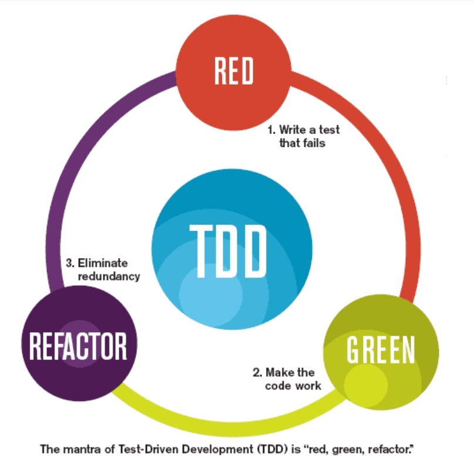

# 测试驱动开发（TDD）

**TDD** 有广义和狭义之分，常说的是狭义的 TDD ，也就是 UTDD<small>（Unit Test Driven Development）</small>。

> 广义的 TDD 是 ATDD<small>（Acceptance Test Driven Development）</small>，包括 BDD<small>（Behavior Driven Test Development）</small>和 Consumer-Driven Contracts Development 等。

**TDD** 的原理是在开发功能代码之前，先编写单元测试用例代码，测试代码确定需要编写什么产品代码。

## 1. 为什么要 TDD

- 传统编码方式

  1. 需求分析，想不清楚细节，管他呢，先开始写

  2. 发现需求细节不明确，去跟业务人员确认

  3. 确认好几次终于写完所有逻辑

  4. 运行起来测试一下，靠，果然不工作，调试

  5. 调试好久终于工作了

  6. 转测试，QA 测出 bug，debug，打补丁

  7. 终于，代码可以工作了

  8. 一看代码烂的像坨屎，不敢动，动了还得手工测试，还得让 QA 测试，还得加班 ...

- TDD 编码方式

  1. 先分解任务，分离关注点

  2. 列 Example，用实例化需求，澄清需求细节

  3. 写测试，只关注需求，程序的输入输出，不关心中间过程

  4. 写实现，不考虑别的需求，用最简单的方式满足当前这个小需求即可

  5. 重构，用手法消除代码里的坏味道

  6. 写完，手动测试一下，基本没什么问题，有问题补个用例，修复

  7. 转测试，小问题，补用例，修复

  8. 代码整洁且用例齐全，信心满满地提交

> 有很多人说 TDD 时，我的代码量增加了，所以开发效率降低了。但是，如果没有单元测试，你就要手工测试，你要花很多时间去准备数据，启动应用，跳转界面，观察显示效果等，反馈是很慢的。准确说，『**快速反馈**』是单元测试的好处。
> 
> 简单来说，你的代码量有增加，但是工作量和工作时间有减少。付出减去回报，最后你还是有的赚。

## 2. 如何 TDD

TDD 的基本流程是：红，绿，重构。

更详细的流程是：

1. 写一个测试用例

2. 运行测试

3. 写刚好能让测试通过的实现

4. 运行测试

5. 识别坏味道，用手法修改代码

6. 运行测试

一切都是为了让程序符合预期，这样当出现错误的时候，就能很快定位到错误<small>（它一定是刚刚修改的代码引起的，因为一分钟前代码还是符合我的预期的）</small>。通过这种方式，节省了大量的调试代码的时间。

## 3. TDD 的三条规则

1. <small>（不考虑重构、优化代码的情况）</small>除非是为了使一个失败的 unit test 通过，否则不允许编写任何产品代码。

2. 编写测试用例时，一次性只允许编写造成失败的最小代码。

3. 编写产品代码时，一次性只允许编写造成成功的最小代码。

这三条规则的本质是：**分离关注点，“一次只戴一顶帽子”** 。

在我们编程的过程中，有几个关注点：**需求**，**实现**，**设计** 。

TDD 给了我们明确的三个步骤，每个步骤关注一个方面：

1. **造『红』**：写一个失败的测试用例，它是对一个小需求的描述，只需要关心输入输出，这个时候根本不用关心如何实现。

2. **变『绿』**：专注在用最快、最直观、甚至是最笨的方式实现当前这个小需求，不用关心其他需求，也不要管代码的质量是不是够好，实现方式是不是那么优雅。

3. **重构**：既不用思考需求，也没有实现的压力<small>（因为你已经有了一个 60 分的版本，实在不行用这个版本向老板交差）</small>，只需要找出代码中的不够好的地方，改造它。

