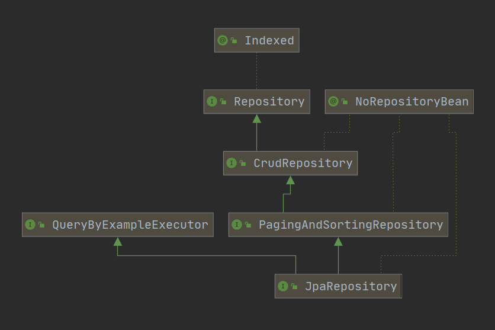

# <font color="orange">Spring Data JPA 的基本使用</font>

## 1. 基本概念

### 1.1 JPA 由来 

> 从理论上来说，Mybatis 和 Hibernate 并非同一类框架：Mybatis 是半自动 ORM 框架，而 Hibernate 是全自动的。

而从全自动 ORM 框架的角度来将，Hibernate 也非唯一的一个，跟它同类的竞争对手还有：TopLink、JDO 等<small>（虽然市场占有率十分低）</small> 。

不同的全自动 ORM 框架<small>（这里并不包括 Mybatis）</small>之间，功能是是相似的，但是 API 接口的区别十分大。不便于项目在底层技术实现之间迁移。

JPA（Java Persistence API）是 Sun 官方提出的 Java 持久化 <strong>规范</strong>。它的出现主要是为了简化现有的持久化开发工作和整合 ORM 技术，提供统一的 API 接口，结束现在 Hibernate、TopLink、JDO 等 ORM 框架各自为营的局面。

<small>注意：JPA 只是一套规范，不是一套产品。JPA 和 Hibernate、TopLink、JDO 之间的关系，就像 slf4j 和 log4j2、logback 之间的关系一样。</small>

### 1.2 Spring Data JPA

一个项目直接<small>（或间接）</small>使用 Hibernate 有三种方式：

1. 直接使用 Hibernate。

2. 直接使用 JPA，间接使用 Hibernate；

3. 通过 **`spring-data-jpa`**，将 JPA（和 Hibernate）整合进 Spring 项目，以一种特定的方式<small>（sprig data）</small>使用 JPA，从而间接使用 Hibernate 。

Spring Data JPA 是 Spring 基于 ORM 框架、JPA 规范的基础上封装的一套 JPA 应用框架。如果说，JPA 简化了 Hibernate 的使用，那么 spring-data-jpa 则是在这个基础上再一次简化了 hibernate，提高了开发效率。<small>Spring Data JPA 让我们摆脱了 DAO 层的操作，基本上所有 CRUD 都可以依赖于它实现。</small>

Spring Data JPA 其实就是要求在 Spirng Data 的体系下使用 JPA。<small>Spring Data JPA 只是 Spring Data 体系中的一员。</small>


## 2. 快速上手

### 2.1 添加依赖

```xml
<dependency>
    <groupId>org.springframework.boot</groupId>
    <artifactId>spring-boot-starter-data-jpa</artifactId>
</dependency>
<dependency>
    <groupId>mysql</groupId>
    <artifactId>mysql-connector-java</artifactId>
</dependency>
```

### 2.2 添加配置文件

```properties
spring.datasource.driver-class-name=com.mysql.cj.jdbc.Driver
spring.datasource.url=jdbc:mysql://127.0.0.1:3306/scott\
    ?useUnicode=true\
    &characterEncoding=utf-8\
    &useSSL=true\
    &serverTimezone=UTC
spring.datasource.username=root
spring.datasource.password=123456

spring.jpa.show-sql=true
spring.jpa.properties.hibernate.dialect=org.hibernate.dialect.MySQL5Dialect
spring.jpa.properties.hibernate.format_sql=true
spring.jpa.properties.hibernate.hbm2ddl.auto=update

logging.level.root=INFO
logging.level.xxx.yyy.zzz=DEBUG
logging.pattern.console=${CONSOLE_LOG_PATTERN:\
  %clr(${LOG_LEVEL_PATTERN:%5p}) \
  %clr(|){faint} \
  %clr(%-40.40logger{39}){cyan} \
  %clr(:){faint} %m%n\
  ${LOG_EXCEPTION_CONVERSION_WORD:%wEx}}
```

**`hibernate.hbm2ddl.auto`** 参数的作用主要用于：自动创建、更新、验证数据库表结构，有四个值。

| 值 | 说明 |
| :- | :- |
| `create` | 每次启动项目都会删除上一次创建的 Table，再根据配置重新创建 Table 。<small>这种方式会导致数据库表数据丢失。</small> |
| `create-drop` | 本质上和 `create` 一样，只不过是本次项目结束时就删除 Table 。<small>不用等到下次启动时再删除。</small>|
| **`update`** | <small>最常用。</small>会以 Model 类的配置为依据，在没有表时建表，在表中没有某列时，新增列。每次启动时都是如此。|
| `validate` | 每次加载 Hibernate 时，会以 Model 类的配置来验证数据库中的表结构，两者必须严格一直<small>（char 和 varchar 都算不一致）</small>。这个过程中不会创建、更新新表。如果不一致会报错。|


> **`update`** 对数据库表结构的『更新』仅限于：
> - 根据 Model 创建一个原本不存在的 Table；
> - 为已存在的 Table『新增』列。
> 
> 不包括
> - 修改已有列的数据类型；
> - 新增或修改已有列的约束条件；
> - 删除 Table 的某列。


### 2.3 开启 JPA 框架功能

在某个配置类（或入口类）上加上 ***`@EnableJpaRepositories(basePackages = "xxx.yyy.zzz.dao")`*** 注解。

> 经测试，这一步并非必须。不加时 Spring Boot 也会自动启动 JPA 框架功能。而且，默认会扫描入口类平级及下级包，看哪个类『脑袋』上有 ***`@Repository`*** 注解。


### 2.4 实体类

```java
/*
 * DBMS   - catalog  - schema   - table
 * Mysql  - <no>     - database - table
 * Oracle - database - <no>     - table
 */
@Entity
@Table(name="表名", schema ="数据库名")
public class Department {

  @Id
  @GeneratedValue(strategy = GenerationType.IDENTITY)
  private Integer id;

  @Column(nullable = false, unique = true)
  private String name;

  @Column(nullable = false)
  private String location;

  // getter / settet ...
}
```

- 由于默认配置的存在，上述示例省略了默写配置<small>（后续会讲解）</small>。

- `@Entity(name="EntityName")` **必须**

  用来标注一个数据库对应的实体，数据库中创建的表名默认和类名一致。其中，name 为可选，对应数据库中一个表，使用此注解标记 JavaBean 是一个 JPA 实体。

- `@Table(name="", catalog="", schema="")` *可选*

  用来标注一个数据库对应的实体，数据库中创建的表名默认和类名一致。通常和 `@Entity` 配合使用，只能标注在实体的 class 定义处，表示实体对应的数据库表的信息。

  在数据库理论领域中，DBMS - Catalog - Schema - Table 是四级概念，但不是所有的数据库系统都支持这四级。MySql 就不支持其中的 catalog ，而 schema 就是 mysql 中的 database 。

- `@Id` **必须**

  `@Id` 定义了映射到数据库表的主键的属性，一个实体只能有一个属性被映射为主键。

- `@GeneratedValue(strategy=GenerationType, generator="")` *可选*

  - `strategy`：表示主键生成策略,有 `AUTO`、`INDENTITY`、`SEQUENCE` 和 `TABLE` 4 种。

  - `generator`：表示主键生成器的名称。

- `@Column(name="user_code", nullable=false, length=32)` *可选*

  `@Column` 描述了数据库表中该字段的详细定义，这对于根据 JPA 注解生成数据库表结构的工具。
  
  - `name`：表示数据库表中该字段的名称，默认情形属性名称一致;
  
  - `nullable`：表示该字段是否允许为 null，默认为 true;
  
  - `unique`：表示该字段是否是唯一标识，默认为 false;
  
  - `length`：表示该字段的大小，仅对 String 类型的字段有效。

- `@Transient` *可选*

  `@Transient` 表示该属性并非一个到数据库表的字段的映射，ORM 框架将忽略该属性。


> 另外，*@Enumerated* 和 *@Enumerated* 注解在某些场景下可能也会用到。

这些标注于属性上的注解，也可以标注在属性的 get 方法上。注意，不是/不用标注在 set 方法上。


## 3. UUID 和 ASSIGNED 主键策略（了解、自学）

通常 JPA『背后』是 Hibernate，而 Hibernate 除了和上述的一样的 **`identity`**、**`sequence`** 主键生成策略之外，还有 **`uuid`** 和 **`assigend`** 两种主键生成策略。

在 JPA 中使用 Hibernate 的 **`uuid`** 和 **`assigend`** 策略，需要【多】使用一个注解：***`@GenericGenerator`*** 。

- strategy = "uuid"：

  ```java
  @Id
  @GeneratedValue(generator = "xxx")
  @GenericGenerator(name = "xxx", strategy = "uuid")
  private String id;
  ```

- strategy = "assigend"：

  ```java
  @Id
  @GeneratedValue(generator = "yyy")
  @GenericGenerator(name = "yyy", strategy = "assigned")
  private Long id;
  ```

## 4. Repository 构建

> 提前声明一点，如果要在 JUnit 中测试 Repository，记得使用 **`@Transactionl`** 注解。否则会报错：no session 。

自定义的 ***`Repository`*** 只要继承 ***`JpaRepository`*** 即可，就会帮我们自动生成很多内置方法。这是 spring-data-jpa 为我们带来的便利！

父接口 JpaRepository 要求传入两个泛型参数：

- 第一个泛型参数是自定义的 Repository 所操作的 *`@Entity`* ；

- 第二个泛型参数是 Entity 的 *`@Id`* 属性类型。

```java
@Repository
public interface UserRepository extends JpaRepository<User, Long> {
}
```



***`JpaRepository`*** 继承 PagingAndSortingRepository 和 QueryByExampleExecutor。PagingAndSortingRepository 又继承了 CrudRepository 。

| 祖先 | 作用 |
| :- | :- |
| CrudRepository | 内置了我们最常用的增、删、改、查的方法。|
| PagingAndSortingRepository | 在 CrudRepository 基础上负责排序和分⻚ | 
| QueryByExampleExecutor | 提供了很多示例的查询方法。|

因此使用 JPA 操作数据库时，只需要构建的 Repository 继承了 ***`JpaRepository`***，就会拥有了很多常用的数据库操作方法。常用的方法有：

- 增/改

  ```java
  repository.save(entity);
  ```

  添加和修改功能都是使用 *`.save()`* 方法。
  
  有一点需要注意的是，对于修改而言，要先执行查询，再对查询到的 Entity 进行修改，而后再调用 *`.save()`* 方法。

- 删

  ```java
  repository.delete(entity);
  repository.deleteById(id);
  ```

  删除常见两种：先执行查询，再对查询到的 Entity 调用 *`.delete`* 方法进行删除；另一种是直接提供 Entity 的 ID 进行删除。

- 查

  ```java
  repository.getOne(id);
  repository.findById(id);
  repository.findAll();
  ```

  *`.getOne()`* 和 *`findById()`* 都是根据 ID 进行查询。区别在于：查不到时，*`.getOne()`* 抛出 ***`EntityNotFoundException`*** 异常，而 *`.findById()`* 查不查得到都是返回 ***`Optional<>`*** 。

  补充一点，在 Repository 的继承体系中 QueryByExampleExecutor 提供了通过 Example 对象进行条件查询。不过，它用起来还是相对比较繁琐，因此，通常使用的是其它方案来实现各种条件查询。这也是 spring-data-jpa 对 JPA 的改进之处。


## 5. 自定义简单的条件查询

spring-data-jap 还有一个功能非常实用：可以根据方法名自动生产 SQL。比如 *`.findByUserName()`* 会自动生产一个以 `userName` 为参数的查询方法。只需要在我们自定义的 Repository 中创建好方法，使用的时候直接将接口注入到类中调用即可。

- 根据用户名查询用户：

  ```java
  User findByUserName(String userName);
  ```

- 也可以加一些关键字 And、or：

  ```java
  User findByUserNameOrEmail(String username， String email);
  ```

- 修改、删除、统计也是类似语法：

  ```java
  Long deleteByUserName(String userName);
  Long countByUserName(String userName);
  ```

- 基本上 SQL 体系中的关键词都可以使用，如 LIKE 、IgnoreCase、OrderBy：

  ```java
  List<User> findByEmailLike(String email);
        User findByUserNameIgnoreCase(String userName);
  List<User> findByUserNameOrderByEmailDesc(String email);
  ```

可以根据查询的条件不断地添加和拼接，Spring Boot 都可以正确解析和执行，其他使用示例例可以参考下表。

**具体的关键字，使用方法和生产成 SQL 如下表所示**

| Keyword | Sample | JPQL snippet |
| :- | :- | :- |
| And                | findByLastnameAndFirstname   | … where x.lastname = ?1 and x.firstname  = ?2 |
| Or                 | findByLastnameOrFirstname    | … where x.lastname = ?1 or x.firstname = ?2   |
| Is, Equals         | findByFirstnameIs, <br>findByFirstnameEquals | … where x.firstname = ?1      |
| Between            | findByStartDateBetween       | … where x.startDate between ?1 and ?2    |
| LessThan           | findByAgeLessThan            | … where x.age < ?1    |
| LessThanEqual      | findByAgeLessThanEqual       | … where x.age <= ?1   |
| GreaterThan        | findByAgeGreaterThan         | … where x.age > ?1    |
| GreaterThanEqual   | findByAgeGreaterThanEqual    | … where x.age >= ?1   |
| After              | findByStartDateAfter         | … where x.startDate > ?1 |
| Before             | findByStartDateBefore        | … where x.startDate < ?1 |
| IsNull             | findByAgeIsNull              | … where x.age is null     |
| IsNotNull, NotNull | findByAge(Is)NotNull         | … where x.age not null    |
| Like               | findByFirstnameLike          | … where x.firstname like ?1 |
| NotLike            | findByFirstnameNotLike       | … where x.firstname not like ?1 |
| StartingWith       | findByFirstnameStartingWith  | … where x.firstname like ?1 (parameter bound with appended %)  |
| EndingWith         | findByFirstnameEndingWith    | … where x.firstname like ?1 (parameter bound with prepended %) |
| Containing         | findByFirstnameContaining    | … where x.firstname like ?1 (parameter bound wrapped in %) |
| OrderBy            | findByAgeOrderByLastnameDesc | … where x.age = ?1 order by x.lastname desc |
| Not                | findByLastnameNot            | … where x.lastname <> ?1 |
| In                 | findByAgeIn(Collection ages) | … where x.age in ?1 |
| NotIn              | findByAgeNotIn(Collection age) | … where x.age not in ?1 |
| TRUE               | findByActiveTrue()           | … where x.active = true |
| FALSE              | findByActiveFalse()          | … where x.active = false |
| IgnoreCase         | findByFirstnameIgnoreCase    | … where UPPER(x.firstame) = UPPER(?1) |


『The End』
