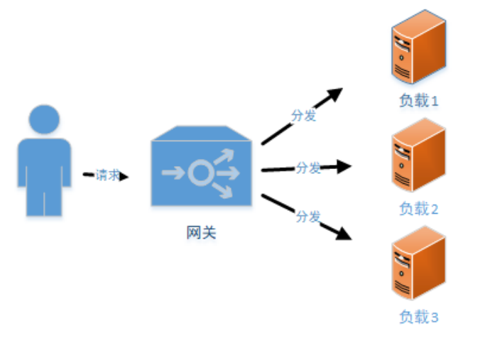
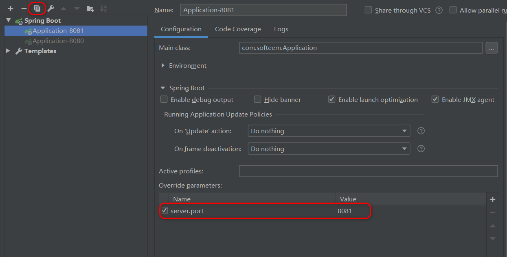
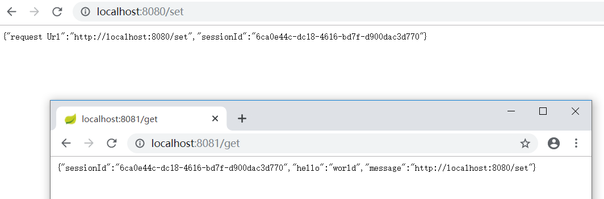
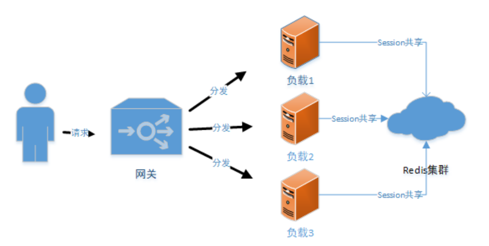

# <font color="orange">Spring Session 实现 Session 共享</font>

## 1. Session 共享问题

在微服务架构中，往往由多个微服务共同支撑前端请求，如果涉及到用户状态就需要考虑分布式 Session 管理问题。

比如用户登录请求分发在 **`服务器A`** ，用户购买请求分发到了 **`服务器B`** ， 那么 **`服务器B`** 就必须可以获取到用户的登录信息，否则就会影响正常交易。



因此，在分布式架构或微服务架构下，必须保证一个应用服务器上保存 Session 后，其他应用服务器可以同步或共享这个 Session 。

目前主流的分布式 Session 管理有两种方案：

- Session 复制功能

  部分 Web 服务器<small>（例如，Tomcat）</small>能够支持 Session 复制功能。用户可以通过修改 Web 服务器的配置文件，让 Web 服务器进行 Session 复制，保持每一个服务器节点的 Session 数据都能达到一致。

  这种方案的局限性在于：

  - 依赖于 Web 服务器。不是所有的 Web 服务器都提供这种功能。

  - 每个 Web 服务器节点都会保存所有的 Session 对象，从而导致内存资源的浪费。


- Session 集中存储

  在单独的服务器<small>（或服务器集群）</small>上使用缓存技术集中管理所有的 Session 对象。所有的 Web 服务器都从这个存储介质中存取对应的 Session，实现 Session 共享。
  
## 2. Spring Session

Spring Session 提供了一套创建和管理 Servlet HttpSession 的方案。它默认采用外置的 Redis 来存储 Session 数据，以此来解决 Session 共享的问题。

Spring 为 Spring Session 和 Redis 的集成提供了组件：***`spring-session-data-redis`*** 。

### 2.1 快速集成

#### pom.xml

```xml
<dependency>
    <groupId>org.springframework.boot</groupId>
    <artifactId>spring-boot-starter-data-redis</artifactId>
</dependency>
<dependency><!-- 不要忘记加这个包!!! -->
    <groupId>org.apache.commons</groupId>
    <artifactId>commons-pool2</artifactId>
</dependency>

<dependency>
    <groupId>org.springframework.session</groupId>
    <artifactId>spring-session-data-redis</artifactId>
</dependency>
```

<strong>注意</strong>：这个 *`spring-session-...`* 并不是 *`spring-session-core`*，虽然它引用到了 *`spring-session-core`* 。引入这个包的时候请注意一下。

#### 配置文件

```properties
## Redis 配置
## Redis 数据库索引（默认为0）
spring.redis.database=0
## Redis 服务器地址
spring.redis.host=localhost
## Redis 服务器连接端口
spring.redis.port=6379
## Redis 服务器连接密码（默认为空）
spring.redis.password=

## 以下配置非本功能必须
## 连接池最大连接数（使用负值表示没有限制）
spring.redis.lettuce.pool.max-active=8
spring.redis.lettuce.pool.max-wait=-1
spring.redis.lettuce.shutdown-timeout=100
spring.redis.lettuce.pool.max-idle=8
spring.redis.lettuce.pool.min-idle=0

logging.level.root=INFO
logging.level.xxx.yyy.zzz=DEBUG
logging.pattern.console=${CONSOLE_LOG_PATTERN:\
  %clr(${LOG_LEVEL_PATTERN:%5p}) \
  %clr(|){faint} \
  %clr(%-40.40logger{39}){cyan} \
  %clr(:){faint} %m%n\
  ${LOG_EXCEPTION_CONVERSION_WORD:%wEx}}
```

#### 配置类

```java
@Configuration
@EnableRedisHttpSession(maxInactiveIntervalInSeconds = 86400*30)
public class SessionConfig {
}
```

***`maxInactiveIntervalInSeconds`***：设置 Session 失效时间，使用 Redis Session 之后，原 Spring Boot 中的 *`server.session.timeout`* 属性不再生效。

至此，Spring Boot 的 Session 共享功能配置结束。

### 2.2 验证

在 Web 层写两个方法进行验证。当然，偷懒一点，你可以将这里测试用的 *`@RestController`* 连同上面的 *`@Configuration`* 一起写在 Spring Boot 的启动类中。类似如下：

```java
@RestController
@EnableRedisHttpSession(maxInactiveIntervalInSeconds = 86400 * 30)
@SpringBootApplication
public class Application {

    public static void main(String[] args) {
        SpringApplication.run(Application.class, args);
    }

    @RequestMapping(value = "/set")
    public Map<String, Object> setSession(HttpServletRequest request) {
        Map<String, Object> map = new HashMap<>();
        request.getSession().setAttribute("message", request.getRequestURL());
        request.getSession().setAttribute("hello", "world");
        map.put("sessionId", request.getSession().getId());
        map.put("request Url", request.getRequestURL());
        return map;
    }

    @RequestMapping(value = "/get")
    public Object getSession(HttpServletRequest request) {
        Map<String, Object> map = new HashMap<>();
        map.put("sessionId", request.getSession().getId());
        map.put("message", request.getSession().getAttribute("message"));
        map.put("hello", request.getSession().getAttribute("hello"));
        return map;
    }

}
```

复制一份本项目<small>（或在 Idea 中启动两次，注意端口冲突问题）</small>，分别从两个 URL 中访问/触发 Session 的存取功能。







