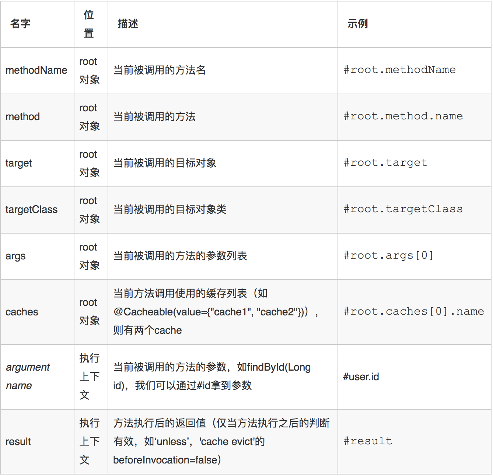

# <font color="orange">Spring Boot 中使用 Cache 缓存</font>

## 1. 基本概念

绝大多数的网站/系统，最先遇到性能瓶颈就是数据库，而且绝大多数的网站/系统的业务对数据库的操作都是读多写少。使用缓存做数据库的前置缓存，可以非常有效地降低数据库的压力，从而提升整个系统的响应效率和并发量。

大部分使用缓存的场景是基于数据库的缓存，这类缓存场景的逻辑往往是：如果缓存中存在数据，就从缓存中读取；如果缓存中不存在数据，就再从数据库中读取。

为了简化业务代码中的相关逻辑判断，Spring 在 `3.1` 版本引入了了基于注释驱动的 **Spring Cache** 。它的原理是 Spring Cache 利用了 Spring AOP 的动态代理技术，在项目启动的时候动态生成它的代理类，在代理类中实现了对应的逻辑。

<strong>Spring Cache 它本质上不是一个具体的缓存实现方案，而是一个对缓存使用的抽象</strong>。<small>简单来说，它相当于是 slf4j，它并不是真正干活的那个。</small>

使用 Spring Cache 的好处：

| # | 好处 |
| :-: | :- |
| 1 | 提供基本的 Cache 抽象，方便切换各种底层 Cache； |
| 2 | 通过注解 Cache 可以实现类似于事务一样，缓存逻辑透明的应用到我们的业务代码上，且只需要更少的代码就可以完成；|
| 3 | 提供事务回滚时也自动回滚缓存；|
| 4 | 支持比较复杂的缓存逻辑；|

## 2. Spring Boot 中 Cache 的使用

Spring Boot 提供了非常简单的解决方案，其中最核⼼的是三个注解：

| # | 注解 |
| :-: | :- |
| 1 | @Cacheable |
| 2 | @CacheEvict |
| 3 | @CachePut |
  
**`spring-boot-starter-cache`** 是 Spring Boot 体系内提供使用 Spring Cache 的 Starter 包。

```xml
<dependency>
  <groupId>org.springframework.boot</groupId>
  <artifactId>spring-boot-starter-cache</artifactId>
</dependency>
```

它会进行缓存的自动化配置和识别，Spring Boot 为 Redis 自动配置了 **RedisCacheConfiguration** 等信息，spring-boot-starter-cache 中的注解也主要是使用了 Spring Cache 提供的支持。

## 3. 整合 EHCache 初试 Spring Cache

EhCache 是一个纯 Java 的进程内缓存框架，具有快速、精干等特点。<small>Hibernate 中的默认 Cache 就是使用的 EhCache</small> 。

- pom.xml

  ```xml
  <!--ehcache依赖-->
  <dependency>
    <groupId>net.sf.ehcache</groupId>
    <artifactId>ehcache</artifactId>
  </dependency>
  ```

通过 spring-cache 使用 EhCache 有两点需要注意的地方：

1. 为配置类标注 **`@EnableCaching`** 注解，启用 spring-cache 功能。

2. 被 EhCache 缓存的对象需要实现 **`Serializable`** 接口。

- ehcache.xml

  ```xml
  <?xml version="1.0" encoding="UTF-8"?>
  <ehcache xmlns:xsi="http://www.w3.org/2001/XMLSchema-instance"
         xsi:noNamespaceSchemaLocation="http://ehcache.org/ehcache.xsd"
         updateCheck="false">

    <!--
        磁盘存储：将缓存中暂时不使用的对象，转移到硬盘，类似于 Windows 系统的虚拟内存
        path：指定在硬盘上存储对象的路径。path 可以配置的目录有：
                     user.home  用户的家目录。
                      user.dir  用户当前的工作目录。
                java.io.tmpdir  默认的临时目录。System.getProperty("java.io.tmpdir");
        ehcache.disk.store.dir  ehcache 的配置目录。
                   d:\\ehcache  手动指定一个绝对路径。
     -->
    <diskStore path="java.io.tmpdir" />

    <!--
        defaultCache：默认的缓存配置信息，如果不加特殊说明，则所有对象按照此配置项处理
        maxElementsInMemory 设置了缓存的上限，最多存储多少个记录对象
                    eternal 代表对象是否永不过期 (指定 true 则下面两项配置需为 0，表示无限期)
          timeToIdleSeconds 最大的发呆时间 /秒
          timeToLiveSeconds 最大的存活时间 /秒
             overflowToDisk 是否允许对象被写入到磁盘
        说明：下列配置自缓存建立起 10x60 秒有效 。
        在有效的 10x60 秒内，如果连续 2x60 秒未访问缓存，则缓存失效。
        就算有访问，也只会存活 10x60 秒。
     -->
    <defaultCache maxElementsInMemory="10000" eternal="false" timeToIdleSeconds="600"
                  timeToLiveSeconds="600" overflowToDisk="true" />

    <cache name="cache" maxElementsInMemory="10000" eternal="false" timeToIdleSeconds="120"
           timeToLiveSeconds="600" overflowToDisk="true" />

  </ehcache>
  ```


## 4. @Cacheable

*`@Cacheable`* 注解标注于查询方法上。被标注了该注解的方法的返回值，会被 Sprig Cache 存入缓存，并且在调用中先从缓存中获取。缓存中没有，才会执行该查询方法本身的逻辑<small>（从数据库中查询）</small>。

例如：

```java
@RequestMapping("/hello")
@Cacheable(value="helloCache")
public String hello(String name) {
    log.info("没有走缓存！");
    return "hello " + name;
}
```

先后两次访问 *`http://localhost:8080/hello?name=ben`* 你会发现只有一个日志输出。

***`@Cacheable`*** 支持如下几个参数：

| 参数 | 说明 |
| :- | :- |
| value | 缓存的名称。在 spring 配置文件中定义，必须指定⾄至少一个 |
| key | 缓存的 key，可以为空。<br>如果指定，则要按照 SpEL 表达式编写；<br>如果不指定，则缺省按照方法的所有参数进行组合。|
| condition | 触发条件，只有满足条件的情况才会加入缓存，默认为空，既表示全部都加入缓存，支持 Spring EL 。|

上述方法可以改造成：

```java
@RequestMapping("/condition")
@Cacheable(value="condition", condition="#name.length() <= 4")
// @Cacheable(value="condition", condition="#name != null")
public String condition(String name) {
    log.info("没有走缓存！");
    return "hello " + name;
}
```

在浏览器多次访问 *`http://localhost:8080/condition?name=justicando`*，会发现日志一次输出 `没有缓存`，这就是因为参数 *`name`* 不满足 *`length() <= 4`* 的要求<small>（只有满足要求才会走缓存逻辑）</small>。

总结：

- 当执行到一个被 *`@Cacheable`* 注解的方法时，Spring 首先检查 *`condition`* 条件是否满足;

- 如果不满足，执行方法，返回；

- 如果满足，在缓存空间中查找使用 *`key`* 存储的对象，

  - 如果找到，将找到的结果返回，

  - 如果没有找到，执行方法，将方法的返回值以 key-value 对象的方式存如缓存中，然后方法返回。

- <strong>需要注意的是</strong>：当一个支持缓存的方法在对象内部被调用时是不不会触发缓存功能的。

- *`@Cacheable`* 可以标注于类上。其效果等同于类下所有方法都标注了该注解。


## 5. 用于 Repository 上

***`@Cacheable(cacheNames = "cache", key = "#a0")`***


```yml
Hibernate: 
    select
        account0_.id as id1_0_0_,
        account0_.amount as amount2_0_0_,
        account0_.name as name3_0_0_ 
    from
        account account0_ 
    where
        account0_.id=?
 INFO | com.softeem.CqrsDemo3ApplicationTests    : Optional[Account{id=1, name='tommy', amount=1000.0}]
Hibernate: 
    select
        account0_.id as id1_0_0_,
        account0_.amount as amount2_0_0_,
        account0_.name as name3_0_0_ 
    from
        account account0_ 
    where
        account0_.id=?
 INFO | com.softeem.CqrsDemo3ApplicationTests    : Optional[Account{id=1, name='tommy', amount=1000.0}]
```

## 6. @CachePut

*`@CachePut`* 与 *`@Cacheable`* 类似。相同点在于:

- 被标注了 *`@CachePut`* 的方法的返回的结果会被缓存。<small>这和 *`@Cacheable`* 是一致的。</small>

不同点在于：

- *`@CachePut`* 标注的方法没有从缓存中取数据的环节/功能 。

简单来说，*`@CachePut`* 标注的方法只会向缓存中存数据，而从不从缓存中取数据。

*`@CachePut`* 也是有 *`value`*、*`key`*、*`condition`* 三个属性，功能和使用方式和 @Cacheable 一致。


## 7. @CacheEvict

***`@CacheEvict`*** 注解标注于删除和修改方法上。

被标注了 ***`@CacheEvict`*** 注解的方法在执行结束后，Spring Cache 会删除该注解指定的缓存中的键值对。

***`@CacheEvict`*** 可以指定的属性有 *`value`*、*`key`*、*`condition`*、*`allEntries`* 和 *`beforeInvocation`*，其中 *`value`*、*`key`* 和 *`condition`* 的语义与 @Cacheable 对应的属性类似。即 

- *`value`* 表示清除操作是发生在哪些 Cache 上的（对应 Cache 的名称）；

- *`key`* 表示需要清除的是哪个 key，如未指定则会使用默认策略生成的 key；

- *`condition`* 表示清除操作发生的条件。

### allEntries 属性

*`allEntries`* 是 boolean 类型，表示是否需要清除缓存中的所有元素，默认为 *`false`*，表示不需要。当指定了 *`allEntries`* 为 *`true`* 时，Spring Cache 将忽略指定的 *`key`*，删除 *`value`* 指定的缓存中的所有键值对。

### beforeInvocation 属性

清除操作默认是在对应方法成功执行之后触发的，那么这就导致这样的一个情况：*方法如果因为抛出异常结束，而非正常结束，那么就不会触发清除操作* 。

使用 *`beforeInvocation`* 可以改变触发清除操作的时间，当我们指定该属性值为 *`true`* 时，Spring 会在 调用该方法之前清除缓存中的指定元素。

```java
@RequestMapping("/beforeInvocation")
@CacheEvict(value="usersCache", allEntries=true, beforeInvocation=true)
public void beforeInvocation() {
    throw new RuntimeException("test beforeInvocation");
}
```

## 8. SpEL 上下文数据

Spring Cache 提供了一些供我们使用的 SpEL 上下文数据，下表直接摘自 Spring 官方文档：




## 9. @Caching

有时候我们可能组合多个 Cache 注解使用；比如用户新增成功后，我们要添加 id-user 键值对，添加 username-user 键值对，添加 email-user 键值对。此时就需要 *`@Caching`* 组合多个注解标签了。

```java
@Caching(  
    put = {  
        @CachePut(value = "user", key = "#user.id"),  
        @CachePut(value = "user", key = "#user.username"),  
        @CachePut(value = "user", key = "#user.email")  
    }  
)  
public User save(User user) { ... }
```

从 @Caching 注解源码可以看出，除了 *`@Caching - @CachePut`* 这种组合使用之外，它也可以结合 *`@Cacheable`* 和 *`@CacheEvict`* 使用：

```java
@Caching(  
  put = {
    @CachePut( ... ),
    @CachePut( ... ),
    @CachePut( ... )
  }
)

@Caching(  
  cacheable = {
    @Cacheable( ... ),
    @Cacheable( ... ),
    @Cacheable( ... )
  }
)

@Caching(  
  evict = {
    @CacheEvict( ... ),
    @CacheEvict( ... ),
    @CacheEvict( ... )
  }
)
```
