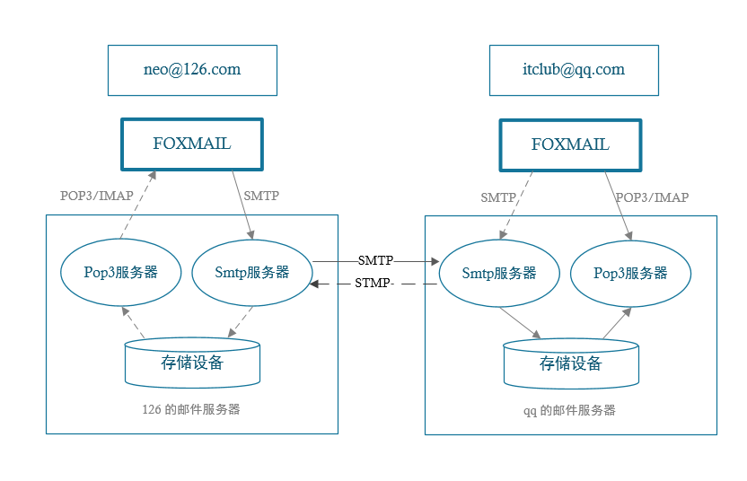
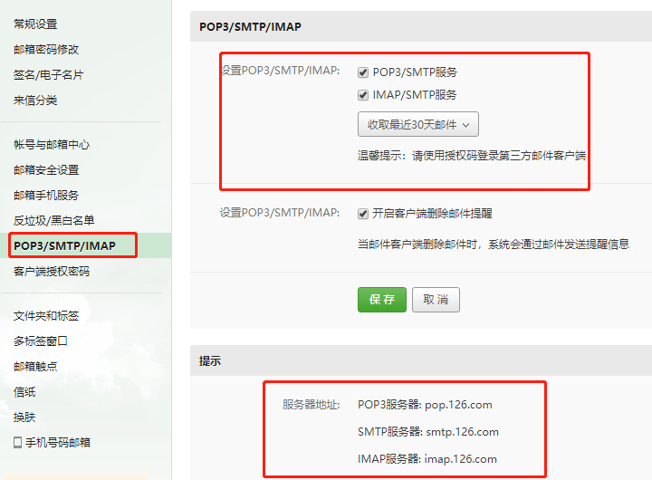
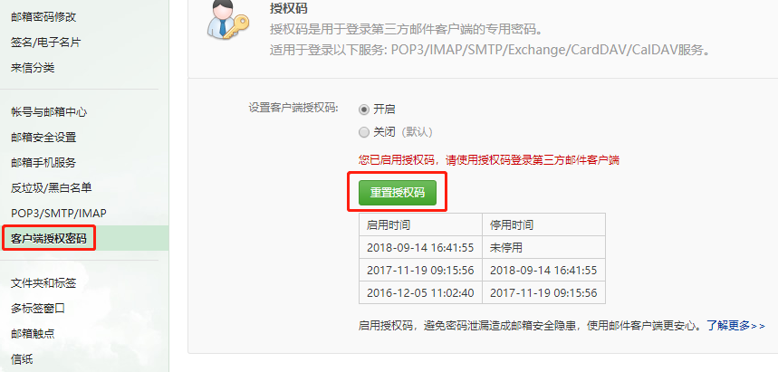

# <font color="orange">使用 Spring Boot 开发邮件系统</font>

## 1. 邮件发送流程



- 发信人在用户代理上编辑邮件，并写清楚收件人的邮箱地址;

- 用户代理根据发信人编辑的信息，生成一封符合邮件格式的邮件;

- 用户代理把邮件发送到发信人的邮件服务器上，邮件服务器上面有一个缓冲队列列，发送到邮件服务器上面的邮件都会加入到缓冲队列中，等待邮件服务器上的 SMTP 客户端进行行发送;

- 发信人的邮件服务器使用 SMTP 协议把这封邮件发送到收件人的邮件服务器上;

- 收件人的邮件服务器收到邮件后，把这封邮件放到收件人在这个服务器上的信箱中;

- 收件人使用用户代理来收取邮件，首先用户代理使用 POP3 协议来连接收件人人所在的邮件服务器，身份验证成功后，用户代理就可以把邮件服务器上面的收件人人邮箱里面的邮件读取出来，并展示给收件人。


这就是邮件发送的一个完整流程。

> 简单来说，邮件的接收发送类似 Git 中的 push 和 pull，是分开的两个操作。并且 push 和 pull 使用的是不同的协议：push 使用的是 SMTP 协议；pull 使用的是 POP3 协议。

## 2. 简单使用

最早期的时候使用 JavaMail 的相关 API 来开发，需要自己去封装消息体，代码量比较庞大;后来 Spring 推出了 JavaMailSender 来简化邮件发送过程，JavaMailSender 提供了强大的邮件发送功能，可支持各种类型的邮件发送。

现在 Spring Boot 在 JavaMailSender 的基础上又进行了封装，就有了现在的 `spring-boot-starter-mail`，让邮件发送流程更加简洁和完善。


### 2.1 pom 包配置

```xml
<dependency>
    <groupId>org.springframework.boot</groupId>
    <artifactId>spring-boot-starter-mail</artifactId>
</dependency>
```

### 2.2 配置文件 

在 *`application.properties`* 中添加邮箱配置，不同的邮箱参数稍有不同，下面面列举几个常用邮箱配置。

#### 163 邮箱配置

```properties
spring.mail.host=smtp.163.com   // 邮箱服务器器地址
spring.mail.username=xxx@oo.com // 用用户名
spring.mail.password=xxx        // 密码
spring.mail.default-encoding=UTF-8

// 超时时间，可选
spring.mail.properties.mail.smtp.connectiontimeout=5000
spring.mail.properties.mail.smtp.timeout=3000
spring.mail.properties.mail.smtp.writetimeout=5000
```

#### 126 邮箱配置

```properties
spring.mail.host=smtp.126.com
spring.mail.username=xxx@126.com
spring.mail.password=xxx
spring.mail.default-encoding=UTF-8
```

#### QQ 邮箱配置如下:

```properties
spring.mail.host=smtp.qq.com
spring.mail.username=xxx@qq.com
spring.mail.password=xxx
spring.mail.default-encoding=UTF-8
```

> 注意:测试时需要将 *`spring.mail.username`* 和 *`spring.mail.password`* 改成自自己邮箱对应的登录名和密码，这里的密码不是邮箱的登录密码，是开启 POP3 之后设置的客户端授权密码。

这里以 126 邮件举例，有两个地方需要在邮箱中设置。

#### 开启 POP 3 / SMTP 服务、IMAP / SMTP 服务



图片下方会有 SMTP 等相关信息的配置提示。

#### 开通设置客户端授权密码



设置客户端授权密码一般需求手机验证码验证。

## 3. 文本邮件发送 

Spring 已经帮我们内置了 JavaMailSender，直接在项目中引用即可，封装一个 MailService 类来实现普通的邮件发送方法。

```java
@Component
public class MailServiceImpl implements MailService {

    private final Logger logger = LoggerFactory.getLogger(this.getClass());

    @Autowired
    private JavaMailSender mailSender;

    @Value("${spring.mail.username}")
    private String from;

    @Override
    public void sendSimpleMail(String to, String subject, String content) {
        SimpleMailMessage message = new SimpleMailMessage();
        message.setFrom(from);
        message.setTo(to);
        message.setSubject(subject);
        message.setText(content);
        try {
            mailSender.send(message);
            logger.info("简单邮件已经发送。");
        } catch (Exception e) {
            logger.error("发送简单邮件时发生生异常!", e);
        }
    }
}
```

> 文本邮件抄送使用:message.copyTo(copyTo) 来实现。

- from，即为邮件发送者，一般设置在配置文件中
- to，邮件接收者，此参数可以为数组，同时发送多人
- subject，邮件主题
- content，邮件的主体

邮件发送者 from 一般采用固定的形式写到配置文件中。

## 4. 编写 test 类进行测试 

```java
@RunWith(SpringRunner.class)
@Spring BootTest
public class MailServiceTest {

    @Autowired
    private MailService MailService;

    @Test
    public void testSimpleMail() throws Exception {
        mailService.sendSimpleMail("hemiao3000@126.com", "这是一封简单邮件", "大家好，这是我的第一封邮件!");
    }
}
```

稍微等待几秒，就可以在邮箱中找到此邮件内容了。

## 5. 富文本邮件 

在日常使用的过程中,我们通常在邮件中加入图片或者附件来丰富邮件的内容。

### 发送 HTML 格式邮件

邮件发送支持以 HTML 语法去构建自定义的邮件格式,Spring Boot 支持使用用 HTML 发送邮件。

我们在 MailService 中添加支持 HTML 邮件发送的方法:

```java
public void sendHtmlMail(String to, String subject, String content) {
    MimeMessage message = mailSender.createMimeMessage();
    try {
        // true 表示需要创建一一个 multipart message
        MimeMessageHelper helper = new MimeMessageHelper(message, true);
        helper.setFrom(from);
        helper.setTo(to);
        helper.setSubject(subject);
        helper.setText(content, true);
        mailSender.send(message);
        logger.info("html邮件发送成功");
    } catch (MessagingException e) {
        logger.error("发送html邮件时发生生异常!", e);
    }
}
```

> 富文本邮件抄送使用:helper.addCc(cc) 来实现。

和文本邮件发送代码对比,富文本邮件发送使用 MimeMessageHelper 类,该类支持发送复杂邮件模板,支持文本、附件、HTML、图片等。

在测试类中构建 HTML 内容,测试发送:


```java
@Test
public void testHtmlMail() throws Exception {
    String content = 
    "<html>\n" + 
        "<body>\n" + 
            "<h3>hello world ! 这是一一封html邮件!</h3>\n" +
        "</body>\n" +
    "</html>";

    mailService.sendHtmlMail("hemiao3000@126.com","这是一封HTML邮件", content);
}
```

代码中拼接出的 HTML 的 String 字符串交给 MimeMessageHelper 来处理理,最后由邮件客户端负责渲染显示内容。

### 发送带附件的邮件

在 MailService 添加 sendAttachmentsMail 方法,发送带附件的邮件主要是使用 FileSystemResource 对文件进行封装,再添加到 MimeMessageHelper 中。

```java
public void sendAttachmentsMail (
        String to, String subject, 
        String content, String filePath) {
    MimeMessage message = mailSender.createMimeMessage();
    try {
        MimeMessageHelper helper = new MimeMessageHelper(message, true);
        helper.setFrom(from);
        helper.setTo(to);
        helper.setSubject(subject);
        helper.setText(content, true);
        FileSystemResource file = new FileSystemResource(new File(filePath));
        String fileName = file.getFilename();
        helper.addAttachment(fileName, file);

        // helper.addAttachment("test"+fileName, file);
        mailSender.send(message);
        logger.info("带附件的邮件已经发送。");
    } catch (MessagingException e) {
        logger.error("发送带附件的邮件时发生生异常!", e);
    }
}
```

> 添加多个附件可以使用多条 helper.addAttachment(fileName, file) 。

在测试类中添加测试方法:

```java
@Test
public void sendAttachmentsMail() {
    String filePath = "e:\\temp\\fastdfs-client-java-5.0.0.jar";
    mailService.sendAttachmentsMail("hemiao3000@126.com", "主题:带附件的邮件", "有附件,请查收!", filePath);
}
```

> 附件可以是图片、压缩包、Word 等任何文件,但是邮件厂商一般都会对附件大小有限制,太大的附件建议使用网盘上传后,在邮件中给出链接。

### 发送带静态资源的邮件

邮件中的静态资源一般指图片,在 MailService 中添加 sendInlineResourceMail 方法:

```java
public void sendInlineResourceMail(
        String to, String subject, 
        String content, String rscPath, String rscId) {
    MimeMessage message = mailSender.createMimeMessage();
    try {
        MimeMessageHelper helper = new MimeMessageHelper(message, true);
        helper.setFrom(from);
        helper.setTo(to);
        helper.setSubject(subject);
        helper.setText(content, true);
        FileSystemResource res = new FileSystemResource(new File(rscPath));
        helper.addInline(rscId, res);
        mailSender.send(message);
        logger.info("嵌入静态资源的邮件已经发送。");
    } catch (MessagingException e) {
        logger.error("发送嵌入静态资源的邮件时发生异常!", e);
    }
}
```

在测试类中添加测试方法:

```java
@Test
public void sendInlineResourceMail() {
    String rscId = "neo006";
    String content = "<html><body>这是有图片片的邮件:</body></html>";
    String imgPath = "e:\\temp\\weixin.jpg";
    mailService.sendInlineResourceMail("hemiao3000@126.com", "主题:这是有图片的邮件", content, imgPath, rscId);
}
```

> 添加多个图片可以使用多条  和 helper.addInline(rscId, res) 来实现。
