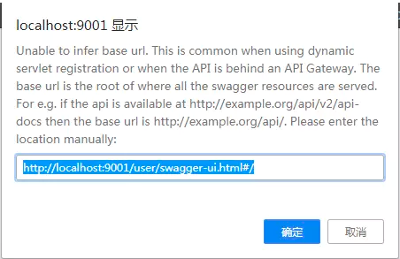
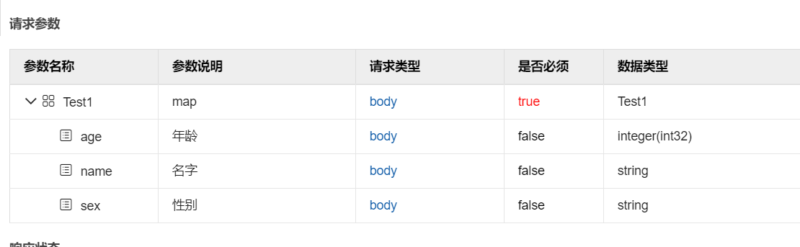
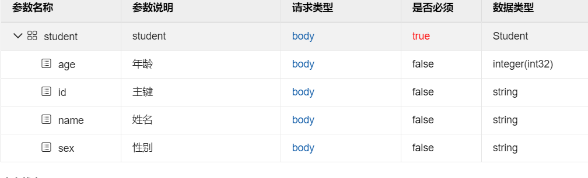
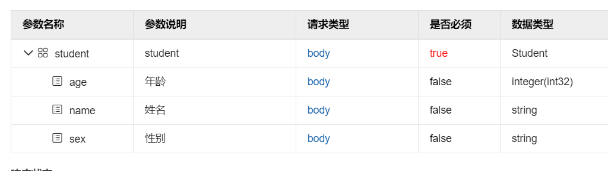
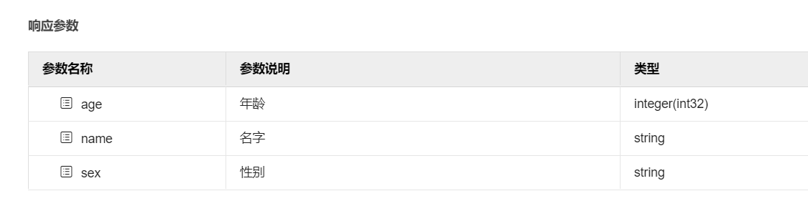

# <font color="orange">Swagger</font>

## 1. 什么是 Swagger

Swagger 是一系列 RESTful API 的工具，通过 Swagger 可以获得项目的⼀种交互式文档，客户端 SDK 的⾃ 动生成等功能。

Swagger 的目标是为 REST APIs 定义一个标准的、与语⾔言无关的接口，使人和计算机在看不到源码或者看不到文档或者不能通过网络流量检测的情况下，能发现和理解各种服务的功能。当服务通过 Swagger 定义，消费者就能与远程的服务互动通过少量的实现逻辑。

Swagger<small>（丝袜哥）</small>是世界上最流行的 API 表达工具。

## 2. 快速上手

使用 Spring Boot 集成 Swagger 的理念是，使⽤用注解来标记出需要在 API 文档中展示的信息，Swagger 会根据项目中标记的注解来生成对应的 API 文档。Swagger 被号称世界上最流行的 API 工具，它提供了 API 管理的全套解决方案，API 文档管理需要考虑的因素基本都包含，这里将讲解最常用的定制内容。

Spring Boot 集成 Swagger 2.X 很简单，需要引入依赖并做基础配置即可。

```xml
<dependency>
    <groupId>io.springfox</groupId>
    <artifactId>springfox-swagger2</artifactId>
    <version>2.9.2</version>
</dependency>
<dependency>
    <groupId>io.springfox</groupId>
    <artifactId>springfox-swagger-ui</artifactId>
    <version>2.9.2</version>
</dependency>
```

## 3. 创建 SwaggerConfig 配置类

```java
@Configuration
@EnableSwagger2
public class SwaggerConfig {
}
```

在 SwaggerConfig 的类上添加两个注解：

| 注解 | 说明 |
| :- | :- |
| @Configuration | 启动时加载此类 |
| @EnableSwagger2 | 表示此项目启用 Swagger API 文档功能 |


在 SwaggerConfig 中添加两个方法：<small>（其中一个方法是为另一个方法作辅助的准备工作）</small>

```java
@Bean
public Docket api() {
    return new Docket(DocumentationType.SWAGGER_2)
        .apiInfo(apiInfo())
        .select()
        // 此处自行修改为自己的 Controller 包路径。
        .apis(RequestHandlerSelectors.basePackage("xxx.yyy.zzz"))
        .paths(PathSelectors.any())
        .build();
}
```

此方法使用 **@Bean**，在启动时初始化，返回实例 Docket<small>（Swagger API 摘要对象）</small>，这里需要注意的是 `.apis(RequestHandlerSelectors.basePackage("xxx.yyy.zzz"))` 指定需要扫描的包路路径，只有此路径下的 Controller 类才会自动生成 Swagger API 文档。

```java
private ApiInfo apiInfo() {
    return new ApiInfoBuilder()
       .title("XXX 项目接口文挡")
       .description("XXX Project Swagger2 UserService Interface")
       .termsOfServiceUrl("http://localhost:8080/swagger-ui.html")
       .version("1.0")
       .build();
}
```

这块配置相对重要一些，主要配置页面展示的基本信息包括，标题、描述、版本、服务条款等，查看 ApiInfo 类的源码还会发现支持 license 等更多的配置。

如果，你的项目中配置了拦截器，那么拦截器会拦截你的 /swagger-ui.html 请求，从而导致你看不到 swagger 页面。




这种情况下，你需要在你的拦截器的配置中，将 swagger 请求排除在外：

```java
@Configuration
@EnableWebMvc
@ComponentScan("xxx.yyy.zzz.web.controller")
public class SpringWebConfig implements WebMvcConfigurer {

    // 暂未验证
    @Override
    public void addInterceptors(InterceptorRegistry registry) {

        registry.addInterceptor(new MyInterceptor())
                .addPathPatterns("/**")
                .excludePathPatterns(
                    "/swagger-ui.html", 
                    "/swagger/**", 
                    "/swagger-resources/**"
                )
                .order(1);

    }
}
```

配置完成之后启动项目，在浏览器中输入网址 [http://localhost:8080/swagger-ui.html](http://localhost:8080/swagger-ui.html)，即可看到上面的配置信息。


## 4. Swagger 常用注解

Swagger 通过注解表明该接口会生成文档，包括接口名、请求方法、参数、返回信息等，常用注解内容如下：

| 作用范围 | API | 使⽤用位置 |
| :------------- | :- | :- |
| 协议集描述     | `@Api` | 用于 Controller 类上 |
| 协议描述       | `@ApiOperation` | 用在 Controller 的方法上 |
| 非对象参数集   | `@ApiImplicitParams` | 用在 Controller 的方法上 |
| 非对象参数描述 | `@ApiImplicitParam` | 用在 `@ApiImplicitParams` 的方法里边 |
| 响应集         | `@ApiResponses` | 用在 Controller 的方法上 |
| 响应信息参数   | `@ApiResponse` | 用在 `@ApiResponses` 里边 |
| 描述返回对象的意义 | `@ApiModel` | 用在返回对象类上 |
| 对象属性       | `@ApiModelProperty` | 用在出入参数对象的字段上|

例如：

```java
@Api(value = "用户服务", description = "用户操作 API")
@RestController
@RequestMapping("/user")
public class UserController {

    @ApiOperation(value = "获取用户信息", notes = "根据id在取用户信息", produces = "application/json", response = Result.class)
    @ApiImplicitParams({
            @ApiImplicitParam(name = "id", value = "用户Id", required = true, dataType = "int", paramType = "path")
    })
    @GetMapping(value = "/{id}")
    public Result<DomainUser> getUser(@PathVariable int id) {
        System.out.println(id);
        return new Result<DomainUser>(ResultCode.OK, new DomainUser());
    }
}
```

## 5. knife4j-Swagger 

knife4j 是 Swagger 生成 API 文档的增强解决方案，最主要是 knife4j 提供了动态字段注释功能来实现 Map 来接收参数这个的接口文档生成，忽略参数属性来实现同一个实体类对不同接口生成不同的文档。


### 5.1 配置

-   引入 jar 包

    ```xml
    <dependency>
        <groupId>com.github.xiaoymin</groupId>
        <artifactId>knife4j-spring-boot-starter</artifactId>
        <version>3.0.2</version>
    </dependency>
    ```

-   添加注释来开启 knife4j

    ```java
    @Configuration
    @EnableSwagger2
    @Import(BeanValidatorPluginsConfiguration.class)
    public class SwaggerConfig {

        @Bean
        public Docket createRestApi() {
            ...
        }

        private ApiInfo apiInfo() {    
        }
    ```

    完整的实例如下：

    ```java
    @Configuration
    @EnableSwagger2
    @Import(BeanValidatorPluginsConfiguration.class)
    public class SwaggerConfig {

        @Bean
        public Docket createRestApi() {
            return new Docket(DocumentationType.SWAGGER_2)
                .apiInfo(apiInfo())
                .select()
                .apis(RequestHandlerSelectors.basePackage("xxx.yyy.zzz"))
                .paths(PathSelectors.any())
                .build();
        }

        private ApiInfo apiInfo() {
            String title = "test";
            return new ApiInfoBuilder().title(title)
                .description("接口")
                .termsOfServiceUrl("http://localhost:8080/doc.html")
                .version("1.0")
                .build();
        }

    }
    ```

-   静态资源拦截配置

    ```java
    @Configuration
    public class WebMvcConfig implements WebMvcConfigurer {
        @Override
        public void addResourceHandlers(ResourceHandlerRegistry registry) {
            registry.addResourceHandler("doc.html").addResourceLocations("classpath:/META-INF/resources/");
            registry.addResourceHandler("/webjars/**").addResourceLocations("classpath:/META-INF/resources/webjars/");
        }
    }
    ```

knife4j 有提供 UI 来显示，默认访问地址是：

    http://${host}:${port}/doc.html

### 5.2 动态字段注释

knife4j 提供了 **@ApiOperationSupport** 和 **@DynamicParameters** 这两个注解：

- @ApiOperationSupport：该注解是扩展增强注解，目前主要扩展的属性有 order<small>（接口排序）</small>、author<small>（接口开发者）</small>、params<small>（动态字段集合）</small>、responses<small>（返回动态字段集合）</small>、ignoreParameters 。

- @DynamicParameters：动态扩展注解，主要包括 name<small>（Model 名称）</small>、properties<small>（属性列表）</small>。

#### 入参动态注解 {docsify-ignore}

```java
@PostMapping("/test1")
@ApiOperationSupport(params = @DynamicParameters(properties = {
    @DynamicParameter(name = "name", value = "名字", example = "张三"),
    @DynamicParameter(name = "sex", value = "性别", example = "女"),
    @DynamicParameter(name = "age", value = "年龄", example = "20")
}))
public void test1(@RequestBody Map<String, Object> map) {
    String name = (String) map.get("name");
    String sex = (String) map.get("sex");
    Integer age = (Integer) map.get("age");
    log.info("姓名:" + name);
    log.info("性别:" + sex);
    log.info("年龄:" + age);
}
```

自动生成接口文档如下：




#### 忽略参数属性 {docsify-ignore}

-   提供两个URI 接口作对比

    ```java
    @PostMapping("/test3")
    public void test3(@RequestBody Student student) {
        log.info(student.toString());
    }

    @PostMapping("/test4")
    @ApiOperationSupport(ignoreParameters = {"id"})
    public void test4(@RequestBody Student student) {
        log.info(student.toString());
    }
    ```

-   自定义用于参数绑定的实体类

    ```java
    @ApiModel
    public class Student {

        @ApiModelProperty(value="主键")
        private String id;

        @ApiModelProperty(value="姓名")
        private String name;

        @ApiModelProperty(value="年龄")
        private Integer age;

        @ApiModelProperty(value="性别")
        private String sex;

        ...
    }
    ```

自动生成文档如下：







#### 返回值动态注解  {docsify-ignore}

```java
@PostMapping("/test2")
@ApiOperationSupport(responses = @DynamicResponseParameters(properties = {
@DynamicParameter(name = "name", value = "名字"),
    @DynamicParameter(name = "sex", value = "性别"),
    @DynamicParameter(name = "age", value = "年龄")
  }))
public Map<String,Object> test2(){
    Map<String,Object> map=new HashMap<>();
    map.put("name","张三");
    map.put("sex","男");
    map.put("age",19);
    return map;
}
```

自动生成文档如下：




#### 使用自定义返回类 {docsify-ignore}

我们一般都会有一个 Result 这样的类作为统一的返回类，Result 类中的 data 属性里是数据。例如：

```java
public class Result<T> {

    private int code;

    private String message;

    private T data;

    ...
}
```

> 更讲究的，可能会定义出好几种不同的 Result：**SingleResult**、**ListResult**、**SliceResult** 。


但是如果返回的 data 中的数据项少于三个，很多人可能就不会为 T 去定义 DTO 类，而是直接偷懒使用 Map。例如：Result\<Map\<String, Object\>\> 。

这种情况下，knife4j 无法通过注解生成文档。所以，不i要偷懒。

-   自定义 DTO 类


    ```java
    @Data
    @NoArgsConstructor
    @AllArgsConstructor
    @ApiModel
    public class Student {

        @ApiModelProperty(value = "姓名", example = "张三")
        private String name;

        @ApiModelProperty(value = "性别", example = "男")
        private String sex;

        @ApiModelProperty(value = "年龄", example = "20")
        private int age;
    }
    ```

-   自定义 Result

    ```java
    @Data
    @NoArgsConstructor
    @AllArgsConstructor
    @ApiModel
    public class Result<T> {

        @ApiModelProperty(value = "响应状态码", example = "200")
        private int code;

        @ApiModelProperty(value = "响应状态信息", example = "success")
        private String message;

        @ApiModelProperty(value = "响应数据")
        private T data;
    }
    ```