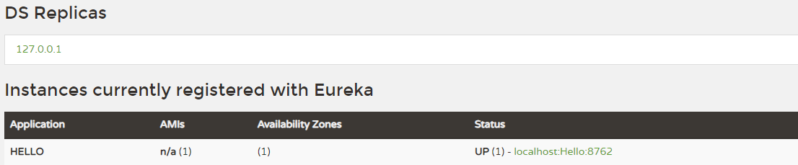

# <font color="orange">初识 Spring Cloud</font>

## 0. 微服务

微服务架构通常会与单体架构<small>（Monolithic Style）</small>进行比较。Web 应用程序发展的早期，大部分 Web 工程是将所有的功能模块打包到一起部署和运行，例如 Java 应用程序打包为一个 war 包。在单体应用中，所有这些模块都被集成在一起，这样运行的系统就叫做单体应用。

单体应用的优点是开发简单直接，集中式管理基本不会重复开发；功能都在本地，没有分布式的管理开销和调用开销。缺点也很明显，如开发效率低、代码维护难，稳定性和扩展性都存在不足。

> 微服务最早是由 Martin Fowler 与 James Lewis 于 2014 年共同提出。

微服务架构，是一种软件架构方式。微服务的主要特点体现在组件化、松耦合、自治和去中心化等方面。它将应用构建成一系列按业务领域划分模块的、小的自治服务，通过分解巨大单体式应用为多个服务方法解决了复杂性问题。每个服务还提供了一个严格的模块边界，甚至允许用不同的编程语言编写不同的服务。不过，微服务应用是分布式系统，由此会带来分布式系统固有的复杂性，包括测试、运维的复杂度。

## 1. 什么是 Spring Cloud

Spring Cloud 是微服务架构思想的一个具体实现，它为开发人员提供了快速构建分布式系统中一些常见模式的工具<small>（如，配置管理、服务发、断路器、智能路由、微代理、控制总线等）。</small>

Spring Cloud 基于 Spring Boot 框架，它不重复造轮子，而是将第三方实现的微服务应用的一些模块集成进去。准确的说，Spring Cloud 是一个容器。

## 2. 最简单的 Spring Cloud 项目

最简单的 Spring Cloud 微服务架构包括『**服务发现**』和『**服务提供者**』<small>（即，一个大型系统拆分出来的子模块）</small>，最极端的微服务可以做到一个方法就是一个服务，一个方法就是一个项目。

> 在一个系统中，服务怎么拆分，要具体问题具体分析，也取决于系统的并发性、高可用性等因素。

首先是服务发现，这里我们采用 **Eureka Server** 。

通过 [*https://start.spring.io*](https://start.spring.io) 或 [*https://start.aliyun.com*](https://start.aliyun.com) 所提供的 Spring Initializer 功能，引入依赖：

- 在搜索框中输入 **Eureka Server** 后再选中，或

- 在 **Spring Cloud Discovery** 下选中 **Eureka Server** 。

- 另外，这里『**不需要引入 Spring Web**』。

<font color="red">注意</font>：除非完全没有网络，导致无法利用 Spring Initializer 功能，否则对于初学者而言，不要自己去创建普通的 Maven 项目后再添加相关包的依赖。这样做很容易遗漏和出错。

```xml
<dependency>
  <groupId>org.springframework.cloud</groupId>
  <artifactId>spring-cloud-starter-netflix-eureka-server</artifactId>
</dependency>
```

> 在线转换 **.properties** 和 **.yml** 配置文件。例如：[https://www.toyml.com/index.html](https://www.toyml.com/index.html)


- **application.yml** 文件

  ```yml
  server:
    port: 8761
  spring:
    application:
      name: eureka-server-registry
  eureka:
    instance:
      hostname: 127.0.0.1   # ${spring.cloud.client.ip-address}
      instance-id: ${eureka.instance.hostname}:${server.port}
      prefer-ip-address: true
    client:
      fetchRegistry: false
      registerWithEureka: false
      serviceUrl:
        defaultZone: http://127.0.0.1:${server.port}/eureka
    server:
      enable-self-preservation: true  # 关闭自保护模式会告警信息提示，但不影响运行。
  ```

  <small>以上配置暂不深究（后续详细讲解），先看整体运行效果。</small>

- bootstrap.yml ：

  ```yml
  logging:
    level:
      root: WARN
      com.woniu: DEBUG
      com.example: DEBUG
    pattern:
      console: "${CONSOLE_LOG_PATTERN:\
        %clr(${LOG_LEVEL_PATTERN:%5p}) \
        %clr(|){faint} \
        %clr(%-40.40logger{39}){cyan} \
        %clr(:){faint} \
        %m%n${LOG_EXCEPTION_CONVERSION_WORD:%wEx}}"
  ```


添加一个启动类 **RegistryApplication.java**

```java
@SpringBootApplication
@EnableEurekaServer // 看这里，看这里，看这里
public class RegistryApplication {
    public static void main(String[] args) {
        SpringApplication.run(RegistryApplication.class, args);
    }
}
```

<br>

---

<br>

然后再创建一个项目，实现『**服务提供者**』，在 *pom.xml* 添加如下内容:

通过 `https://start.spring.io` 或 `https://start.aliyun.com` 所提供的 Spring Initializer 功能，引入依赖：

- 在搜索框中输入 **Eureka Discovery Client** 后再选中。或

- 在 **Spring Cloud Discovery** 下选中 **Eureka Discovery Client** 。

- 另外，这里『**需要引入 Spring Web**』 。

- 实际添加的核心依赖关系如下：

  ```xml
  <dependency>
      <groupId>org.springframework.boot</groupId>
      <artifactId>spring-boot-starter-web</artifactId>
  </dependency>
  <dependency>
      <groupId>org.springframework.cloud</groupId>
      <artifactId>spring-cloud-starter-netflix-eureka-client</artifactId>
  </dependency>
  ```

为项目添加配置文件：

- application.yml 配置文件

  ```yml
  spring:
    application:
      name: hello
  server:
    port: 8762
  eureka:
    client:
      service-url:
        defaultZone: http://127.0.0.1:8761/eureka
  ```

- bootstrap.yml 配置文件

  ```
  # 日志相关配置，略。
  ```

增加一个启动类:

```java
@SpringBootApplication
@EnableEurekaClient // 看这里，看这里，看这里
public class EurekaProducer1Application {

    public static void main(String[] args) {
        SpringApplication.run(EurekaProducer1Application.class，args);
    }

}

@RestController
public class TempController {

    @Value("${server.port}")
    String port;

    @RequestMapping("/hello")
    public String home(String name) {
        return "hi " + name + ", i am from port:" + port;
    }

}
```

这时，分别启动服务发现和服务提供者，浏览器输入: [http://localhost:8761](http://localhost:8761) ，即服务发现的地址:



可以发现，服务提供者 hello 已经注册到服务中心了，然后我们请求 hello 接口地址: [http://localhost:8762/hello?name=tom](http://localhost:8762/hello?name=tom) ，即可以看到下面返回数据:

```
hi tom, i am from port: 8762 
```

以上只是 Spring Cloud 的入门实例，是为了给大家展示什么是 Spring Cloud 。

