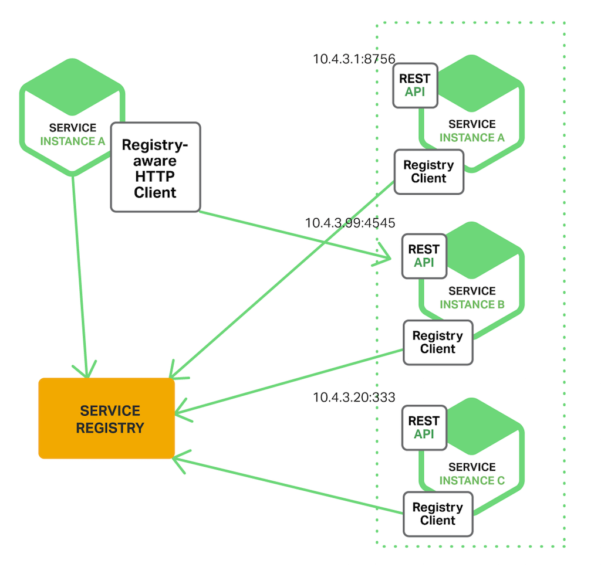
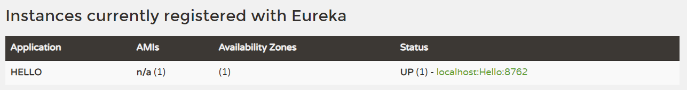

# <font color="orange">服务注册与发现：Eureka</font>

在微服务架构中，每一个微服务都可以通过集群或者其它方式进行动态扩展，每一个微服务实例的网络地址都可能动态变化，这使得原本通过『**硬编码地址的调用方式失去了作用**』。

微服务架构中，服务地址的动态变化和数量变动，迫切需要系统建立一个『**中心化的组件**』对各个微服务实例信息进行登记和管理，同时让各个微服务实例之间能够相互发现，从而达到互相调用的结果。


<dl>
<dt>服务注册</dt>
<dd>服务在中央注册表中注册其服务位置的过程。通常注册其主机和端口，有时还注册认证凭证，协议，版本号和或环境信息。</dd>
<dt>服务发现</dt>
<dd>客户端应用程序查询中央注册表以了解服务位置的过程。</dd>
</dl>

维护中央注册表的角色被称为『**服务注册平台**』或者『**服务注册中心**』。

当一个微服务启动的时候，必须主动向服务注册中心注册其服务地址，以供其他微服务查询调用。图中橘黄色为服务注册中心，绿色为微服务节点。


当一个微服务有多个实例的时候，由调用者从服务注册中心获取注册服务列表；调用者拿到『**注册服务列表**』之后，决定访问哪一个服务实例。





## 1. Spring Cloud 常用的服务注册中心 

Spring Cloud Netflix **Eureka** 是 Spring Cloud 提供用于服务于发现和注册的基础组件，是搭建 Spring Cloud 微服务架构的前提之一。

Eureka 由两部分组成：

- 一个是 Eureka Server，提供服务注册和发现功能，即，我们上述的服务器端；

- 另一个是 Eureka Client，它简化了客户端与服务端之间的交互。

Eureka Client 会定时将自己的注册信息登记到 Eureka Server 中，并从 Server 中下载包括了其它 Eurek Client 信息的『注册表』。

- 基本架构：

  


## 2. 服务注册中心（Registry Center）

首先，创建一个 Spring Boot Maven 工程，通过 

引入依赖：

- 在 Spring Initializer<small>（https://start.spring.io、https://start.aliyun.com）</small>中搜索 **Eureka Server** 后再选中。或

- 在 **Spring Cloud Discovery** 下选中 **Eureka Server** 。

注意事项：

- 这里『**不需要**』引入 *Spring Web*

- 除非完全没有网络，而无法利用 Spring Initializer 功能，否则对于初学者而言，不要自己去创建普通的 Maven 项目后再添加相关包的依赖。这样做很容易遗漏和出错。

- 被引入的依赖项是：

  ```xml
  <dependency>
      <groupId>org.springframework.cloud</groupId>
      <artifactId>spring-cloud-starter-netflix-eureka-server</artifactId>
  </dependency>
  ```


创建启动类 **RegistryApplication.java** ：

```java
@SpringBootApplication
@EnableEurekaServer // 看这里，看这里，看这里
public class RegistryApplication {
    public static void main(String[] args) {
        SpringApplication.run( RegistryApplication.class, args);
    }
}
```

这里，我们注意到除了前面提到的 @SpringBootApplication 外，这个类还增加了一个注解：**@EnableEurekaServer** ，这个注解的作用就是标注该应用程序是一个注册中心，只是添加这个注解还不够，还需要增加配置。

为项目添加配置文件：

- **application.yml** 配置文件<small>（先看执行效果，特殊配置的细节，后续讲解）</small>：

  ```yml
  server:
    port: 8761
  spring:
    application:
      name: eureka-server-registry
  eureka:
    instance:
      hostname: 127.0.0.1   # ${spring.cloud.client.ip-address}
      # 微服务的唯一标识
      instance-id: ${eureka.instance.hostname}:${server.port}
      prefer-ip-address: true
    client:
      # 不向注册中心注册自己
      register-with-eureka: false
      # 不从 Eureka Server 获取服务的注册信息
      fetch-registry: false
      service-url:
        defaultZone: http://${eureka.instance.hostname}:${server.port}/eureka/
    server:
      enable-self-preservation: true # 在较新的版本中，关闭自保护模式会告警。
  ```

  在这里，我们通过 `eureka.instance.hostname` 配置项『写死』了我们的微服务项目的 IP 地址，实际上，在 spring cloud 中有一个内置的变量 `${spring.cloud.client.ip-address}`，可以通过它去『求得』当前服务器的 IP 地址，而不用写死。

  <font color="red">**注意**</font> 如果你的当前服务器有多个 IP ，那么，这里还需要其它配置搭配使用，才能保证合乎你心意。

- **bootstrap.yml** 配置文件：

  ```yml
  # 日志相关配置，略。
  ```

启动该应用程序，打开浏览器并访问: [http://localhost:8761](http://localhost:8761) 。如果看到如下界面，说明注册中心已经启动起来了:


下面说明一下注册中心各个配置项的含义:

- <h3>eureka.server.enable-self-preservation</h3>

  是否开启自我保护，默认为 true 。

  **15** 分钟内超过 **85%** 的客户端节点都掉线了，注册中心就认为是自己掉线，而非客户端掉线。这种情况下，注册中心不会将不可用客户端节点信息从注册表中移除，而是等待网络恢复。

  这里设置为 false ，即关闭自我保护。

  在开发过程中，我们很容易频繁地启动、关停、重启客户端，从而很容易达到自我保护模式的标准。这时，会导致注册中心会『残留』已关闭的客户端信息。因此，开发环境中建议关闭自我保护模式。
  
  <small>不过在最新的、高版本的 spring cloud 中关闭 Eureka Server 的自我保护模式会有警告信息。</small>

- <h3>eureka.instance.prefer-ip-address</h3>

  是否以客户端节点的 IP 为标识注册到注册中心<small>（的注册表）</small>，默认是以客户端节点的 hostname 来注册的。

  <small>这个配置，和 instance-id 不是一码事。</small>

- <h3>eureka.client.serviceUrl.defaultZone</h3>

  注册中心默认地址。这里看起来似乎有点奇怪：为什么 Eureka Server 需要配置 Eureka Server 的 URL ？

  因为 Eureka Server 可以集群部署，而在居群部署的情况下，Eureka Server 之间会进行注册表信息的同步操作。因此，每个 Eureka Server 需要『感知』其它的 Eureka Server 的存在。

  一个 Eureka Server 也是一个 Eureka Client，它会尝试其它的 Eureka Server 那注册自己，所以需要至少一个注册中心的 URL 来定位其它的 Eureka Server 。如果不提供这样一个注册端点，注册中心也能工作，但是会在日志中打印无法向注册中心注册自己的信息。

> 建议按照以上的配置项写就行了。

Eureka Server 与 Eureka Client 之间的联系主要通过心跳的方式实现。心跳<small>（Heartbeat）</small>即 Eureka Client 定时向 Eureka Server 汇报本服务实例当前的状态，维护本服务实例在注册表中租约的有效性。

为了避免 Eureka Client 在每次服务间调用都向注册中心请求所依赖的服务实例的信息，Eureka Client 将定时从 Eureka Server 中拉取注册表中的信息，并将这些信息缓存到本地，用于服务发现。

## 3. 服务提供者（Service Producer）

我们有了注册中心，那么就可以创建一个服务提供者（即客户端）注册到注册中心去了。

<br>

---

<br>

同样地，按照注册中心的创建方式，创建领一个 Spring Boot Maven 项目，通过 `http://start.spring.io` 或 `https://start.aliyun.com` 所提供的 Spring Initializer 功能，引入依赖：

- 在 Initializer 中搜索 **Eureka Discovery Client** 后再选中。或

- 在 **Spring Cloud Discovery** 下选中 **Eureka Discovery Client** 。

注意事项：

- 这里『**需要**』引入 **Spring Web** 。

- 除非完全没有网络，而无法利用 Spring Initializer 功能，否则对于初学者而言，不要自己去创建普通的 Maven 项目后再添加相关包的依赖。这样做很容易遗漏和出错。

- 实际引入的依赖项目是
  
  ```xml
  <dependency>
      <groupId>org.springframework.boot</groupId>
      <artifactId>spring-boot-starter-web</artifactId>
  </dependency>

  <dependency>
      <groupId>org.springframework.cloud</groupId>
      <artifactId>spring-cloud-starter-netflix-eureka-client</artifactId>
  </dependency>
  ```

然后创建 **EurekaProducer1Application.java** ：

```java
@SpringBootApplication
@EnableEurekaClient // 看这里，看这里，看这里
public class EurekaProducer1Application {

    public static void main(String[] args) {
        SpringApplication.run(EurekaProducer1Application.class, args);
    }

}


@RestController
public class TempController {

  @Value("${server.port}")
  String port;

  @RequestMapping("/hello")
  public String home(String name) {
    return "hi " + name + ", i am from port:" + port;
  }

}
```

这里用到了一个注解：**@EnableEurekaClient**，标注了此注解，说明该项目是一个服务提供者。

为项目添加配置项：

- **application.yml** 配置文件：

  ```yml
  server:
    port: 8081
  spring:
    application:
      name: erueka-client-producer
  eureka:
    instance:
      hostname: 127.0.0.1
      instance-id: ${eureka.instance.hostname}:${server.port}
      prefer-ip-address: true
      lease-renewal-interval-in-seconds: 5
      lease-expiration-duration-in-seconds: 10
    client:
      service-url:
        defaultZone: http://127.0.0.1:8761/eureka/
  ```

- **bootstrap.yml** 配置文件：

  ```yml
  # 日志相关配置，略。
  ```

其中，**spring.application.name** 为该服务的名字，**eureka.client.serviceUrl.defaultZone** 的作用是指定注册中心的地址。

然后启动该工程，重新访问：[`http://localhost:8761`](http://localhost:8761)，即可看到如下界面:



我们可以看到，刚刚创建的服务提供者 eurekaclient 已经被注册到注册中心了。

以上就是本文关于 Eureka 服务注册与发现的全部内容<small>（仅仅只学习上面的知识还远远不够）</small>。

## 4. 服务发现原理 


| # | 说明 |
| :- | :- |
| **Application Service &nbsp;&nbsp;&nbsp;&nbsp;&nbsp;&nbsp;&nbsp;&nbsp;&nbsp;&nbsp;&nbsp;&nbsp;&nbsp;&nbsp;&nbsp;&nbsp;&nbsp;&nbsp;&nbsp;&nbsp;&nbsp;&nbsp;&nbsp;&nbsp;&nbsp;&nbsp;&nbsp;&nbsp;&nbsp;&nbsp;** | 是一个 Eureka Client，扮演服务提供者的角色，提供业务服务，向 Eureka Server 注册和更新自己的信息，同时能从 Eureka Server 注册表中获取到其它服务的信息。|
| **Eureka Server**|扮演服务注册中心的角色，提供服务注册和发现的功能。每个 Eureka Client 向 Eureka Server 注册自己的信息，也可以通过 Eureka Server 获取到其它服务的信息达到发现和调用其它服务的目的。|
| **Application Client**|是一个 Eureka Client，扮演了服务消费者的角色，通过 Eureka Server 获取到注册到其上的其它服务的信息，从而根据信息找到所需的服务发起远程调用。|
|**Replicate**|Eureka Server 之间注册表信息的同步复制，使 Eureka Server 集群中不同注册表中服务实例信息保持一致。|
| Make Remote Call|服务之间的远程调用。|
| Register|注册服务实例 |


## 5. Eureka 的自我保护与健康检查 

在 Eureka Server 的各个服务的 Status 栏显示着 **UP** ，表示该服务及其多实例处于状态正常。其它取值 **DOWN** 、**OUT_OF_SERVICE** 、**UNKNOWN** 等均表示该服务处于不可被请求的状态，只有 **UP** 状态的微服务会被请求。

Eureka Server 与 Eureka Client 之间使用『**心跳机制**』来确定Eureka Client（微服务实例）的状态。

在 Eureka Client 端，有 2 个配置与这个『心跳机制』有关：

```yml
# Eureka Client 配置
eureka:
  instance:
    lease-renewal-interval-in-seconds: 30 # 默认值
    lease-expiration-duration-in-seconds: 90 # 默认值
```

- **lease-renewal-interval-in-seconds** ：表示每间隔 N 秒，Client 向 Server 发送一次心跳，以证明自己<small>（Client）</small>还存活。

- **lease-expiration-duration-in-seconds** ：是 Client 端告知 Server，如果<small>（未来）</small>我<small>（Client）</small>在连续的 N 秒内没有给你<small>（Server）</small>发心跳，就代表我<small>（Client）</small>“死”了，请你<small>（Server）</small>将我<small>（Client）</small>踢除。

---

Eureka Client 通过心跳机制向 Eureka Server 证明自己的存活状态，但是，一旦 Eureka Client 挂掉了，超过了 Client 自己所声明的最长上报时间，Eureka Server 也不是实时将其移除。

Eureka Server 每间隔一段时间时间『集中』清理无效的客户端，这个配置是 Server 端的：

```yml
# Eureka Server 配置
eureka:
  server:
    eviction-interval-timer-in-ms: 60000 # 默认值，单位毫秒
```

<br>

---

<br>

Eureka Server 发现 Client 没给它<small>（Server）</small>发送心跳，不一定是 Client 出现了问题，也有可能是 Eureka Server 自己掉线了。

默认情况下，如果在 **15** 分钟内超过 **85%** 的客户端节点都没有正常的心跳，那么 Eureka 就认为这些客户端与注册中心出现了网络故障<small>（比如网络故障或频繁的启动关闭客户端）</small>，Eureka Server自动进入『**自我保护模式**』。

和这个概念有关的配置是：

```yml
# Eureka Server 配置
eureka:
  server:
    enable-self-preservation: true
    renewal-threshold-update-interval-ms: 15 * 60 * 1000
    renewal-percent-threshold: 0.85
```

Eureka Server 一旦认为是自己出了问题，从而开启保护模式后，就不再将失效的服务从列表中剔除。当网络故障恢复后，Eureka Server 会自动退出自我保护模式。

在开发和测试环境中，由于我们会经常性地、频繁地启停服务，导致心跳消失，因此我们通常会将 Eureka Server 的『**自我保护模式**』关闭掉，以避免它触发进入保护模式，从而导致改下线的服务没有下线。

关闭自我保护模式，需要在服务端和客户端配置：

```yml
# 服务端配置
# 1. 关闭自我保护模式。（新版本中官方不建议关闭，会有告警）
# 2. 缩短清理周期。（其实默认值也行）
eureka:
  server:
    enable-self-preservation: false 
    eviction-interval-timer-in-ms: 60000

# 客户端配置：
# 1. 缩短心跳上报周期
# 2. 缩短有效期时长
eureka:
  instance:
    lease-renewal-interval-in-seconds: 4
    lease-expiration-duration-in-seconds: 12
```


## 6. Eureka 集群服务注册（了解、自学）

服务注册中心在整个微服务体系中，至关重要！如果服务注册中心挂了，整个系统都将崩溃。所以服务注册中心通常不会被部署为单点应用，而是采用集群的部署方式，其中个别节点挂掉不影响整个系统的运行。

假设：

| 注册中心 | IP 地址 |
| :- | :- |
| peer-1 | 192.168.1.110 |
| peer-2 | 192.168.1.111 |
| peer-3 | 192.168.1.112 |

关键配置在于：

- 在 eureka 集群搭建过程中，**fetch-registry** 和 **register-with-eureka** 一定设置为 true 。表示从其他 2 个实例同步服务注册信息，并且向其他的 2 个 Server 注册自己。

- 将 peer-1 的 defaultZone 设置为 peer-2 和 peer-3 。

```yml
spring:
  application:
    name: eureka-server-registry-1
server:
  port: 8761
eureka:
  instance:
    hostname: 192.168.1.110
    health-check-url: http://${eureka.instance.hostname}:${server.port}/actuator/health
  client:
    fetch-registry: true
    register-with-eureka: true
    service-url:
      defaultZone: http://192.168.1.111:8761/eureka/,http://192.168.1.112:8761/eureka/
```

另外两个 Server 的配置反之亦然。

```xml
<dependency>
   <groupId>org.springframework.boot</groupId>
   <artifactId>spring-boot-starter-actuator</artifactId>
</dependency>
```

## 7. config.properties

在注册中心启动过程中，你会看到日志信息中有这样的 WARN 日志：

```txt
No URLs will be polled as dynamic configuration sources
```

这里的原因在于我们的项目间接引用到了 **spring-cloud-starter-netflix-archaius** 包。虽然，我们没有用到它，但是这个包既然在我们项目中，那么它就会『**期望**』我们项目的 resources 目录下有一个名为 **config.properties** 的配置文件<small>（其中放它要用到的配置文件）</small>。

由于实际上我们并没由于用到这个包，所以，你可以将这个包移除。或者在 **resources** 目录下创建一个空的 **config.properties** 文件。


## 8. Gist

### 8.1 Eureka Server 

- application.yml

  ```yml
  server:
    port: 8761
  spring:
    application:
      name: eureka-server-registry
  eureka:
    instance:
      hostname: ${spring.cloud.client.ip-address}
      instanceId: ${eureka.instance.hostname}:${server.port}
      prefer-ip-address: true
    client:
      fetchRegistry: false
      registerWithEureka: false
      serviceUrl:
        defaultZone: http://127.0.0.1:${server.port}/eureka
    server:
      enable-self-preservation: false
      eviction-interval-timer-in-ms: 3000 # 默认值，单位毫秒
  logging:
    level:
      root: WARN
      com.woniu: debug
      com.example: debug
    pattern:
      console: "${CONSOLE_LOG_PATTERN:\
          %clr(${LOG_LEVEL_PATTERN:%5p}) \
          %clr([%15.15t]){faint} \
          %clr(%-40.40logger{39}){cyan} \
          %clr(:){faint} \
          %m%n${LOG_EXCEPTION_CONVERSION_WORD:%wEx}}"
  ```


### 8.2 Eureka Client

- bootstrap.yml

  ```yml 
  eureka:
    instance:
      instance-id: ${eureka.instance.hostname}:${server.port}
      prefer-ip-address: true
      lease-renewal-interval-in-seconds: 5
      lease-expiration-duration-in-seconds: 10
    client:
      service-url:
        defaultZone: http://127.0.0.1:8761/eureka

  management:
    endpoints:
      web:
        exposure:
          include: "*"
  #        include: refresh,health,hystrix.stream
    endpoint:
      health:
        show-details: always

  logging:
    level:
      root: WARN
    pattern:
      console: "${CONSOLE_LOG_PATTERN:\
        %clr(${LOG_LEVEL_PATTERN:%5p}) \
        %clr([%15.15t]){faint} \
        %clr(%-40.40logger{39}){cyan} \
        %clr(:){faint} \
        %m%n${LOG_EXCEPTION_CONVERSION_WORD:%wEx}}"
  ```

- application.yml

  ```yml
  server:
    port: 8080
  spring:
    application:
      name: ...
  eureka:
    instance:
      hostname: ${spring.cloud.client.ip-address}
  ```

『The End』

