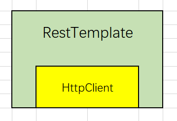

# <font color="orange">RestTemplate 和 Ribbon</font>

在 Spring Cloud 体系中，发起远程调用，本质上就是发起 HTTP 请求。

服务的提供者本质上就是一个 RESTful 风格的 Web 服务，因此，在知道其 API 的情况下我们只要能够发出 HTTP 请求，实际上就『调用』到了这个服务。

## 1. RestTemplate

> 你的项目只要直接或间接引入了 **spring-web** 包，你就可以使用 **RestTemplate** 。

### 1.1 RestTemplate 和它的小伙伴


RestTemplate 类似于 Slf4J，它本身并没有做『更多』的什么事情，它的主要功能和目的是对背后真正干活的“人”做二次包装，以提供统一的、简洁的使用方式。

在默认的<small>（未引入其它包的）</small>情况下，在 RestTemplate 背后真正干活的是 JDK 中的网络相关类：HttpURLConnection 。如此之外，RestTemplate 还支持使用 HttpClient 和 OkHTTP 库，<small>前提是，你要额外引入这两个包</small>。

当然，无论 RestTemplate 背后是谁在真正地处理 HTTP 请求和响应，RestTemplate 对外提供的接口都是一致的，并且更简洁。

> 引用并使用 apache 基金会的 httpclient 。
> ```xml
> <dependency>
>     <groupId>org.apache.httpcomponents</groupId>
>     <artifactId>httpclient</artifactId>
> </dependency>
> ```





**RestTemplate** 提供的常用方法是以 HTTP 协议中的 6 个动词开头的：

| HTTP Method	| 常用方法	| 描述 |
| :- | :- | :- |
| GET	    | getForObject	| 发起 GET 请求响应对象 |
| GET	    | getForEntity	| 发起 GET 请求响应结果、包含响应对象、请求头、状态码等 HTTP 协议详细内容 |
| POST	    | postForObject	| 发起 POST 请求响应对象 |
| POST	    | postForEntity	| 发起 POST 请求响应结果、包含响应对象、请求头、状态码等 HTTP 协议详细内容 |
| DELETE	| delete        | 发起 HTTP 的 DELETE 方法请求 |
| PUT	    | put           | 发起 HTTP 的 PUT 方法请求 |


这些方法的名称清楚地表明它们发出的是何种 HTTP 请求，而名称中包含的第二部分表示返回的内容。


### 1.2 RestTemplate 实现远程调用 

```java
@Test
public void contextLoads() throws Exception {

    // 真实使用场景中，它可以配置为单例
    RestTemplate restTemplate = new RestTemplate();

    // 发送远程的http请求的地址
    String url = "http://127.0.0.1:8080/hello";

    // 发送到远程服务的参数
    MultiValueMap<String, Object> params = new LinkedMultiValueMap<>();
    params.add("name", "tom");
    params.add("phoneNo", "13214409773");
    params.add("content", "HttpClient 测试远程服务调用");

    // 通过 RestTemplate 对象发送 post 请求
    String str = restTemplate.postForObject(url, params, String.class);
//  Xxx obj = restTemplate.postForObject(url, params, Xxx.class);

    System.out.println(str);
}
```

### 1.3 请求头和响应头 

有时候你可能有些额外的信息需要附带在请求头中发送到后台，此时，你可以使用如下形式的代码：

```java
RestTemplate restTemplate = new RestTemplate();
String url = "http://47.xxx.xxx.96/register/checkEmail";

HttpHeaders headers = new HttpHeaders();
headers.setContentType(MediaType.APPLICATION_FORM_URLENCODED);
headers.add("...", "...");
headers.add("...", "...");
headers.add("...", "...");

MultiValueMap<String, String> params = new LinkedMultiValueMap<>();
params.add("...", "...");
params.add("...", "...");
params.add("...", "...");

HttpEntity<MultiValueMap<String, String>> request = new HttpEntity<>(params, headers);

Xxx obj = restTemplate.postForObject(url, params, Xxx.class);
```


如果我们想获取更多的 HTTP 响应信息<small>（例如响应头）</small>，可以使用 **postForEntity** 方法。如下：

```java
ResponseEntity<String> entity = restTemplate.postForEntity(url, params, String.class);

// 查看响应的状态码
System.out.println(entity.getStatusCodeValue());

// 查看响应的响应体
System.out.println(entity.getBody());

// 查看响应头
HttpHeaders headMap = entity.getHeaders();
for (Map.Entry<String, List<String>> m : headMap.entrySet()) {
    System.out.println(m.getKey() + ": " + m.getValue());
}
```


### 1.4 RestTemplate 底层实现的切换 

RestTemplate 底层实现最常用的有以下三种：

- **SimpleClientHttpRequestFactory** <small>封装 JDK 的 URLConnection。默认实现</small>

- **HttpComponentsClientHttpRequestFactory** <small>封装第三方类库 HttpClient</small>

- **OkHttp3ClientHttpRequestFactory** <small>封装封装第三方类库 OKHttp</small>

> HttpClient 使用率更高，而 OKHttp 的执行效率最高。

所以，在你将 RestTemplate 配置成单例时，你可以指定它使用何种底层库：    

```java
@Bean
public RestTemplate restTemplate() {
    RestTemplate restTemplate = new RestTemplate(); // 默认实现
//  RestTemplate restTemplate = new RestTemplate(new SimpleClientHttpRequestFactory()); // 等同默认实现
//  RestTemplate restTemplate = new RestTemplate(new HttpComponentsClientHttpRequestFactory()); // 使用 HttpClient
//  RestTemplate restTemplate = new RestTemplate(new OkHttp3ClientHttpRequestFactory()); // 使用 OkHttp
    return restTemplate;
}
```

在实际的应用中，只需要选择上面的代码中的其中一种 RestTemplate Bean 即可。当然，无论 RestTemplate 底层使用何种网络库，我们对于它的使用方式都是统一的。

## 2. 客户端负载均衡器：Ribbon

### 2.1 Ribbon 在 RestTemplate 中的负载均衡

在你没有意识到 Ribbon<small>（读作 [ˈrɪbən] ）</small>存在的时候，Ribbon 就已经可以在你的项目中<small>（配合 RestTemplate）</small>起作用了。

为你的 RestTemplate 的 @Bean 加上 **@LoadBalanced** 注解：

```java
@Bean
@LoadBalanced // 它来自于 spring-cloud-starter-netflix-eureka-client 
RestTemplate restTemplate() {
  return new RestTemplate();
}
```

> @LoadBalanced 注解背后就是 Spring AOP 动态代理的思想。

你循环调用 RestTemplate，以目标服务在 Eureka Server 上注册的名字来代替 URL 中的 IP 地址，你就会发现有负载均衡的效果：

```java
String url = "http://SELF-DEPARTMENT/hello";

for (int i = 0; i < 10; i++) {
    String str = template.postForObject(url, null, String.class);
    System.out.println(str);
}
```

这里之所以能出现负载均衡现象是因为：

1. 你的项目间接引用到了 Ribbon，*spring-cloud-starter-netflix-eureka-client* 包中已经包含了 ribbon；

   当然，你也可以单独引用（**spring-cloud-starter-netflix-eureka-ribbon**），不过，逻辑上这就是一句啰嗦的废话。

2. 你的项目是一个 Eureka Client 项目，当它启动时，它会去 Ereuka Server 上拉取已注册的所有的服务的 IP 地址等相关信息；

3. 当你通过 RestTemplate 以『**application name**』为依据发出请求时，Ribbon 会参与进来，会将 application-name『**替换**』成上述第 2 步中查到的 IP 地址。

4. 在『**替换**』的过程中，它以某种规则轮流使用同一个服务的多个实例的 IP 地址，从而实现负载均衡效果。这里的『**某种规则**』指的就是负载策略。

5. 默认的负载策略是轮循。

> 这里需要注意的是，使用了 **@LoadBalanced** 注解之后，RestTemplate 的 URL 中不能再出现 IP:Port，哪怕只有一个单点，也只能出现目标服务在 Eureka Server 上注册的 name。反之亦然。

**Spring Cloud Ribbon** 不像注册中心<small>（Eureka Server）</small>、配置中心<small>（Config Server）</small>、网关<small>（Gateway）</small>那样独立部署、运行。它更像是一个工具类<small>（库）</small>，『**嵌套**』在各个组件中配合其它组件使用。


### 2.2 Ribbon 的执行原理

Ribbon 是以拦截器的方式『**参与**』到 RestTemplate 的请求发送功能中的。

当我们 RestTemplate 执行请求操作时，就会被 Ribbon 的拦截器拦截。Ribbon 通过 `request.getURI()` 方法求能获得 RestTemplate 所发出的请求的 URI，不过此时 URI 中的内容是目标服务的 *application-name* 而非 IP 。

由于我们的项目作为 Eureka Client 能够从 Eureka Server 上拉取到 application-name 所对应的一个<small>（或多个）</small>IP 地址及端口信息，因此，Ribbon 会根据某种『**规则**』<small>（算法）</small>获取到目标服务的真实的访问路径。

最后，Ribbon 放行 RestTemplate，让它向目标服务继续发起请求<small>（并获取返回）</small>。


### 2.3 负载均衡策略和 IRule 接口

前面提到过的『**规则**』、『**算法**』就是『**负载均衡策略**』。

Ribbon 内置了 8 种负载均衡策略<small>（其实是 7 种）</small>，它们都直接或间接实现了 **IRule** 接口：

其中常见的有：

1. *RandomRule*

   随机策略。随机选择目标服务的实例。

2. **RoundRobinRule**（默认策略） 

   轮询策略。按顺序循环选择目标服务的实例。

3. **WeightedResponseTimeRule**

   根据响应时间分配一个 Weight（权重），响应时间越长，Weight 越小，被选中的可能性越低。

   这个策略以前版本中被称作 *ResponseTimeWeightedRule* 。

4. **BestAvailablRule**

   这种策略下，Ribbon 会观测、统计目标服务的各个实例的运行状况、并发量。

   当再次发起对目标服务的访问时，Ribbon 会先过滤掉因为多次访问故障而被标记为 Error 的 实例。然后选择一个并发量<small>（ActiveRequestCount）</small>最小的实例发起访问。

   俗话说就是：先去掉不能干活的，然后在能干活的里面找一个最闲的。


> 上述 4 种策略简单高效，使用较多。而 *AvailabilityFilteringRule* 和 *ZoneAvoidanceRule* 策略需要结合断路、超时等参数配置，使用起来比较复杂，容易进坑，所以使用较少。


--- 

Ribbon 默认的负载均衡策略是：轮询，如果我们想调整一下负载均衡策略，可以通过如下的配置。在『服务消费者』的服务中<small>（即使用 RestTemplate 发起请求的一方）</small>，做 Ribbon 负载均衡策略的调整。

目前最简单的方式就是：

```yml
SELF-DEPARTMENT:
  ribbon:
    NFLoadBalancerRuleClassName: com.netflix.loadbalancer.RandomRule
```

注意，以上配置的仅针对 application-name 为 SELF-DEPARTMENT 的微服务有效。即，若你要调用多个不同的微服务，你要对它们一一配置。


### 2.4 Ribbon 的饥饿加载

默认情况下，服务消费方调用服务提供方接口的时候，第一次请求会慢一些，甚至会超时，而之后的调用就没有问题了。

这是因为 Ribbon 进行客户端负载均衡的 Client 并不是在服务启动的时候就初始化好的，而是在调用的时候才会去创建相应的 Client，所以第一次调用的耗时不仅仅包含发送HTTP请求的时间，还包含了创建 RibbonClient 的时间，这样一来如果创建时间速度较慢，同时设置的超时时间又比较短的话，很容易就会出现上面所描述的现象。

你可以通过启用 Ribbon 的饥饿加载（即，立即加载）模式，并指定在项目启动时就要加载的服务：

```yaml
ribbon:
  eager-load:
    enabled: true   # 开启饥饿加载
    clients: aservice-sms, xxx, xxx  # 需要饥饿加载的服务
```

### 2.5 Ribbon 的超时和超时重试

理论上，Ribbon 是有超时设置，以及超时之后的重试功能的。但是，在 RestTemplate 和 Ribbon 结合的方案中，Ribbon 的超时设置和重试设置的配置方式一直在变动，因此有很多『配置无效』的现象，十分诡异。

考虑到我们在后续的项目中不会使用 RestTemplate 和 Ribbon 整合，而是使用 OpenFeign ，因此，这里就不展开解释了。
