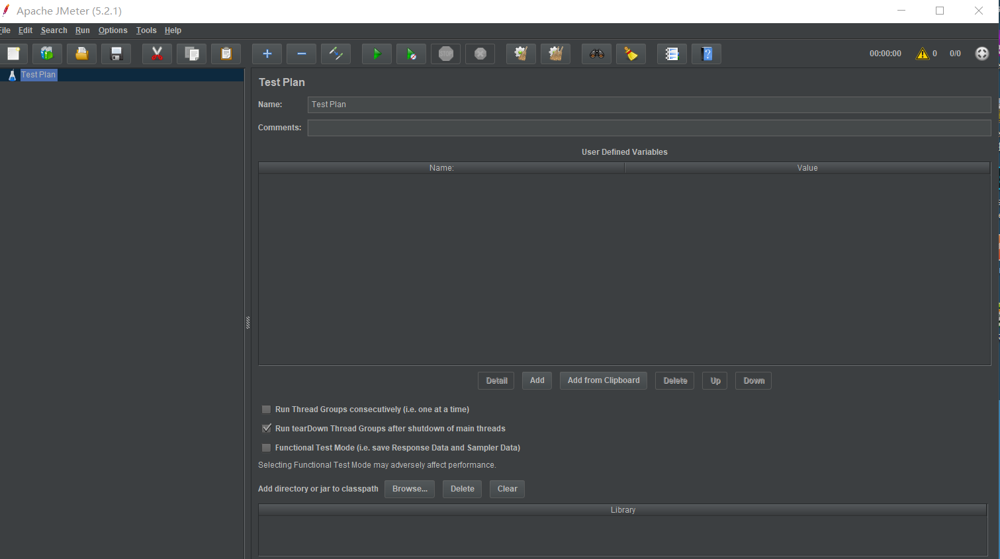
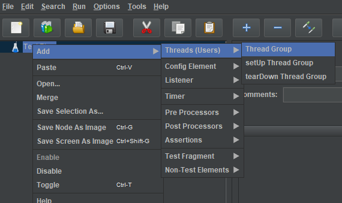
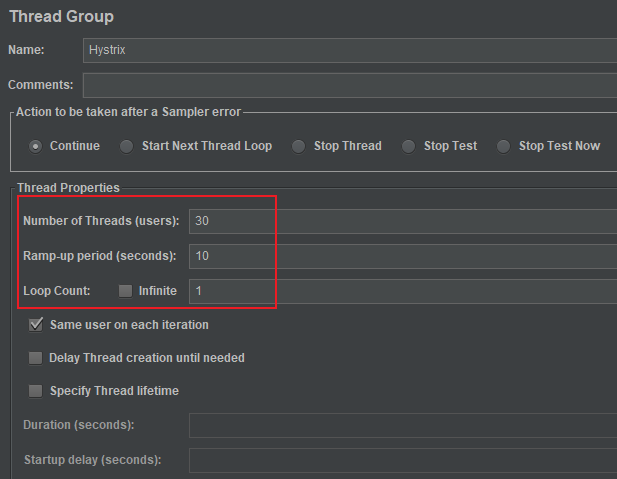
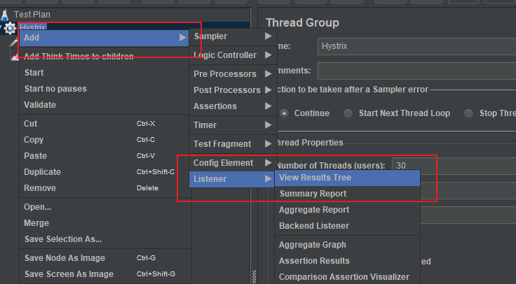
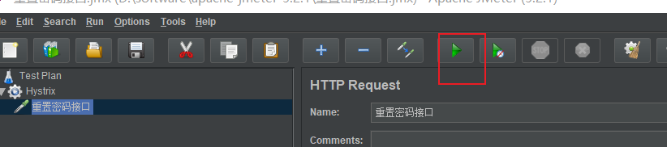

# <font color="orange">断路器：Hystrix</font>

## 1. 容错

微服务架构的系统通常会包含多个微服务，各个微服务可能部署在不同的机器上并通过网络进行通信，那么就不可避免会遇到 `网络请求超时`、`微服务不可用` 等问题，这就会进一步引起依赖它的微服务不可用，这样不断引发服务故障的现象称为『**雪崩效应**』，最终的结果是整个应用系统瘫痪。

针对上述问题，处理容错有以下常用手段：

-   超时重试

    在 HTTP 请求中通常会设置请求的超时时间，超过一定时间后我们<small>（主调方）</small>就会断开连接<small>（不再等待被调方的响应）</small>。

    在设置『超时』的同时，一般会配合设置请求『重试』，也就是在请求失败时再次自动发起请求，但要注意重试次数不能设置太多。

    具体的超时时间和重试次数需要结合具体的业务来指定。

-   熔断器

    使用熔断器模式，如果请求出现异常，所有请求都会直接返回，而不会等待或阻塞，这样可以减少资源的浪费。

    熔断器所造成的这种现象也叫『快速失败』。

    熔断器还有一种半开的状态，当熔断器发现异常后会进入半开状态，此时它会『放行一个请求』来检测被调系统是否已经恢复，如果请求调用成功，则代表被调系统已经恢复正常，那么就会关掉熔断器，否则继续打开。

    

-   限流

    由于被调系统处理能力时有限，如果请求方访问量过大会导致被调系统不可用。除了可以增加机器的物理配置，也可以对系统进行限流。常见的限流措施有控制并发数量。

## 2. Hystrix 简介

Hystrix 是 Netflix 公司推出的一款针对分布式系统延迟和容错的开源库，其设计目的是通过添加延迟容忍和容错逻辑，从而控制分布式服务之间的交互。

Hystrix 封装了微服务调用过程中的每一个依赖，使每个依赖彼此隔离，当延迟情况发生时，它会被限制在资源中，并包含回退<small>（fallback）</small>逻辑，该逻辑决定在依赖发生任何类型故障时应做出何种响应。

Hystrix 的目标是阻止级联故障，对通过第三方客户端访问的依赖的延迟和故障进行保护和访问。Hystrix 实现这一目标的大致思路如下：

1. 将外部依赖的访问请求封装在独立的线程中，进行资源隔离。
2. 对于超出设定阈值的服务调用，直接进行超时处理，不允许其消耗过长时间而导致线程阻塞。
3. 每个依赖服务维护一个独立的线程池，一旦线程池满了，直接拒绝服务调用。
4. 统计依赖服务调用的成功次数、失败次数、拒绝次数、超时次数等结果。
5. 在一段时间内，如果服务调用的异常次数超过一定的阈值，就会触发熔断器，停止对特定服务的所有请求。在一定时间内对服务降级，一段时间之后自动尝试恢复。
6. 如果某个服务出现调用失败、被拒绝、超时等异常情况，就会自动调用 fallback 降级机制。


> Hystrix 是使用在服务调用者，即，服务消费者一方的。也就是使用 RestTemplate / OpenFeign 的那方。

## 3. 集成并使用 Hystrix

> 再次强调 Hystrix 是用于服务的使用者一方的，即通过 RestTemplate / OpenFeign 发出 HTTP 请求的那一方。它是用于保护服务的使用者，避免它因为其所以依赖的服务提供者的崩溃而崩溃。

- 服务『**提供者**』的对外提供的接口<small>（简化到了最精简的情况）</small>：

  ```java
  @RequestMapping("/")
  public String welcome() {
      return "welcome to microservice-producer: " + port;
  }
  ```

- 服务『**调用者**』使用 RestTemplate 进行『调用』：

  ```java
  public String demo1() {
      String url = "http://MICROSERVICE-PRODUCER/"; // 这么使用时，别忘了用 @LoadBalanced 注解来激活 Ribbon 来替换 IP 和端口。
      return template.postForObject(url, null, String.class);
  }
  ```


### 3.1 集成

引入依赖：

- 在 Spring Initializer 中输入、搜索 **Hystrix** 。或

- 在 *Spring Cloud Circuit Breaker* 下选中 **Hystrix** 。

注意事项：

- pom 中实际引入的核心依赖是

  ```xml
  <dependency>
    <groupId>org.springframework.cloud</groupId>
    <artifactId>spring-cloud-starter-netflix-hystrix</artifactId>
  </dependency>
  ```


在服务<small>（使用者的）</small>入口启动类上面加上 **@EnableHystrix** 或 **@EnableCircuitBreaker** 注解，表示激活熔断器的默认配置。

> **@EnableHystrix** 注解是 **@EnableCircuitBreaker** 的语义化，它们的关系类似于 **@Service** 和 **@Component** 。


### 3.2 配置

Hystrix 的全局配置也称为默认配置，它们在配置文件中通过 **hystrix.command.default.\*** 来进行配置<small>（再次强调，Hystrix 是用于服务的调用方，所以这里的配置自然也是配置在服务的调用方这边）</small>。例如:

```yml
hystrix:
  command:
    default:
      execution:
#       timeout:
#         enabled: false # 直接关停 hystrix 的超时判断功能，或
        isolation:
          thread:
            timeoutInMilliseconds: 3000
```

> 无论我们的使用的是 RestTemplate 还是 OpenFeign，它们都会是使用到 Ribbon 的负载均衡<small>（和超时重试）</small>能力。而 Ribbon 也会监管请求超时问题。
> 
> 所以，理论上，Hystrix 的超时时长的判断标准应该大于 Ribbon 的超时重试的总耗时，否则，会出现 Ribbon 还在『努力』，但是 Hystrix 决定『放弃』的情况。<small>当然，这样也不是不行，只是有些不科学。</small>
> 
> 除了合理的参数值设置之外，你还可以直接关闭掉 Hystrix 的超时判断，完全由 Ribbon 来评判、上报<small>（给 Hystrix）</small>超时与否。

具体的配置项详情见 [这里](https://github.com/Netflix/Hystrix/wiki/Configuration) 。

默认情况下，Hystrix 的『超时』的判断标准为 1 秒。<small>这个设置明显偏小了点，将它调大，或关闭它。</small>

另外，常见的配置项还有：

- **metrics.rollingStats.timeInMilliseconds** ：统计窗口时间，单位毫秒。默认 `10000`，即 10 秒。

- **circuitBreaker.enabled**： 是否启用熔断器。默认值为 `true` 。

- **circuitBreaker.requestVolumeThreshold** ：窗口期内发生 N 个失败就触发熔断。断路器由『**关闭**』状态进入『**开启**』状态，默认值为 `20` 。

- **circuitBreaker.errorThresholdPercentage** ： 窗口期内发生 N% 的错误就触发熔断。断路器由『**关闭**』状态进入『**开启**』状态。默认值为 `50` ，即 50% 失败。

- **circuitBreaker.sleepWindowInMilliseconds** ：熔断后 N 毫秒才开始尝试恢复。断路器由『**开启**』状态转变为『**半开**』状态。<small>默认值 5000 ，即 5 秒钟。</small>

例如：

```yml
hystrix:
  command:
    default:
      execution:
        isolation:
          thread:
            timeoutInMilliseconds: 3000 # 超时阈值
      metrics:
        rollingStats:
          timeInMilliseconds: 10000
      circuitBreaker:
#       enabled: true     # 默认值即为 true
        requestVolumeThreshold: 20
        errorThresholdPercentage: 60
        sleepWindowInMilliseconds: 300000
```

全局配置完成之后，想让哪一个方法实现断路器功能，就在哪一个方法上加上注解 **@HystrixCommand** 。注意，这里的『**方法**』指的是调用了 Feign 或 RestTeamplte 的方法，通常就是 @Service 中的方法。

> **@HystrixCommand** 注解的背后也是 Spring AOP 动态代理思想。

```java
@HystrixCommand(fallbackMethod = "demo1FallBack")
public String demo1() {
    String url = "http://MICROSERVICE-PRODUCER/";
    return template.postForObject(url, null, String.class);
}
```

另外，**OpenFeign 已经整合了 Hystrix，但是默认情况下并未将其激活使用**。记得我们要将它打开：

```yml
feign:
  hystrix:
    enabled: true
```


### 3.3 验证


先后依次启动『注册中心』、『服务提供者』和『服务消费者』。

初始情况下，由于『服务提供者』是可用的，因此，『服务消费者』对外提供的服务也是可用的。


```java
@GetMapping("/")
public Map<String, String> doSomething() {
    System.out.println("do something ...");

    producerServiceClient.demo1();

    System.out.println("do other thing...");

    // 这里偷懒使用的 Map，没有定义 ResponseResult<T> 类。
    Map<String, String> result = new HashMap<>();
    result.put("code", "10086");
    result.put("message", "do something 成功");
    return result;
}
```

可通过 postman 验证。结果如下：

```json
{
    "code": "10086",
    "message": "do something 成功"
}
```

现将『服务提供者』关闭，造成『**服务不可用**』情况。毫无疑问，此时『服务使用者』理应受到影响，其对外提供的服务也会出问题。

可通过 postman 验证。

返回结果如下：

```json
{
    "timestamp": "日期时间",
    "status": 500,
    "error": "Internal Server Error",
    "message": "... timed-out and fallback failed.",    看这里，看这里，看这里
    "path": "..."
}
```

新版本返回的结果中的 **message** 的内容有所变化，**timed-out** 变为了 **failed** ，显示为：

```json
"message": "... failed and no fallback available.",
```

注意，此时熔断器还未被激活，它还没有开始阻止你去访问目标服务，因此，你每次都去调用目标服务，辛辛苦苦等半天，最后得到一个 time-out，而不是预期中的结果 。
 

---

通过 jmeter 模拟短时大量请求，达到服务使用者<small>（eureka-client-consumer-feign）</small>的熔断标准。

通过 jmeter 5 秒内对服务使用者<small>（eureka-client-consumer-feign）</small>发出 60 次请求。

1. 下载后解压到你系统下的任意目录，然后运行其 **bin/jmeter.bat** 文件

   

2. 右键 **Test Plan** > **Add** ，新建线程组。一个线程模拟一个用户，新建线程组就是新建一组用户。

   

    
3. 模拟时间窗口（Ramp-up period）10 秒钟内，执行 30 次（users）请求，执行 1 轮（Loop Count）。你可以调整这些参数以满足我们定义的服务熔断标准。

   


4. 添加测试样本（访问接口）

   

   
    

5. 添加 Results Tree（结果查看树）

   

6. 启动测试的方法

   


再次通过 postman 向服务使用者<small>（eureka-client-consumer-feign）</small>发出请求时，你会发现它的响应信息发生了变化，返回的响应的 message 中会出现 **short-circuited** 字样：

```json
{
    "timestamp": "日期时间",
    "status": 500,
    "error": "Internal Server Error",
    "message": "... short-circuited and fallback failed.", 看这里，看这里，看这里
    "path": "..."
}
```

此时，熔断器已经被激活生效。它的效果就是：它会拦截、阻止 RestTemplate 发起请求。Hystrix 基于之前的失败的经历，认为你本次调用大概率还是会失败，因此它直接告诉你调用调用失败。这就是所谓的快速失败<small>（fast fail）</small>。

并且，在未来的 5 分钟内，哪怕是『服务提供者』已经恢复正常了，『服务使用者』也不会真调用它，依然认为调用失败。


## 4. 服务降级（failback）

当『服务消费者』的熔断器『**起来干活**』后，我们调用它的服务时，得到的错误信息如下：

```json
{
    "timestamp": "日期时间",
    "status": 500,
    "error": "Internal Server Error",
    "message": "... short-circuited and fallback failed.", 看这里，看这里，看这里
    "path": "..."
}
```

这样的响应结果，提供给用户显然是不够友好的。上面的提示信息有两层含义：

- 服务熔断被触发，也就是断路器处于开启状态；

- 断路器被触发之后，访问 fallback 方法，但是这个 fallback 方法我们之前没有定义。

当服务提供者故障触发熔断机制，此时我们可以预先提供一个处理方法，作为降级后的执行方法一般叫 **fallback** ，fallback 方法返回值一般是设置的默认值或者来自缓存，或者是一些友好提示信息。

以下写法仅作了解，后续我们主要是结合 OpenFeign 使用：

```java
@HystrixCommand(fallbackMethod = "demo2")
public String demo1() {
    String url = "http://SELF-DEPARTMENT/";
    return template.postForObject(url, null, String.class);
}

public String demo2() {
    return "error";
}
```

这个时候，当 demo1<small>（中的 RestTemplate）</small>执行失败时，demo2 方法会执行，demo2 的返回值将作为 demo1 的返回值的替代返回。


## 5. 配置单个 HystrixCommand（了解）

很显然，我们之前在 .yml 中的有关 Hystrix 的配置时全局配置，因为它的名字叫 **default** ：

```yml
hystrix:
  command:
    default:  # 这里，default 代表默认配置、全局配置。
      execution:
        isolation:
          thread:
            timeoutInMilliseconds: 3000
      metrics:
        rollingStats:
          timeInMilliseconds: 10000
      circuitBreaker:
#       enabled: true   # 默认值为 true
        requestVolumeThreshold: 20
        errorThresholdPercentage: 60
        sleepWindowInMilliseconds: 300000
```

**default** 配置对所有的 **@HystrixCommand** 生效，除非这个 **@HystrixCommand** 用自己的配置去屏蔽 default 配置。

```java
@HystrixCommand(
    fallbackMethod = "demo2",
    commandProperties = {
        @HystrixProperty(name = "execution.isolation.thread.timeoutInMilliseconds", value = "1000"),
        @HystrixProperty(name = "...", value = "..."),
        @HystrixProperty(name = "...", value = "...")
    }
)
public String demo1() {
    String url = "http://SELF-DEPARTMENT/";
    return template.postForObject(url, null, String.class);
}
```


## 6. Feign 指定 fallback

在接口注解 **@FeignClient** 中指定 fallback 。

> 首先你要启用 Feign 的 hystrix 配置的开关：
> 
> ```yml
> feign:
>   hystrix:
>     enabled: true
> ```
> feign 整合了 Hystrix 但是默认未激活使用。


```java
@FeignClient(value = "producer-mail", fallback = 看这里)
public interface MailService {
    ...
}
```

这种方式的 fallback 配置中，需要你『**额外地**』为接口去编写一个实现类。显而易见，这个实现类中的各个方法，就是接口中各个远程调用方法的对应的 fallback 。

```java
@Component  // 别忘了这里
public class MailServiceFallback implements MailService {

    @Override
    public Map<String, String> send(String to, String content) {
        Map<String, String> result = new HashMap<>();
        result.put("code", "10086");
        result.put("message", "内部错误，请稍后再试");
        return result;
    }

}
```

这样，但凡是调用 MailService 的服务的方法，出现调用失败时，都会使用这个类下的各个方法作为 fallback 。

## 7. Hystrix 的超时和重试

```yml
hystrix:
  command:
    default:
      execution:
        timeout:
          enabled: true
        isolation:
          thread:
            timeoutInMilliseconds: 3000   # 默认 1000，短得有点过分了。
```

由于，Hystrix、OpenFeign、Ribbon 它们三者的调用层次顺序是：

```
hystrix
└── openfeign
    └── ribbon
```

最底层的是 ribbon ，因此是 ribbon 先进行重试，如果重试不成功<small>（抛异常）</small>，hystrix 会再次调用 openfeign 发请求，重试。

而由于 Ribbon 的超时重试次数是 

    (1 + MaxAutoRetries ) x (1 + MaxAutoRetriesNextServer)
  
因此，理论上 Hystrix 的超时阈值应该：

    超时阈值 > (ribbon 的最大重试次数 x readTimeout)

这样，才能保证 Ribbon 重试的时候不被 Hystrix 熔断。否则 Hystrix 命令超时后，该命令直接熔断，Ribbon 的重试工作就会被强行终止，导致出现『Ribbon 还想抢救一下，但是 Hystrix 决定放弃的情况』。当然，这样不是不可以，只是显得不科学。

## 8. Hystrix 的线程池隔离策略

默认情况下 Hystrix 是使用线程池作为隔离策略。在这种策略下，每一个 OpenFeign Client 准备了独立的线程池，但凡是对这个 OpenFeign 的调用，Hystrix 都会将方法的调用代码放进从线程池中取出的一个线程里执行。

当线程池中的线程耗完<small>（所有请求均未返回）</small>时，Hystrix 就会触发 Openfeign 的 fallback 逻辑。

```yml
hystrix:
  threadpool:
    default:
      coreSize: 200
      maxQueueSize: 1000
      queueSizeRejectionThreshold: 800 
```

| 参数 | 说明 |
| :-------------------------- | :--------------------------------------------- |
| coreSize                    | 并发执行的最大线程数，默认 10                  |
| maxQueueSize                | BlockingQueue 的最大队列数，默认值 -1          |
| queueSizeRejectionThreshold | 即使 maxQueueSize 没有达到，达到 queueSizeRejectionThreshold 该值后，请求也会被拒绝，默认值 5 |


## 9. 其它

除了线程池之外，Hystrix 还可以使用信号量来作资源隔离。

使用信号量隔离需要显示地将属性 execution.isolation.strategy 设置为 `semaphore`<small>（它和 thread 一样，都是定义在 ExecutionIsolationStrategy 枚举中的）</small>，同时配置信号量个数，默认为 10 。

客户端需向依赖服务发起请求时，首先要获取一个信号量才能真正发起调用，由于信号量的数量有限，当并发请求量超过信号量个数时，后续的请求都会直接拒绝，进入 fallback 流程。

即，发起请求是信号量减一，接收到响应后信号量加一。

信号量隔离主要是通过控制并发请求量，防止请求线程大面积阻塞，从而达到限流和防止雪崩的目的。
