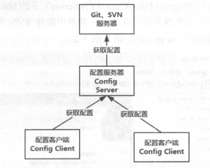

# <font color="orange">配置中心：Spring Cloud Config</font>

在实际使用场景中，集群中会存在多个微服务，而每个服务又有可能存在多个实例。如果每一个微服务都是靠自己的 **application.properties** 或 **application.yml** 进行配置，那么整个项目的配置就会繁琐为混乱。例如：

多个 Service Producer 使用的是用一个数据库。理论上，可以在各个项目中配置数据库连接相关配置。但是，如果一旦有变动，如数据库所在主机的 IP 变动了，那么你需要改很多处地方，而且还必须确保无一遗漏。

因此 Spring Cloud 为我们集成了『**配置中心**』：**spring-cloud-config** 组件。

Spring Cloud Config 是一个高可用的分布式配置中心，专门用于管理系统的所有配置，也就是我们将所有配置文件放到统一的地方进行管理。

- **Config Server**：负责向各个子系统提供配置信息；

- **Config Client**：各个子系统。各个项目各自从 **Config Server** 去『拉取』属于自己的配置信息。

  <font color="red">**注意**</font>：和 Eureka Client 拉取注册表不一样，各个子系统『拉取自己的配置』只拉取一次，一旦拉取成功后这些配置信息就缓存在了各个子系统的本地。


## 1. Config Server 本地存储配置文件 

最简单的注册中心的配置管理方式是各个微服务的相关配置以 .properties 或 .yml 配置文件的形式存储在 Config Server 的磁盘上。

1.  加依赖

    在 spring starter 中引入：*Spring Web* 和 **Config Server** 。

    这个扮演 **Config Server** 角色的 Spring Boot 项目负责在它的本地维护一批配置文件。

2.  加注解

    在启动类上加入 **@EnableConfigServer** 注解，标识本项目的『身份』是 Config Server，并激活相关配置。

3.  加配置

    编写 Config Server 的 **application.yml** 配置文件，并写入如下内容：

    ```yml
    server:
      port: 3301
    spring:
      application:
        name: config-server
      cloud:
        config:
          server:
            native:
              search-locations: classpath:/xxx
      profiles:
        active: native
    ```

    在 Config Server 项目的 classpath<small>（resources）</small>下，创建 `xxx` 文件夹，并在下面创建一个名为 `xxx-service-dev.yml` 的配置文件。这个配置文件的文件名有 2 处需要我们注意的：`xxx-sesrvice` 和 `dev`，后面我们会用到它们两个。


以特定规则的 URI 访问 Config Server，可以看到它对外『暴露』出来的配置信息：

    /<子系统-application-name>/<profile-name>

你所看到的 JSON 内容中就会有 application-name-profile.yml 配置文件中的配置信息。

```json
{
    "name":"xxx-service",
    "profiles":["dev"],
    "label":null,
    "version":"bcbf31dfa30218c9282f6d5eca23364188b803cf",
    "state":null,
    "propertySources":[{
        "name":"https://gitee.com/hemiao3020/config-only-a-demo.git/config/config-single-client-dev.yml",
        "source":{
            "logging.level.root": "WARN",
            ...
        }
    }]
}
```


## 2. 简单的 Config Client 

1.  加依赖

    在 Spring Initializer 中引入：*Spring Web* 和 **Config Client** 。

    这里注意的有 2 点：

    1. 如果是在 Initializer 界面上选择，**不要错选成了 Config Client (PCF)** 。

    2. 如果是手写 pom 中的依赖，Config Client 引入的依赖『**不是想当然的 spring-cloud-config-client**』 。

2.  加配置

    Config Client 是要去『**连接**』Config Server，从中去取属于自己<small>（指定）</small>的配置项。因此，与连接相关的配置，必须要写在 Config Client 的 **bootstrap** 配置文件中。

    ```yml
    spring:
      application:
        name: xxx-service
      cloud:
        config:
          uri: http://127.0.0.1:3301
          profile: dev
    ```

毫无疑问，它所取到的配置，就是 [*http://127.0.0.1:3301/xxx-service/dev*](http://127.0.0.1:3301/xxx-service/dev) 中所记录的。


## 3. Git 服务器 

Config Server 还支持将配置文件存储与 Git Server 和 SVN Server 上。

当然这就是 Config Server 和 Git Server、SVN Server 之间的事情，和 Config Client 无关。Config Client 并不关系 Config Server 上的配置信息来源于哪里。



> 由于 github 网速较慢，因此，这里使用的是 gitee 。不过，实际中可能会是使用 gitlab、gogs、gitea 等搭建局域网的 Git 服务器。

创建的仓库地址为：[配置中心仓库](https://gitee.com/hemiao3000/config-only-a-demo.git)

目录结构如下：

```
仓库
│── config
│   │── xxx-service-dev.yml
│   │── xxx-service-test.yml
│   │── xxx-service-prod.yml
│   │── xxx-service-test.yml
│   │── yyy-service-dev.yml
│   │── yyy-service-test.yml
│   └── yyy-service-prod.yml
│── 其他文件...
└── 其它目录...
```

很显然，上面的 `xxx-service` 和 `yyy-service` 是两个子系统的 application name 。

以最常见的日志格式为例，这些配置文件中的内容，可以是日志的级别和格式设置：

```yml
logging:
  level:
    root: WARN
    com.woniu: DEBUG
    com.example: DEBUG
  pattern:
    console: "${CONSOLE_LOG_PATTERN:\
      %clr(${LOG_LEVEL_PATTERN:%5p}) \
      %clr(|){faint} \
      %clr(%-40.40logger{39}){cyan} \
      %clr(:){faint} \
      %m%n${LOG_EXCEPTION_CONVERSION_WORD:%wEx}}"
```

配置文件的内容大致如下，用于区分，略有不同。

<font color="red">**注意**</font>：并非必须是 **.yml** 文件，配置文件格式为 **.properties** 文件也行。


## 4. Config Server 和 Git 远程仓库 


现在扮演 **Config Server** 角色的 spring-boot 项目就要负责连接到 Git 中央仓库，并从中下载所有子项目的配置项。

因此，显而易见，Config Server 要配置连接 Git 中央仓库的一些必要属性：

编写 `application.yml` 配置文件，并写入如下内容：

```yml
server:
  port: 3301
spring:
  application:
    name: config-server
  cloud:
    config:
      server:
        git:
          uri: https://gitee.com/woniuwh/woniu-config.git
          username: woniuwh
          password: 123456abc
          default-label: master
          search-paths: config
```

上面的配置所表达的意思是： 以 `<username>` 和 `<password>` 登录到 Git 仓库，，从 `<uri>` 下载一个 Git 版本库。并且，从它的 `<default-label>` 分支下的 `<search-paths>` 目录下找配置文件，并加载它们所记录的配置项。

这里需要说明 2 点：

1.  **default-label** 配置的作用

    由于 Git 仓库是有『**分支**』的概念，因此，逻辑上 xxx 文件在 Git 仓库中是可能有多份的。所以，这里要指定分支。

2.  **search-paths** 配置的作用

    Config Server 不强求这个 Git 仓库是专用于它的，也就是说，Git 仓库中可以有其它的、和 Config Server 功能不相关的其它文件夹和文件。因此，你要明确指出 Git 仓库中的哪个文件夹是用于 Config Server 的。

在 Config Server 项目的启动类上加入 **@EnableConfigServer** 注解，标识本项目的『**身份**』是 Config Server，并激活相关配置 。 

现在以特定规则的 URI 访问 Config Server 项目，可以看到它从 Git 中央仓库拉下来的各个子系统的配置项：

    /<子系统-application-name>/<profile-name>[/{分支-name}]

其中 **分支-name** 不是必须的，默认是 **master** 分支。

例如：

```txt
http://127.0.0.1:3301/xxx-service/dev
```

这意味着你要向 Config Server 查看 **config-single-client** 子系统的 **dev** 环境的配置。


在 **propertySources** > **source** 下就是对应的配置文件的内容。


> 实际上除了上述规则，URL 还可以使用如下规则：
> 
> ```
> /{application}-{profile}.yml
> /{application}-{profile}.properties
> /{label}/{application}-{profile}.yml
> /{label}/{application}-{profile}.properties
> ```


## 5. 访问 Git Config Server 的 Config Client 

Config Client 是要去『**连接**』Config Server，从中去取属于 Config Client 自己的配置项。

与连接相关的配置，必须要写在 Config Client 的 **bootstrap** 配置文件中。

```yml
spring:
  application:
    name: config-single-client
  cloud:
    config:
      uri: http://127.0.0.1:3301
      label: master
      profile: dev
```

    /<子系统-application-name>/<profile-name>[/{分支-name}]

毫无疑问，它所取到的配置，就是 [*http://127.0.0.1:3301/config-single-client/dev/master*](http://127.0.0.1:3301/config-single-client/dev/master) 中所记录的。

---

另外，Config Client 可以将 **bootstrap.yml** 写成如下形式，方便未来切换配置：

> 在 yml 文件中，以 **---** 作为配置段的开始的标识。

```yml
spring:
  profiles:
    active: dev

---
spring:
  profiles: prod
  application:
    name: config-single-client
  cloud:
    config:
      uri: http://127.0.0.1:3301
      label: master
      profile: prod

---
spring:
  profiles: dev
  application:
    name: config-single-client
  cloud:
    config:
      uri: http://127.0.0.1:3301
      label: master
      profile: dev
```


在 Config Client 中可以通过属性注入来验证是否获取到了配置项的值。

```java
@Value("${spring.datasource.driver-class-name}")
private String driverClassName;
```

---

另外，你还可以在 **application.yml** 的配置文件中编写同名配置，这样，当 Config Client 无法访问 Config Server 时，就会以 **application.yml** 中的配置项的值为准。


## 6. 刷新配置（了解、自学）

Spring Cloud Config 在项目启动时加载配置内容这一机制，导致了它存在一个缺陷：修改配置文件内容后，不会自动刷新。

例如我们上面的项目，当服务已经启动的时候，去修改 gitee 上的配置文件内容，这时候，再次刷新页面，对不起，还是旧的配置内容，新内容不会主动刷新过来。

但是，总不能每次修改了配置后重启服务吧。因此 Spring Config 提供了一个刷新机制，但是需要我们主动触发。那就是 **@RefreshScope** 注解并结合 *spring-boot-actuator* 。

1. 在 config client 端配置中增加 actuator 配置。

```xml
<dependency>
    <groupId>org.springframework.boot</groupId>
    <artifactId>spring-boot-starter-actuator</artifactId>
</dependency>
```

application.properties

```properties
management.endpoints.web.exposure.include=*
```

这里开放了 config client 端的 actuator 的所有端点/功能，不过实际上我们要用到的仅仅是 */actuator/refresh* 。

2. 在 config client 端的类上增加 **@RefreshScope** 注解，我们是 controller 中使用配置，所以加在 controller 中。

再次说明，以上都是在 config client 端做的修改。与 config server 无关。

之后，重启 client 端，重启后，我们修改 gitee 上的配置文件内容，并提交更改，**再次刷新页面，没有反应** 。

接下来，我们发送 **POST** 请求到 `http://localhost:3302/actuator/refresh` 这个接口。<small>用 postman 之类的工具即可</small>。

此接口就是用来触发加载新配置的，返回内容如下:

```json
[
    "config.client.version",
    "<变动过的配置项名>"
]
```

## 7. 结合 Eureka 使用 Spring Cloud Config 

我们可以将 Config Server 注册到 Eureka Server 注册中心，这样，各个 Config Client 就可以自己去 注册中心『**获取**』到 Config Server 的访问方式，而不用它们自己去记忆、配置。

注意，这里有两种关系：

- Eureka Server 和 Eureka Client；

- Config Server 和 Config Client。

Config Server 在 Eureka 关系中是 Eureka Client 。


- Config Server

  1. 添加 Eurek Client 依赖；

  2. 添加连接到 Eureka Server 的配置；

  3. 留意 Config Server 的 application name，未来，Config Client 就是通过这个 name 来获取 Config Server 的访问方式。

- Config Client

  1. 添加 Eurek Client 依赖;

  2. 添加连接到 Eureka Server 的配置；

  3. 注意，这里使用的是 **@EnableDiscoveryClient** 注解，不是 *@EnableEurekaClient* 。<small>它们两者的功能是独立的，不冲突。</small>

  4. 用新的配置项替换到 **spring.cloud.config.uri** 配置项：

     ```yml
     spring:
       cloud:
         config:
           discovery:
             enabled: true
             service-id: git-config-server
     ```
