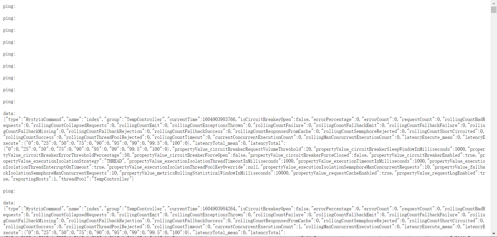
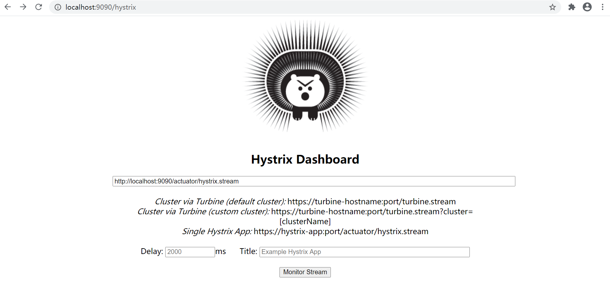
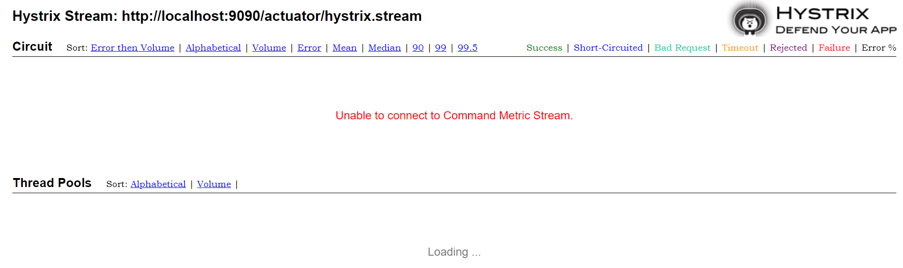
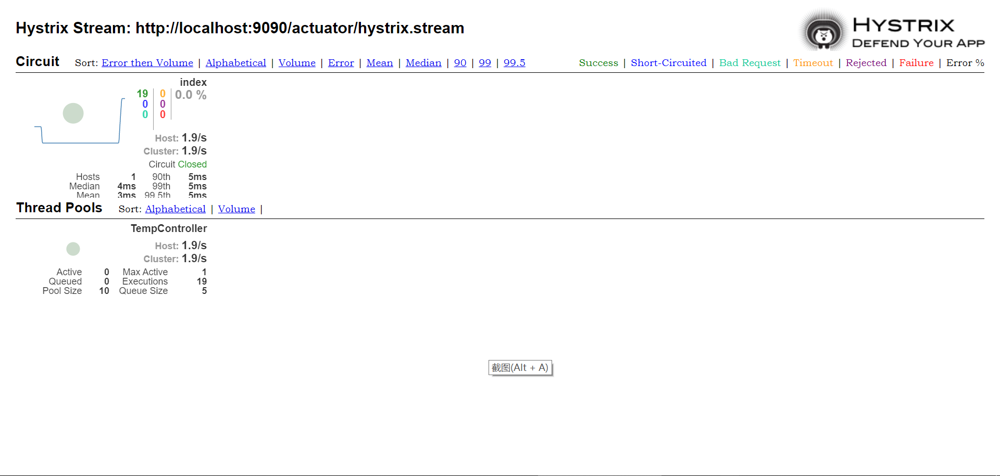
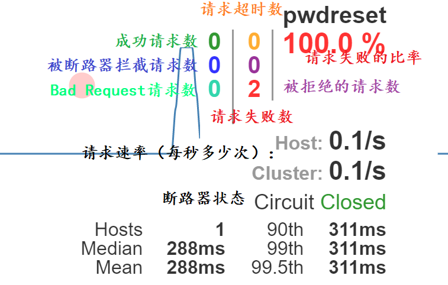
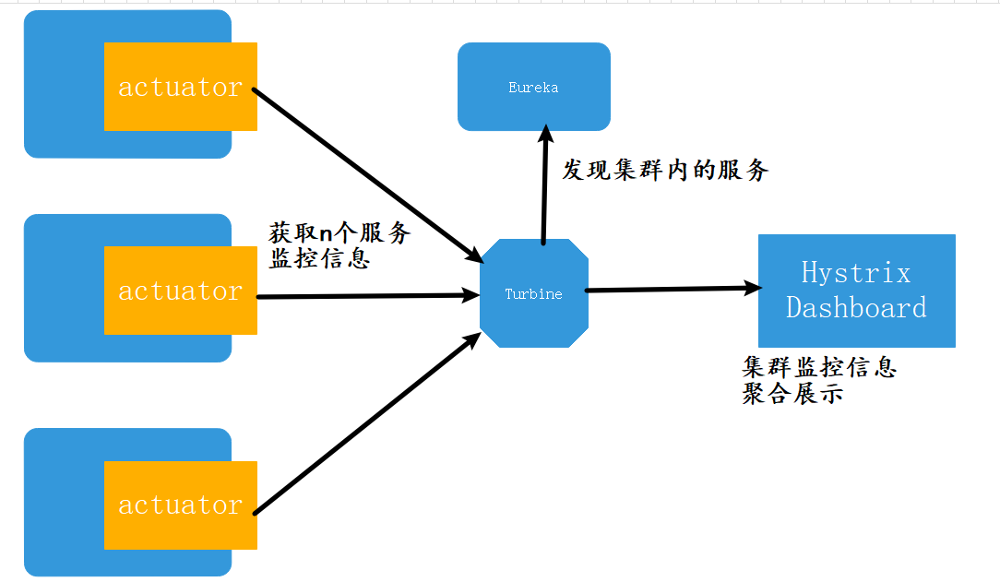
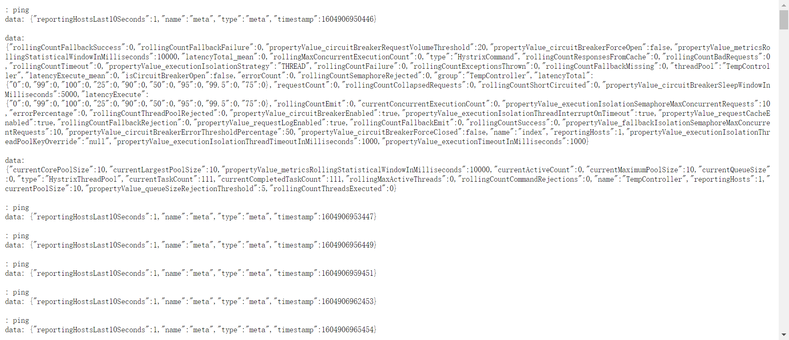
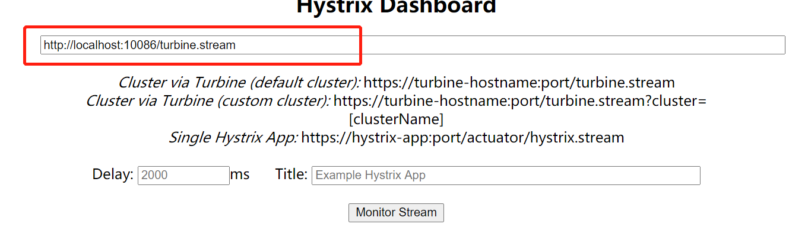

# <font color="orange">Hystrix-DashBoard 服务监控</font>

## 1. 单服务监控 

在使用了 Hystrix 进行服务熔断降级之后，我们亟待于有一种方式可以查看 Spring Cloud 微服务各个节点的哪些方法接口触发了熔断、请求成功数量、请求失败数量，包括断路器状态、服务请求频率等信息。

运维人员对这些信息进行观察、分析之后，才能有效的进行服务的扩容、调整，从而更好地满足微服务系统的高并发以及高可用的要求！

<font color="red">**注意**</font>：由于 Hystrix 是作用于服务的发起方的，所有我们这里贯彻的是请求发起方的 Hystrix 的实时信息，当然，这也间接反映出了请求接收方的运行状态。

在整个监控体系中，角色有 3 个：

| 注册中心      | 服务提供者    | 服务调用者            |
| :------------ | :------------ | :-------------------- |
| eureka-server | eureka-client | eureka-client         |
| *actuator*    | web           | web                   |
|               | *actuator*    | hystrix               |
|               |               | **hystrix-dashboard** |
|               |               | **actuator**          |


### 1.1 step 1. 对外暴露 **hystrix.stream** 端点

未来，Hystrix Dashboard 要通过访问 Hystrix 所在服务的 actuator 的 `hystrix.stream` 端点，来获得 Hystrix 的运行情况，其中就包括Hystrix 所统计的对外发起调用的成功、失败、熔断等情况。

因此，我们首先要 **hystrix.stream** 端点可访问。否则，你访问该该端点的 URL 时会出现 404 错误。

```yml
management:
  endpoints:
    web:
      exposure:
        include: refresh, health, hystrix.stream
#       include: "*"
```

通过配置，开放 actuator 的 **hystrix.stream** 端点后，你可以通过 [*http://localhost:9090/actuator/hystrix.stream*](http://localhost:9090/actuator/hystrix.stream) 查看到服务调用者的熔断信息。

但是，在初次访问时，你会看到大量的滚动的 ***ping*** 字样，而无实际内容！这是因为，服务调用着还未发出对提供者的远程调用，因此 Hystrx 的熔断功能一次执行机会都没有。



你需要手动触发服务调用者的某个功能，进而使它去向服务提供者发出远程请求。在此之后，你在页面上会看到滚动的大段的 Hystrix 相关信息。


### 1.2 step 2: 启用 hystrix-dashboard

为『**服务使用者**』添加 **@EnableHystrixDashboard**，启用其 Hystrix Dashboard 功能。前提是它有 hystrix dashboard 依赖 。

在启用 Hystrix Dashboard 功能之后，通过网址 [*http://localhost:9090/hystrix*]([http://localhost:9090/hystrix]) 你可以看到 Hystrix Dashboard 自带的监控页面。



按照页面上的提示，在输入框中输入需要观测的 URI，也就是上一步中的那个 `actuator/hystrix.stream` 网址。

理论上，你本应该看见该看见的内容，但是实际上并没有：



并且，在『服务调用者』的控制台你会看见 WARN 信息：

```sh
Origin parameter: http://localhost:9090/actuator/hystrix.stream is not in the allowed list of proxy host names. If it should be allowed add it to hystrix.dashboard.proxyStreamAllowList
```

按照提示信息，将你要观察的 URL 添加到 hystrix 的 **proxy-stream-allow-list** 配置项中。这相当于是一个白名单。

```yml
hystrix:
  dashboard:
    proxy-stream-allow-list: localhost, 127.0.0.1
```





页面上的关键指标如下：





## 2. Hystrix-dashboard 集群监控

我们只能每次监控一个服务。在大型的微服务系统中动则几百微服务，还是需要一种把监控信息聚合起来的方式，方便我们发现集群内个服务节点中的问题。




> 我们上面的例子中，为了简便起见，hystrix-dashboard 和服务调用者是同一个项目。按道理，应该创建一个单独的 hystrix-dashboard 项目来监控其它各个服务的熔断器状态。

新建一个 Turbine 项目：

1.  加依赖：

    - eureka-client
    - netflix-turbine

2.  加注解:

    在启动类上使用 **@EnableTurbine** 注解开启 Turbine 功能。

3.  加配置：

    在 application.yml 加入 Eureka Client 和 Turbine 的相关配置：

    ```yml
    server:
      port: 10086

    # 其它配置和 Eureka Client 配置略。

    turbine:
      app-config: CONSUMER
      cluster-name-expression: new String("default")
      combine-host-port: true
    ```

    - **turbine.app-config**：指定需要收集监控信息的服务名，多个服务名之间用逗号分隔。

    - **turbine.combine-host-port**：设置为 `true` ，可以让同一主机上的服务通过主机名与端口号的组合来进行区分。默认情况下会以 host 来区分不同的服务，这会使得在本地调试的时候，本机上的不同服务聚合成一个服务来统计。

    - **turbine.cluster-name-expression**：指定集群名称为**default**。当我们服务数量非常多的时候，可以启动多个 Turbine 服务来构建不同的聚合集群，而这个参数可以用来区分这些不同的聚合集群，同时这个参数值可以在 Hystrix Dashboard 中用来定位不同的聚合集群，只需要在 Hystrix Stream 的 URL 中通过 cluster 参数来指定。

    <font color="red">**注意**</font>：`default` 这个一定要用 `new String("...")` 来『包』一下，否则有 bug 。


访问 Turbine 的 *http://localhost:10086/turbine.stream* ，你可以看到如下的文字信息：




访问 Hystrix Dashboard 并对http://localhost:10086/turbine.stream 聚合结果进行监控：




