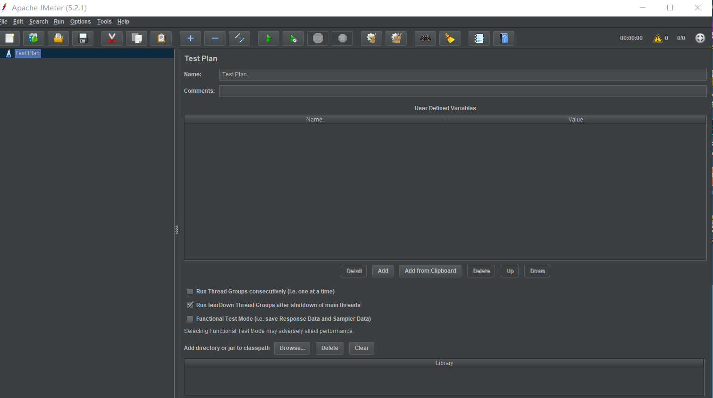
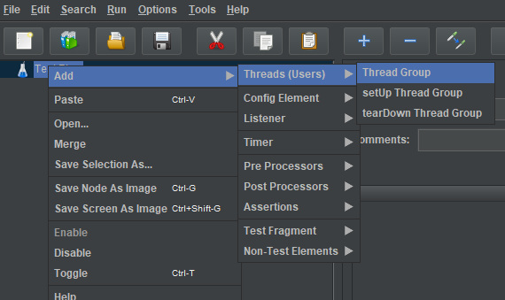
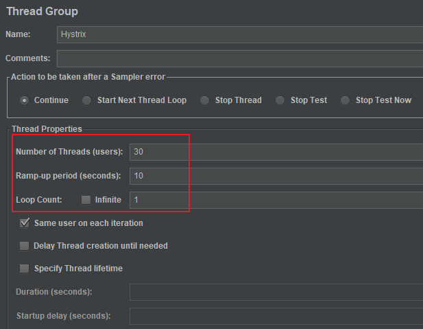
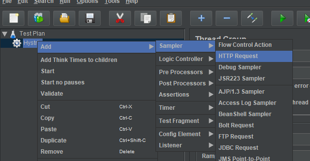
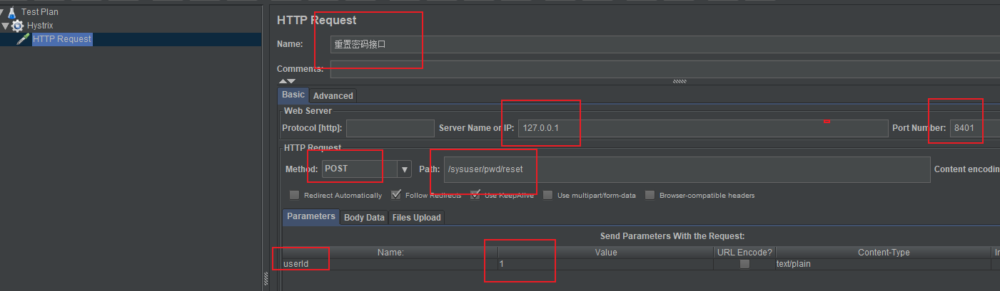
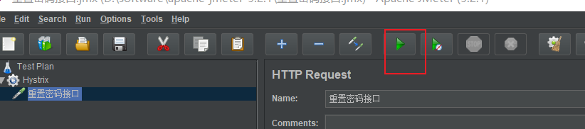

# Apache JMeter

Apache JMeter 是 Apache 组织开发的基于 Java 的压力测试工具。用于对软件做压力测试，它最初被设计用于Web应用测试，但后来扩展到其他测试领域。它可以用于测试静态和动态资源，例如静态文件、Java 小服务程序、CGI 脚本、Java 对象、数据库、FTP 服务器， 等等。

JMeter 可以用于对服务器、网络或对象模拟巨大的负载，来自不同压力类别下测试它们的强度和分析整体性能。另外，JMeter 能够对应用程序做功能/回归测试，通过创建带有断言的脚本来验证你的程序返回了你期望的结果。为了最大限度的灵活性，JMeter 允许使用正则表达式创建断言。

 

---

 

1. 下载后解压到你系统下的任意目录，然后运行其 **bin/jmeter.bat** 文件

   

2. 右键 **Test Plan** > **Add** ，新建线程组。一个线程模拟一个用户，新建线程组就是新建一组用户。

   

    
3. 模拟时间窗口（Ramp-up period）10 秒钟内，执行 30 次（users）请求，执行 1 轮（Loop Count）。你可以调整这些参数以满足我们定义的服务熔断标准。

   

4. 添加测试样本（访问接口）

   

   
    

5. 添加 Results Tree（结果查看树）

   

6. 启动测试的方法

   

