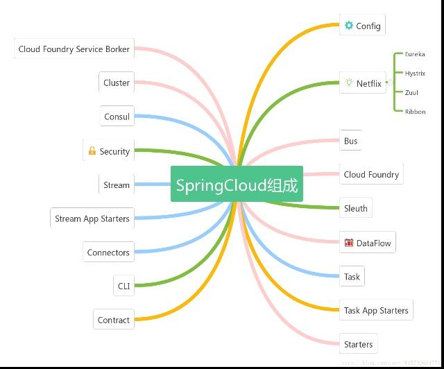
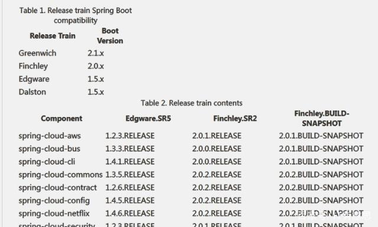
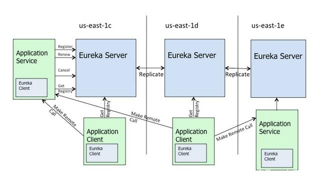
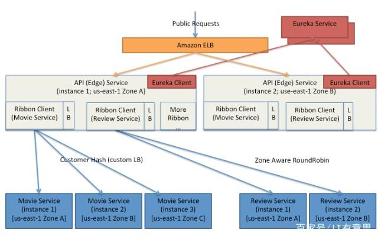
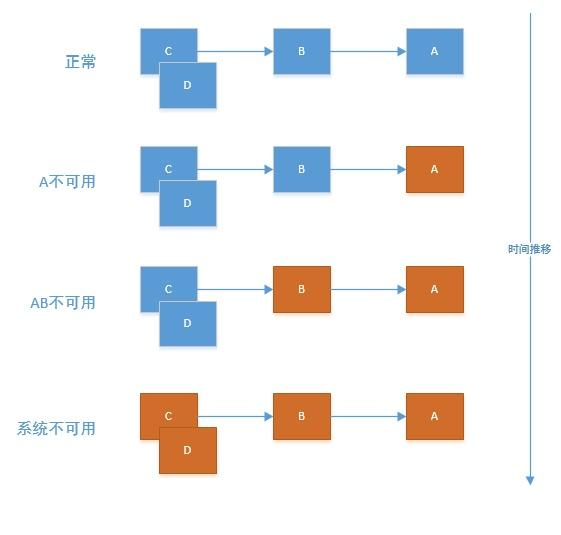

# Spring Cloud 简介与 5 大常用组件

什么是微服务?

- 微服务架构是将应用拆分成多个微型应用，共同组成一个应用系统；
- 每一个微服务都是一个独立的微型应用，拥有自己的独立数据库等资源，可以独立开发、测试和部署；
- 微服务间通过 HTTP 等轻量级的通信协议来相互调用；
- 微服务的部署常常用 docker 或者云虚拟机等技术实现自动化部署。

微服务的优点：

- 降低单个引用复杂性，将巨大的单体应用拆分成多个服务，整个应用的复杂性被分摊到多个服务；
- 技术选型更灵活，每个服务可以独立开发，选用不同的技术实现，发挥各种技术的特长；
- 部署效率高，每个服务独立部署，不需要部署整个应用，持续部署成为可能；
- 可以局部扩容，每个服务可以独立扩展，针对不同的服务的不同压力可以自由选择扩展。

引入微服务的代价：

- 引入额外的复杂性。比如网络需要保证通畅；需要额外的通信失败处理等；
- 开发模式改变，上下游系统关系复杂，依赖众多，需要更好的技术理解能力；
- 测试的复杂度增加，测试某个应用时需要开启多个相关应用，集成测试工作量增加；
- 部署和运维的复杂程度增加，部署数量增多，关系复杂。

Spring Cloud 是微服务架构的集大成者，将一系列优秀的组件进行了整合。基于 Spring Boot 构建，对我们熟悉 spring 的程序员来说，上手比较容易。

通过一些简单的注解，我们就可以快速的在应用中配置一下常用模块并构建庞大的分布式系统。

Spring Cloud 的组件相当繁杂，拥有诸多子项目。重点关注 Netflix 。

## springcloud 的版本说明：

springcloud 项目是由多个独立项目集合而成的，每个项目都是独立的，各自进行自己的迭代和版本发布。所以 springcloud 不方便使用版本号来管理，而是使用版本名。以避免和子项目版本号的冲突。

版本名的来源是伦敦的地铁站名，以字母排序。比如最早的 Release 版本为 Angel，第二个 Release 版本为 Brixton 。

当一个版本的 update 积累的比较多或者解决了一个严重 bug 时，会发布一个 Service Release 版本，简称 SR，后面带的数字就是该大版本下的第一次发布。

从官网上看，springcloud 的 F 版本是基于 springboot 的 2.0.x 构建，之前的是基于 springboot 的 1.5.x 构建

## 下面只简单介绍下经常用的 5 个

| 功能 | 组件 |
| :- | :- |
| 服务发现 | Netflix Eureka |
| 客服端负载均衡 | Netflix Ribbon |
| 断路器 | Netflix Hystrix |
| 服务网关 | Netflix Zuul |
| 分布式配置 | Spring Cloud Config |

## Eureka

- 作用：
  
  > 实现服务治理（服务注册与发现）
  
- 简介：
  
  > Spring Cloud Eureka 是 Spring Cloud Netflix 项目下的服务治理模块。
  
- 组成：
  > Eureka 服务端，用作服务注册中心。支持集群部署。
  > 
  > Eureka 客户端，是一个 java 客户端，用来处理服务注册与发现。

在应用启动时，Eureka 客户端向服务端注册自己的服务信息，同时将服务端的服务信息缓存到本地。客户端会和服务端周期性的进行心跳交互，以更新服务租约和服务信息。

## Ribbon

- 作用：
  
  > Ribbon，主要提供客户侧的软件负载均衡算法。
  
- 简介：
  >  Spring Cloud Ribbon 是一个基于 HTTP 和 TCP 的客户端负载均衡工具，它基于 Netflix Ribbon 实现。通过 Spring Cloud 的封装，可以让我们轻松地将面向服务的 REST-template 请求自动转换成客户端负载均衡的服务调用。
  > 
  > 大多数情况下，我们并没有直接使用到它，而是通过 Feign 来间接使用它。

注意看上图，关键点就是将外界的 rest 调用，根据负载均衡策略转换为微服务调用。

## Hystrix

- 作用：
  
  > 断路器，保护系统，控制故障范围。
  
- 简介：
  
  > 为了保证其高可用，单个服务通常会集群部署。由于网络原因或者自身的原因，服务并不能保证 100% 可用，如果单个服务出现问题，调用这个服务就会出现线程阻塞，此时若有大量的请求涌入，Servlet 容器的线程资源会被消耗完毕，导致服务瘫痪。服务与服务之间的依赖性，故障会传播，会对整个微服务系统造成灾难性的严重后果，这就是服务故障的“雪崩”效应。

## Zuul

- 作用：
  
  > api 网关，路由，负载均衡等多种作用
  
- 简介：
  
  > 类似 nginx，反向代理的功能，不过 netflix 自己增加了一些配合其他组件的特性。

在微服务架构中，后端服务往往不直接开放给调用端，而是通过一个 API 网关根据请求的 url，路由到相应的服务。当添加 API 网关后，在第三方调用端和服务提供方之间就创建了一面墙，这面墙直接与调用方通信进行权限控制，后将请求均衡分发给后台服务端。

## Config

- 作用：

  > 配置管理

- 简介：

  > Spring Cloud Config 提供服务器端和客户端。服务器存储后端的默认实现使用 git，因此它轻松支持标签版本的配置环境，以及可以访问用于管理内容的各种工具。

这个还是静态的，得配合 Spring Cloud Bus 实现动态的配置更新。

## 关于 Dubbo 

Dubbo 是阿里巴巴公司开源的用于【服务治理】的框架。

- Dubbo 的功能等价于 Spring Cloud 体系中的 Eureka 。也就是说，Dubbo 的功能是 Spring Cloud 的一个子集。

  > 如果你真的只需要一个【服务治理】框架，那么 Dubbo 是刚刚好的，但是如果你需要的不仅仅是一个【服务发现】框架，那么在使用 Dubbo 之后，你还要引入支持其他功能的框架，这样，倒不如一开始就直接选择 Spring Cloud 全家桶。

- Dubbo【断更】过。

  > Dubbo 在很长一段时间停止过维护。因为在阿里巴巴内部存在另一个同样功能的框架 HSF 。虽然现在 Dubbo 满血复活了，并且被纳入 Apache 基金会项目，但是这个经历让很多人在技术选型时心存芥蒂。

- Dubbo 的远景目标并不是 Spring Cloud 的直接对手。

  > Dubbo 对自己的定位并不是 Spring Cloud 的竞争对手，而是专注于【服务治理】这一个功能。官方在新的版本的展望中也明确表示，未来希望将 Dubbo 做成 Spring Cloud 生态圈中的一个组件。

- Dubbo 的性能要好于 Spring Cloud 。

  > Dubbo 基于 Netty 的 TCP 及二进制数据传输，而 Spring Cloud 是基于 Http 协议进行文本传输。因此，Dubbo 性能天然是由于 Spirng Cloud 的。 

  > 但是，将 `Spring Cloud 换成 Dubbo` 并不是性能优化的首选项。Spring Cloud 带来的新能损耗对于大部分应用来说是可接受的。相较于新能的损耗，它带来的跨平台和方便交互这些特点更是让人觉得物有所值。这也是当当在 Dubbo 的基础上加上 REST 支持，扩展出 Dubbox 的原因。

- Dubbo 要使用 Zookeeper，而 Zookeeper 是基于 CP 原则设计实现的。

  > 根据 C 数据一致性 A 服务可用性 P 网络分区故障容错性 原则，Zookeeper 放弃了 A。而 Eureka 则是基于 AP 原则构建，放弃了 C 。 

  > 日常生活中所涉及到的场景里，通常我们宁愿舍弃 C，而不愿舍弃 A 。 

  > 例如，在 12306 上买票，你看见貌似有票，可等你去购票时又显示已售完，此时，你可能并没有那么大的怨念。但是如果是 12306 整个网站购票服务不可用，你就要炸锅了。

『完』
