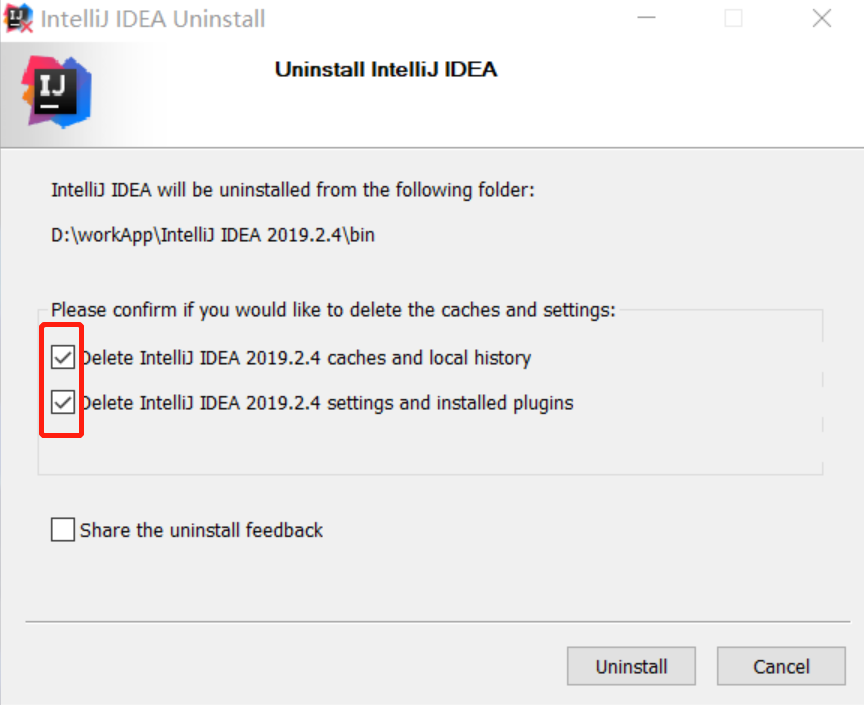
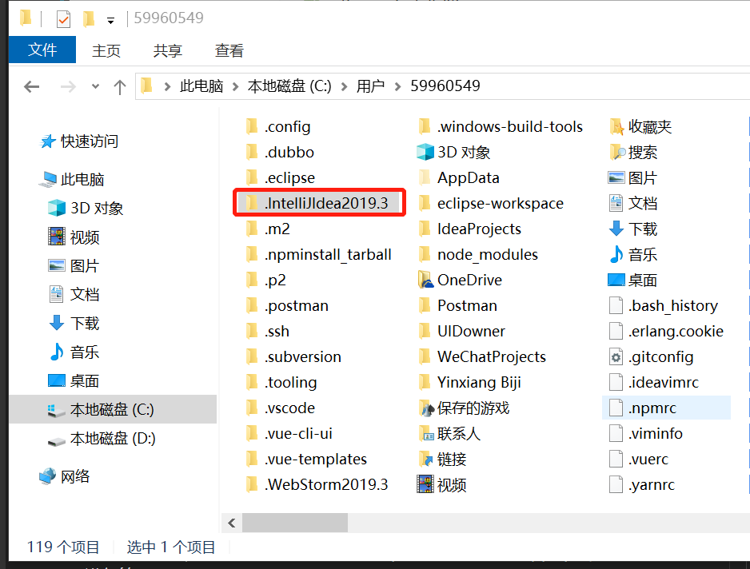
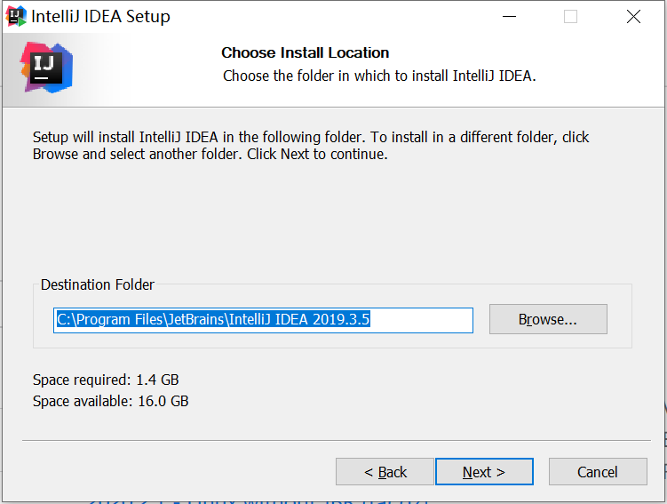
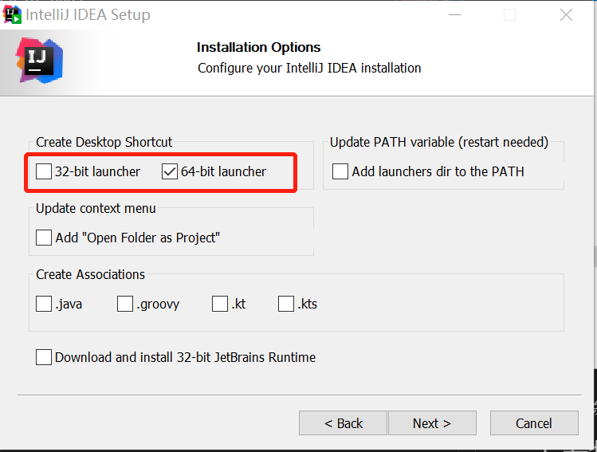
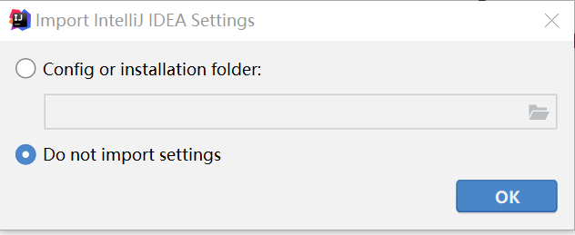
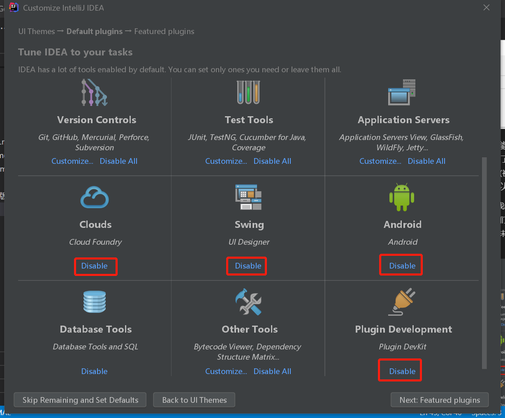
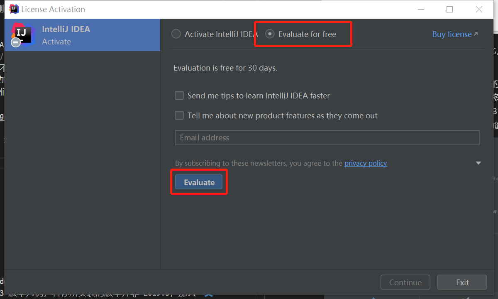
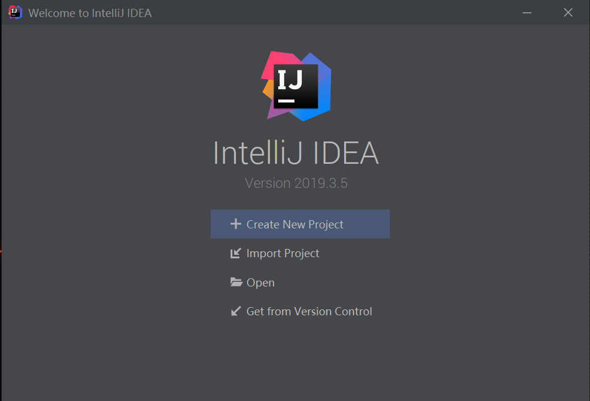
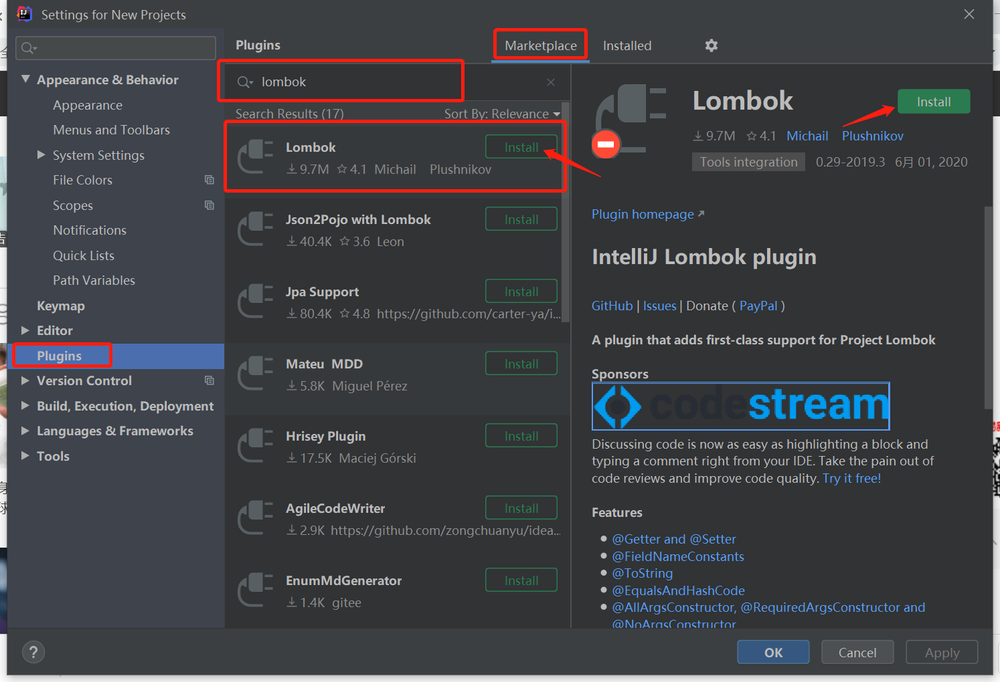
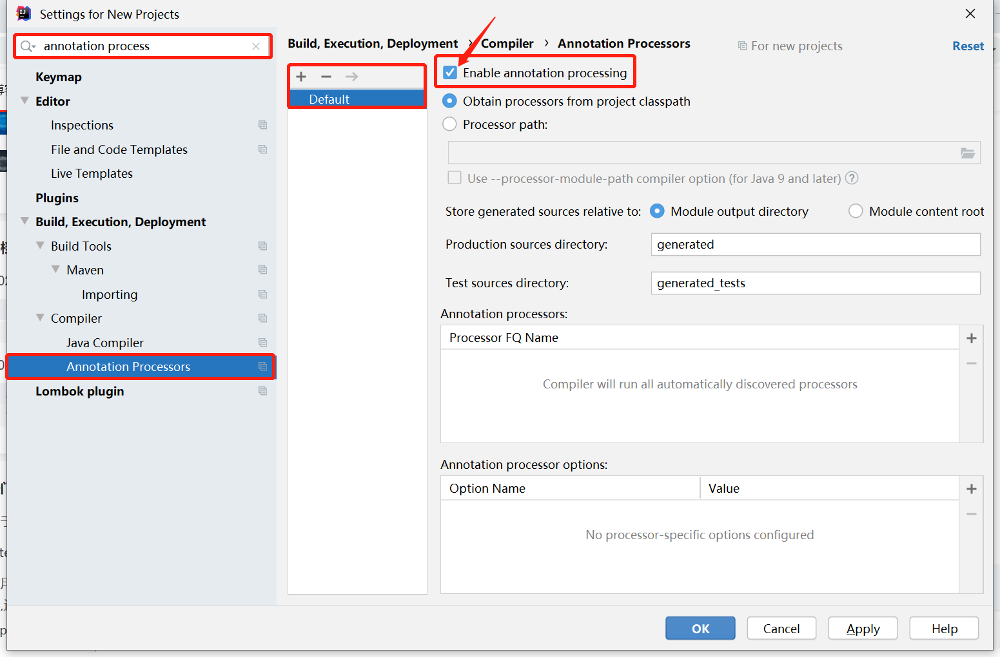

# IDEA IntelliJ的安装

## 0. 卸载已安装的旧版本 IDEA

如果你曾经安装过 IDEA 版本，现在想要重新安装，请务必保证将之前的 IDEA 卸载干净！

所谓『卸载干净』是指以下 2 点：

1. 删除过程中记得要勾选两个 `Delete`：

   
   
2. 删除后要记得删除旧版本的 IDEA 的配置文件：

   

如果删除不干净，会导致后续的破解操作失败。
   
一不做二不休，卸载结束后，把老 IDEA 的安装目录<small>（在 `C:\Program Files\JetBrains\...`）</small>也一起删除干净。

IDEA 2020 版本的安装和以下 3 个目录有关：

- *C:\Users\\<用户名>\AppData\Roaming\JetBrains*

- *C:\Users\\<用户名>\AppData\Local\JetBrains*

- *C:\Program Files\JetBrains* 

## 1. 安装

整个安装过程并无太多特殊之处，原则上一路 `Next` 就行。

1. 如无特殊要求，不要改动软件<small>（IDEA）</small>的默认安装路径。<small>安装别的软件也是这个原则。</small>

   

2. 根据你自己的操作系统的版本，选择安装 32 位或 64 位的 IDEA 。

   

3. 一路 `Next` 到配置页面。因为你没有<small>（或删除了旧版本的）</small>配置，因此，IDEA 要求你对它进行配置。

   

4. （可选操作）IDEA 的很多功能是以『插件』的方式提供的<small>（这一点和 Maven 很像）</small>。为了简化一下页面显示，以避免有太多的菜单选项对我们<small>（初学者）</small>造成干扰，有很多暂时用不上的功能<small>（插件）</small>是可以关闭掉的。

   这里有几个大块的功能模块我们是整体都用不上的，可以整体关掉。<small>其它的更细的功能我们就没有必要都一一关闭了。另外，对于关闭掉的功能（插件），未来如果要使用到，可以再打开，这里无需担心。</small>

   

5. 注册页面选择 30 天免费使用。

   

6. 安装结束，重启，看到启动页面。

   

## 2. 破解

暂缺

## 3. 安装完之后的工作

### 3.1 字体

不知道从哪个版本<small>（至少 2018 版中是没有的）</small>开始，IDEA 自带了一个名为 **`JetBrains Mono`** 的等宽字体。整体效果看起来还不错，推荐使用它。

`File` -> `Settings ...` -> 搜索框输入 `font` 搜索相关项。

程序员对于编程字体的常规要求如下：

- 编程字体必须使用等宽字体！

- 等宽字体也有好坏之分：是否容易区分 O 和 0、1 和 l 等。

- 更进一步地要求是：是考虑到中英文混合情况下的中文宽度问题？

  > 其实，**ubuntu mono** 是为数不多能做到第三点的两三个等宽字体之一。不过它比 **JetBrains Mono** 要宽一些。
  > 
  > 所以，使用 **JetBrans Mono** 在一行可以显示更多的内容。如果只考虑英文的情况，**JetBrans Mono** 要比 **ubuntu mono** 好看一点。

### 3.2 插件

在后续的编程中，我们会陆陆续续使用到 IDEA 的一些插件。在这里，我们可以提前下载。

`File` -> `Settings ...` -> `Plugins` 

| 插件 | 说明 |
| :- | :- |
| **IDE Eval Reset** | 插件形式的 IDEA“破解”工具，需要通过离线包安装。|
| **Maven Helper** | 简化 IDEA 中的 maven 的使用。 |
| **Lombok** | lombok 工具包的配套使用工具。用于简化代码的编写。 |
| **Vue.js** | 在 IDEA 中利用 Vue 框架开发前端项目的工具。 |
| Alibaba Java Coding Guidelines | 阿里巴巴编程规范检查器。 <small>不过，装上后有点影响 IDEA 速度。</small> |
| Free MyBatis plugin | 在使用 MyBatis 框架时用到的一个工具，用以提高编程效率。 <small>但是用时会时常有报错的日志，不知道为什么。</small>|
| Convert Yaml And Properties | 用于 yaml 文件和 properties 文件的相互转换。 | 
| Java Stream Debugger | 一个用于对 stream API 进行可视化调试的工具。|
| PlantUML integration | 在 IDEA 使用 PlantUML 画图的插件。|
| Rainbow Brackets | 彩虹括号，给代码中的括号上了色，便于分辨哪两个正反括号是一对。|
| Chinese ​(Simplified)​ Language Pack | 中文语言包 |

另外，Lombok 插件的使用要打开一个开关：

---

**postfix completion** 功能。