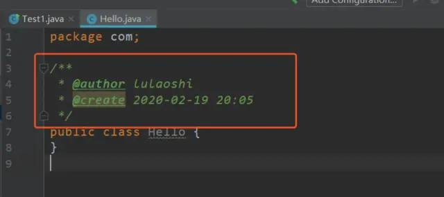

# IDEA 设置

- 软件设置 Settings
    - Appearance & Behavior
        - **设置主题**
        - 设置菜单字体
    - Keymap 快捷键
        - 设置为 Eclipse 快捷键的键位<small>（不推荐）</small>
        - 修改快捷键
        - 查看快捷键功能
    - **Editor > General**
        - 设置鼠标滚轮滚动修改字体大小
        - 设置鼠标悬停提示
        - 设置自动导包
        - 设置显示行号和方法间的分隔符
        - 忽略大小写提示
        - 设置取消单行显示 tabs 的操作
    - Editor > Font 
        - 修改当前主题代码编辑区的字体
    - **Editor > Color Scheme**
        - 修改当前主题控制台输出的字体
        - 修改代码中注释的字体颜色
    - Editor > Code Style 
        - 设定超过指定 import 格式，改为 * 
    - Editor > File and Code Template 
        - 修改类头的文档注释信息
    - Editor > File Encoding 
        - 设置项目文件编码
    - 设置省电模式
    - 设置代码水平或垂直显示
- 当前项目结构设置 Project Structure
    - project
    - modules
    - Artifacts
    - Facets
- 修改 IDEA 默认设置

## 1. IDEA 软件设置 Settings 页面

> Settings 是对软件本身的一些属性进行配置，例如字体、主题、背景图、插件等。

- 如何打开 Settings 设置页面

  

- Settings 设置页面结构详解

  
  
结构：

- Appearance & Behavior  外观和行为

- Keymap 快捷键

- Editor 编辑器设置

- Plugins 插件

- Version Control 版本控制

- Build，Execution，Deployment 构建，执行，部署

- Languages & Frameworks 语言和框架

- Tools 工具集 

## 2 Appearance & Behavior 外观和行为

### 2.1.1 设置主题 

目前我的 IDEA 中有两套主题：Darcula， IntelliJ 。

- Darcula 就是神秘的黑色主题。<small>我个人偏爱黑色</small>

- IntelliJ 白色主题。<small>蜗牛教学要求使用白色</small>

### 2.2.2 设置菜单字体 

## 3. Keymap 快捷键

### 3.1 设置为 Eclipse 快捷键的键位

  如果对 Eclipse 难以忘怀可以使用其键位，这种操作我也不推荐，感觉别扭。

  

### 3.2 修改快捷键

  不要一次性修改大量的快捷键

  

  - Add keyboard Shortcut 添加键盘快捷键  实际上就是修改当前的键位

  - Add Mouse Shortcut 增加鼠标捷径

  - Add Abbreviation

  - Remove Ctrl+Alt+Shift+S  移除改快捷键

### 3.3 查看快捷键的功能
 
   通过快捷键 查找快捷键的功能，例如：你不知道 `Ctrl+F` 什么意思，可以通过该功能进行搜索。

  
  

## 4. Editor 编辑器设置

> Editor 中的设置可以说是最高频使用的设置了，编辑区的字体、自动导包、注释生成等等。

什么是 Editor 编辑器呢？就是写代码的区域。

## 5. Editor > General

### 5.1 设置鼠标滚轮滚动修改字体大小

  

  设置成功之后，就可以通过 Ctrl+滚轮 实现代码字体大小的调节了

### 5.2 设置鼠标悬浮提示

  

  悬停提示是一个非常有用的功能，效果如下：

  

### 5.3 设置自动导包

  

  - Add unambiguous imports on the fly：添加明确的导入
  - Optimize imports on the fly：自动帮我们优化导入的包

### 5.4 设置显示行号和方法间的分隔符

  

  效果如下

  

### 5.5 忽略大小写提示

  1. `Ctrl + Alt + S` 打开设置界面（或者从菜单 `File` > `settings` 进来）

  2. 在搜索框输入 Completion 定位到 Code Completion 功能项

  3. 在右侧配置界面选中 All letters 

  4. 在右侧配置界面把 Match case<small>（匹配大小写）</small>前面的 `√` 去掉，

  

  - IntelliJ IDEA 的代码提示和补充功能有一个特性:区分大小写。如上图标注所示，默认就是 First letter 区分大小写的。

  - 区分大小写的情况是这样的:比如我们在 Java 代码文件中输入 `stringBuffer`， IntelliJ IDEA 默认是不会帮我们提示或是代码补充的，但是如果我们输入 `StringBuffer` 就可以进行代码提示和补充。

### 5.6 设置取消单行显示标签页（Tabs）的操作

  什么是单行显示：

  

  如何设置为多行?

  

  效果如下：

  

## 6. Editor > Font 

### 6.1 修改当前主题代码编辑区的字体

  
  
  默认字体、字体大小、字体行间距，都可以单独设置

## 7. Editor > Color Scheme

### 7.1 修改当前主题控制台输出的字体

  

### 7.2 修改代码中注释的字体颜色

  
  
  

## 8. Editor > Code Style

### 8.1 设置超过指定 import 个数，改为 **`*`**

  

## 9. Editor > File and Code Template

### 9.1 修改类头的文档注释信息

  
  
  效果如下

  

  
## 10. Editor > File Encodings
  
### 10.1 设置项目文件编码

`Transparent native-to-ascii conversion` 主要用于转换 ascii，一般都要勾选， 不然 *.properties* 文件中的注释显示的都不会是中文。

### 10.2 设置当前源文件的编码

对单独文件的编码修改还可以点击右下角的编码设置区。如果代码内容中包含中 文，则会弹出如上的操作选择。其中:

  1. Reload 表示使用新编码重新加载，新编码不会保存到文件中，重新打开此文 件，旧编码是什么依旧还是什么。

  2. Convert 表示使用新编码进行转换，新编码会保存到文件中，重新打开此文件， 新编码是什么则是什么。

  3. 含有中文的代码文件，Convert 之后可能会使中文变成乱码，所以在转换成请 做好备份，不然可能出现转换过程变成乱码，无法还原。

## 11. Build、Execution、Deployment 

## 12. 其它

### 12.1 设置为省电模式

  
  

  如上图所示，IntelliJ IDEA 有一种叫做 省电模式 的状态，开启这种模式之后 IntelliJ IDEA 会关掉代码检查和代码提示等功能。所以一般也可认为这是一种阅读模式，如果你在开发过程中遇到突然代码文件不能进行检查和提示，可以来看看这里是否有开启该功能。

### 12.2 设置代码分屏展示

  

  效果如下

  

  还可以添加分屏快捷键

  

  
## 13. IDEA 当前项目结构设置

项目结构配置就是关于当前模块的配置，只对当前模块生效，例如 Jar包，包结构，源码文件夹，输出路径，依赖和项目构建信息。

### 13.1 如何打开 Project Structure 页面

### 13.2 Project Structure 页面结构讲解

- project

  

- Modules

  可以查看每一个子模块的信息

  

- Artifacts

  IDEA 带包配置，有时候用 IDEA 打的包有问题，部署到 Tomcat 中跑不起来，可以再打包一次。

  

- Facets

  当前项目配置文件的相关信息。

## 14. 修改IDEA默认设置

  

  

