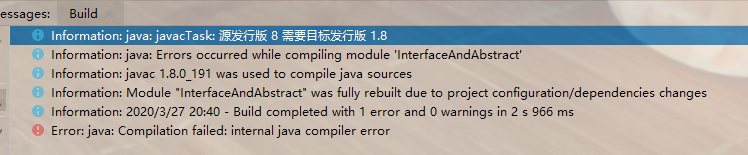
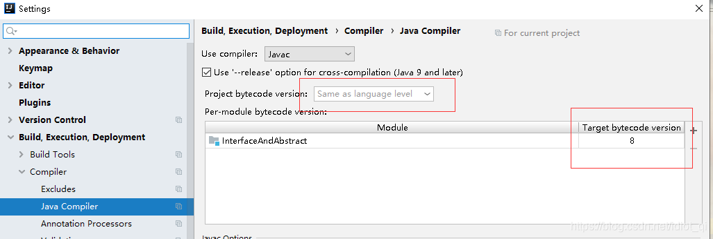
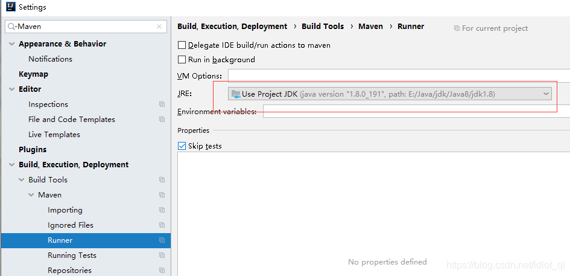
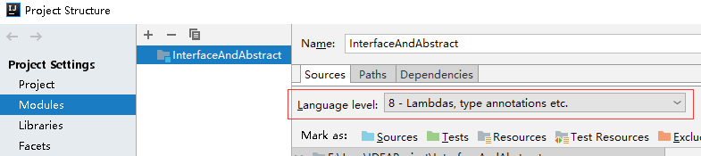
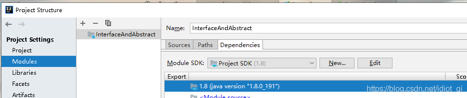

# IDEA 其它设置杂项

## 1. 需要目标发行版 1.8

创建新 maven 项目跑 main，出现这个编译异常：

需要将以下几个位置的 JDK 都要设置成 1.8 才行

1. **Settings** 搜索 **Java Compiler**

   File > Settings > Build, Execution, Deployment > Compiler > Java Compiler

   需要修改 **Project bytecode version** 和 **Target bytecode version** ：

   

2. **Settings** 搜索 **Maven** ，找到 **Runner** ：

   File > Settings > Build, Execution, Deployment > Build Tools > Maven > Runner

   

3. Project Structure | Modules 下     

   - Sources | Language level

     

   - Dependencies

     

