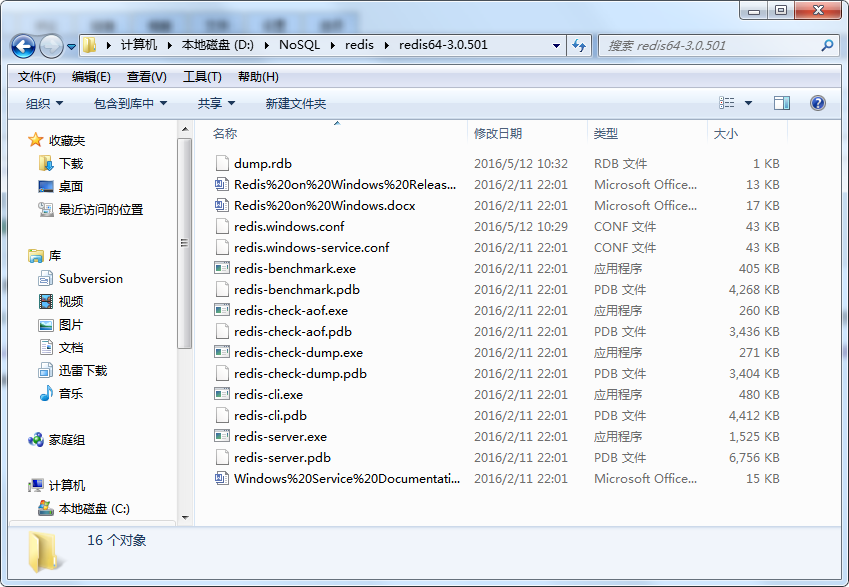

# <font color="orange">Redis 解压版</font>

有些软件对于安装路径有一定的要求，例如：路径中不能有空格，不能有中英文，不能有特殊符号，等等。

为了避免不必要的麻烦，也懒得一一辨别踩坑，我们人为作出「**统一的约定**」：

- 安装版的软件，一律安装在软件的默认安装路径，不要去改变它。<small>默认在哪就是哪，别动。</small>

- 解压版的软件，一律安装在：**D:\ProgramFiles** 。这是一个没中文、没空格的路径！


---


从 [https://github.com/MicrosoftArchive/redis/releases/](https://github.com/MicrosoftArchive/redis/releases/) 上下载 Redis 3.2.100<small>（这是解压免安装版的最高版本）</small>。

解压 **`.zip`** 包后会看到类似如下内容



| 文件名	| 简要 |
| :- | :- |
| redis-benchmark.exe	| 基准测试 |
| redis-check-aof.exe	| aof |
| redischeck-dump.exe	| dump |
| **redis-cli.exe**	        | 客户端 |
| **redis-server.exe**	    | 服务器 |
| **redis.windows.conf**	| 配置文件 |

进入 redis 的解压目录，执行如下命令：

```sh
redis-server.exe redis.windows.conf --maxmemory 200M
```

其中 **`--maxmemory 200M`** 是可选部分，它表示指定 redis 使用的最大内存，如不指定，redis 则使用默认的配置值。


当出现此界面的时候，说明启动成功，Redis 正监听端口 **6379**，等待客户端发起连接。

重新打开一个命令行终端，执行如下命令：


**默认连接 Redis 是不需要密码的**，因为配置文件 **redis.windows.conf** 中并没有指定认证密码。

如有需要，打开 *`redis.window.conf`* 找到 `# requirepass foobared`（这一行是注释），去掉注释符 `#` 或者在其下新增内容：

```
requirepass 123456
```

关闭 redis 服务端，再重新启动。现在在客户端窗口第一次输入命令时，redis 会给出 `(error) NOAUTH Authentication required.` 提示，要求你提供密码，为此你必须使用 **auth** 命令：

```
127.0.0.1:6379> auth 123456
OK
```

或者在 `redis-cli` 连接的时候，就指定密码：`redis-cli.exe -a 123456`

其实本质上，redis-cli 的完整格式是：`redis-cli.exe -h <指定ip> -p <指定端口> -a <指定密码>`

强行终止 Redis Server 进程可能会导致 redis 持久化数据丢失。正确停止 Redis 的方式应该是向 Redis 发送 SHUTDOWN 命令，方法为：

```
./redis-cli.exe shutdown 
./redis-cli.exe -h 192.168.25.130 -p 6379 shutdown 
```
