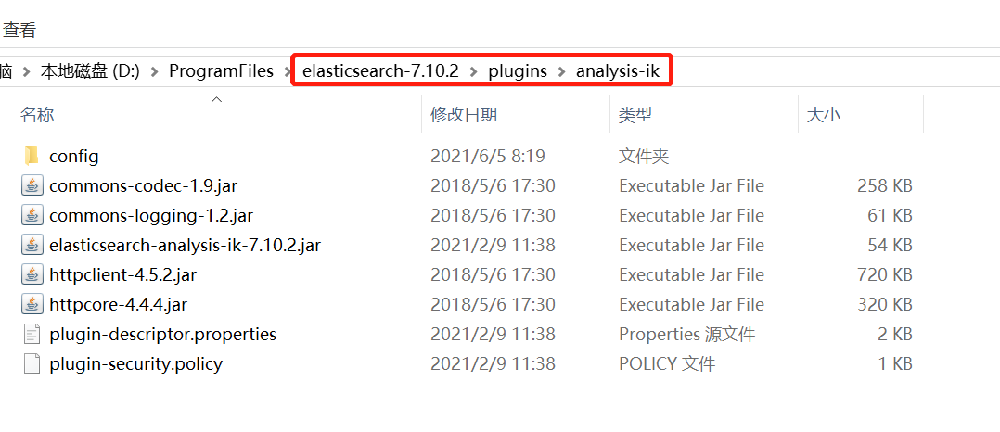

# <font color="orange">Elasticsearch 解压版</font>

有些软件对于安装路径有一定的要求，例如：路径中不能有空格，不能有中英文，不能有特殊符号，等等。

为了避免不必要的麻烦，也懒得一一辨别踩坑，我们人为作出「**统一的约定**」：

- 安装版的软件，一律安装在软件的默认安装路径，不要去改变它。<small>默认在哪就是哪，别动。</small>

- 解压版的软件，一律安装在：**D:\ProgramFiles** 。这是一个没中文、没空格的路径！


> Elasticsearch 只有解压版本，没有安装版

Elastic 官网：[https://www.elastic.co/cn/](https://www.elastic.co/cn/)


Elastic 有一条完整的产品线及解决方案：Elasticsearch、Kibana、Logstash 等，前面说的三个就是大家常说的 ELK 技术栈。


Elasticsearch 具备以下特点：

- 分布式，无需人工搭建集群<small>（solr 就需要人为配置，使用 Zookeeper 作为注册中心）</small>；

- Restful 风格，一切 API 都遵循 Restful 原则，容易上手；

- 近实时搜索，数据更新在 Elasticsearch 中几乎是完全同步的。


> kibana 从 7.11 开始升级了 node.js 的版本，因此，从这个版本开始不再支持 win7，也就是说，win7 能使用的 kibana 的最后的版本是 **7.10.2** 。


## 1. 安装 Elasticsearch


### 1.1 下载解压

> 解压路径中不要有中文和空格！

从官网下载 Elasticsearch 和 Kibana，<small>注意两者版本要一致，例如，必须都是 `7.10.2` 。</small>

> 如果是在 Linux 安装运行，需要注意的是，出于安全考虑，elasticsearch 默认不允许以 root 账号运行。

将 Elasticsearch 和 Kibana 解压到 `D:\ProgramFiles` 。

两者的目录分别是：

- D:\ProgramFiles\elasticsearch-7.10.2

- D:\ProgramFiles\kibana-7.10.2-windows-x86_64


### 1.2 配置

*本步骤是可选操作*

我们进入 `elasticsearch-7.10.2/config` 目录：

需要修改的配置文件有两个：

- elasticsearch.yml

- jvm.options 

#### 1.2.1 jvm.options

Elasticsearch 基于 Lucene 的，而 Lucene 底层是 java 实现，因此我们需要配置 jvm 参数。

编辑 jvm.options：

- 默认配置如下：

  ```
  -Xms1g
  -Xmx1g
  ```

- 内存占用太多了，我们调小一些：

  ```
  -Xms512m
  -Xmx512m
  ```

#### 1.2.2 elasticsearch.yml

`elasticsearch.yml` 配置文件暂时不用改动。

### 1.3 运行

进入 `elasticsearch-7.10.2\bin` 目录

双击 `elasticsearch.bat`，启动成功时，会显示 `started` 字样，并且可我们在浏览器中访问：[http://127.0.0.1:9200](http://127.0.0.1:9200)，可见类似如下内容：

```json
{
  "name" : "DESKTOP-T540P",
  "cluster_name" : "elasticsearch",
  "cluster_uuid" : "XvelzExUQgud2iqO9QLA4w",
  "version" : {
    "number" : "7.10.2",
    "build_flavor" : "default",
    "build_type" : "zip",
    "build_hash" : "747e1cc71def077253878a59143c1f785afa92b9",
    "build_date" : "2021-01-13T00:42:12.435326Z",
    "build_snapshot" : false,
    "lucene_version" : "8.7.0",
    "minimum_wire_compatibility_version" : "6.8.0",
    "minimum_index_compatibility_version" : "6.0.0-beta1"
  },
  "tagline" : "You Know, for Search"
}
```

## 2. 安装 Kibana

Kibana 是一个基于 Node.js 的 Elasticsearch 索引库数据统计工具，可以利用 Elasticsearch 的聚合功能，生成各种图表，如柱形图，线状图，饼图等。

而且还提供了操作 Elasticsearch 索引数据的控制台，并且提供了一定的 API 提示，非常有利于我们学习 Elasticsearch 的语法。

版本与 elasticsearch 保持一致，也是 `7.10.2` 。

### 2.1 下载

> 解压路径中不要有中文和空格！

略

**务必保证 Kibana 和 Elasticsearch<small>（以及未来的 IK 分词器）</small>版本号相同！**

**务必保证 Kibana 和 Elasticsearch<small>（以及未来的 IK 分词器）</small>版本号相同！**

**务必保证 Kibana 和 Elasticsearch<small>（以及未来的 IK 分词器）</small>版本号相同！**


### 2.2 配置

进入 **kibana-7.10.2-windows-x86_64/config** 目录，查看其配置文件 **kibana.yml** 配置文件。

该配置文件中，最重要的一项配置是 `elasticsearch.hosts`<small>（该配置项以前叫 *elasticsearch.url* ）</small>，该配置项要指向 Elasticsearch 服务器的访问地址和端口。

例如: `http://192.168.56.101:9200`。如果，Elasticsearch 在你的本机，那么这个地址就是 `http://localhost:9200` 或者是 `http://127.0.0.1:9200` 。

进入 Kibana 安装目录下的 **bin** 目录，双击 **kibana.bat** 启动。<small>（启动过程比较耗时，耐心等待）</small>。发现 kibana 的监听端口是 5601 。因此，我们可访问：[http://127.0.0.1:5601](http://127.0.0.1:5601)


## 3. 安装 IK 分词器

IK 分词器的下载地址在 [*https://github.com/medcl/elasticsearch-analysis-ik/releases*](https://github.com/medcl/elasticsearch-analysis-ik/releases)

将 elasticsearch-analysis-ik <small>（版本与 Elasticsearch 一致）</small>解压到 Elasticsearch 目录的 `plugins` 目录<small>（`elasticsearch-7.10.2\plugins`）</small>中：


注意目录结构及目录名！<small>另外，plugins 目录中不要有无关的内容。</small>

注意目录结构及目录名！<small>另外，plugins 目录中不要有无关的内容。</small>

注意目录结构及目录名！<small>另外，plugins 目录中不要有无关的内容。</small>


```
elasticsearch
│── plugins
│    └── analysis-ik
│        ├── commons-codec-1.9.jar
│        └── 其它内容
└── 其它内容
```




然后重启 elasticsearch 。

- 测试分词器

  ```json
  POST _analyze
  {
    "analyzer" : "ik_smart",
    "text" : "中国驻洛杉矶领事馆遭亚裔男子枪击 嫌犯已自首"
  }
  ```

注意：IK 分词器有两种类型

| IK 分词器类型 | 说明 |
| :- | :- |
| ik_smart | 会做最粗粒度的拆分。 |
| ik_max_word | 会将文本做最细粒度的拆分，会穷尽各种可能。 |

以上述例子为例，`ik_max_word` 拆出了 15 项，而 `ik_smart` 拆出 11 项<small>（不同版本的 ik 分词器可能会略有不同）</small>。

